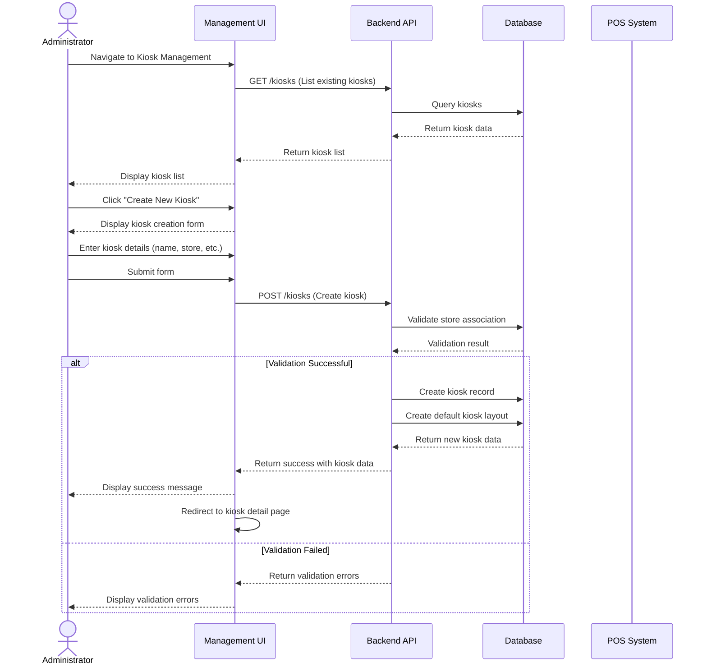
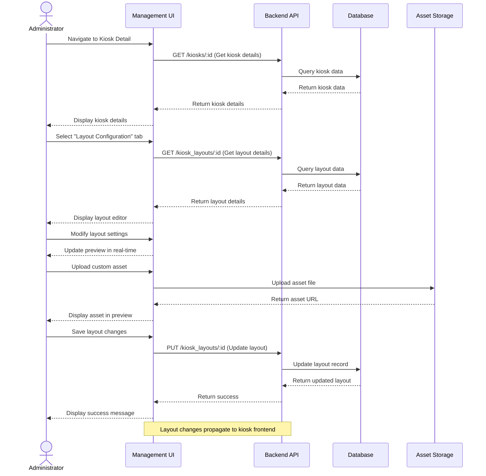
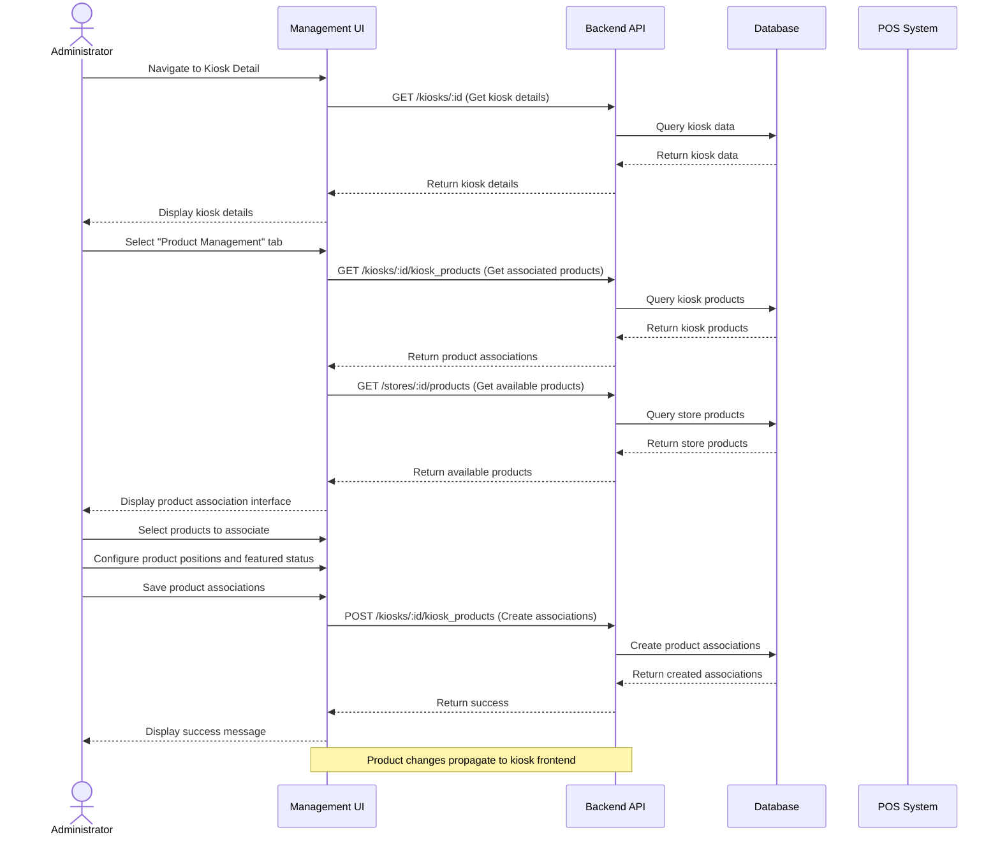
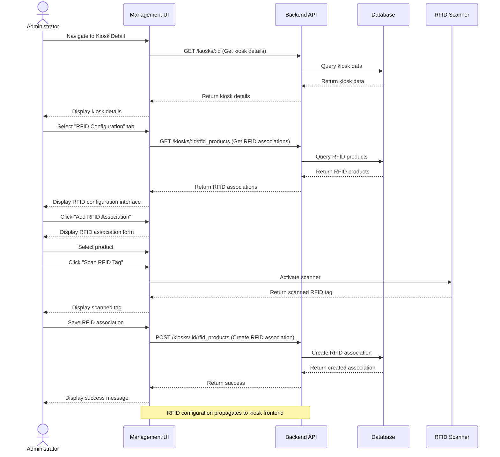
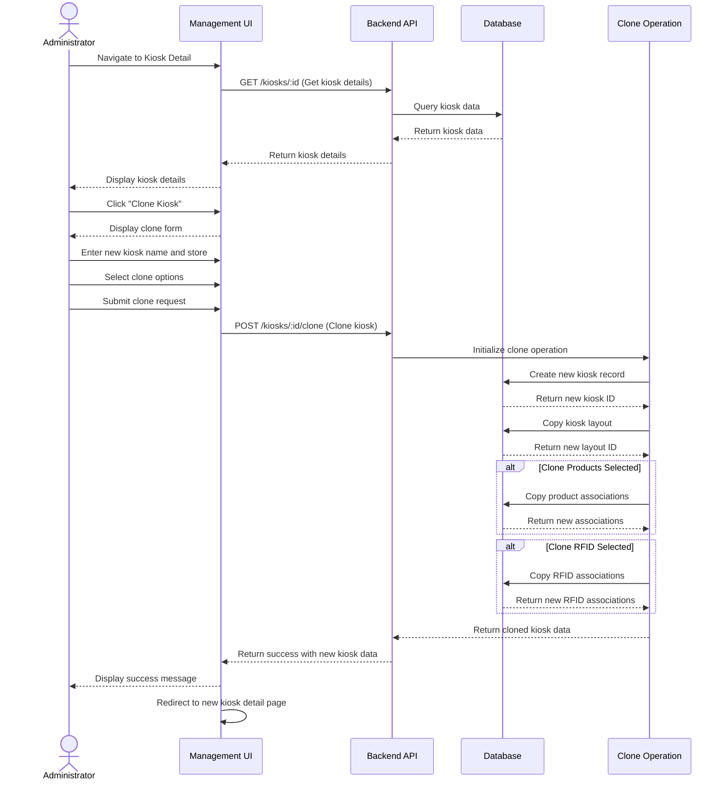
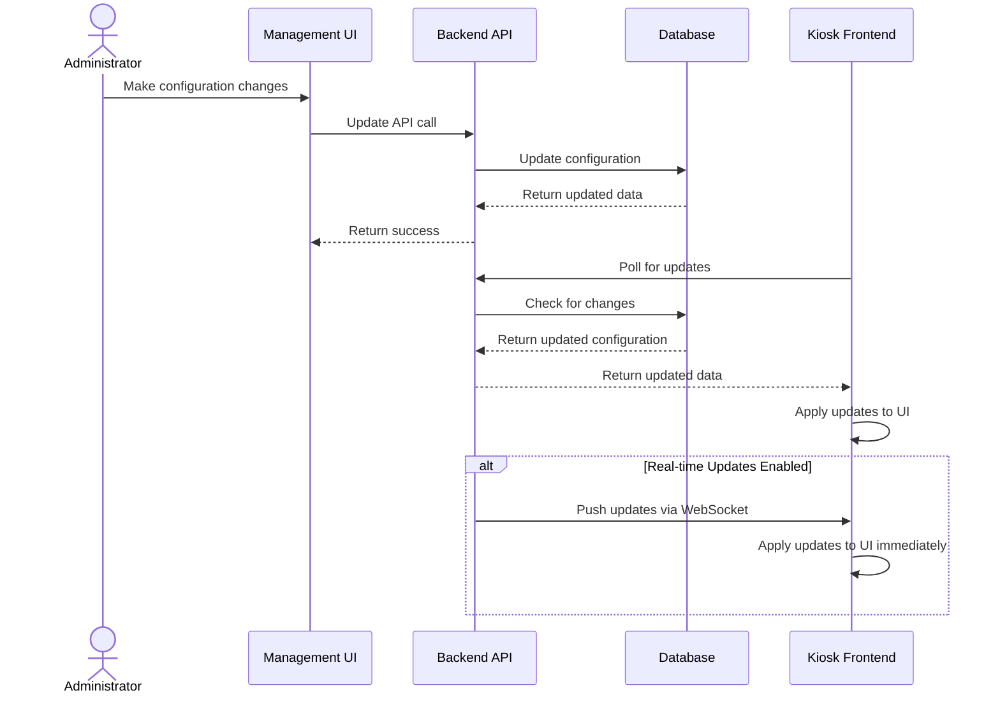
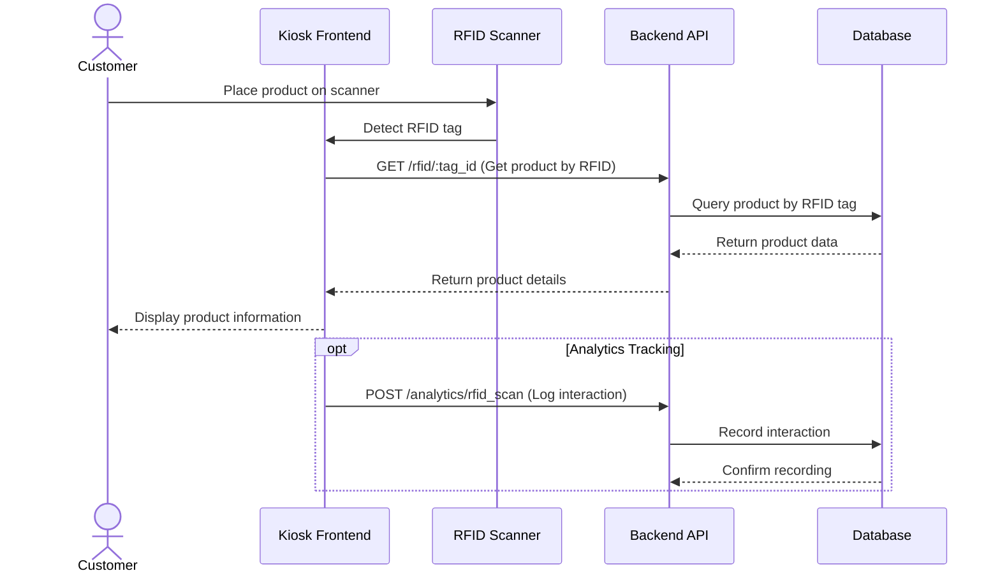

# Kiosk Management Flow Sequence Diagrams

This document contains sequence diagrams that illustrate the key flows in the kiosk management process, including kiosk creation, layout configuration, product association, and RFID integration.

## Kiosk Creation Flow

The following diagram illustrates the sequence of interactions when an administrator creates a new kiosk.

## Layout Configuration Flow

The following diagram illustrates the sequence of interactions when configuring a kiosk's layout.

## Product Association Flow

The following diagram illustrates the sequence of interactions when associating products with a kiosk.

## RFID Configuration Flow

The following diagram illustrates the sequence of interactions when configuring RFID functionality for a kiosk.

## Kiosk Cloning Flow

The following diagram illustrates the sequence of interactions when cloning an existing kiosk.

## Kiosk Frontend Update Flow

The following diagram illustrates how updates to kiosk configuration propagate to the frontend kiosk interface.

## RFID Interaction Flow

The following diagram illustrates the sequence of interactions when a customer places a product with an RFID tag on a kiosk.

These sequence diagrams provide a visual representation of the key flows in the kiosk management process, illustrating the interactions between different components of the system. 