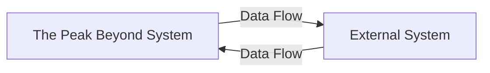
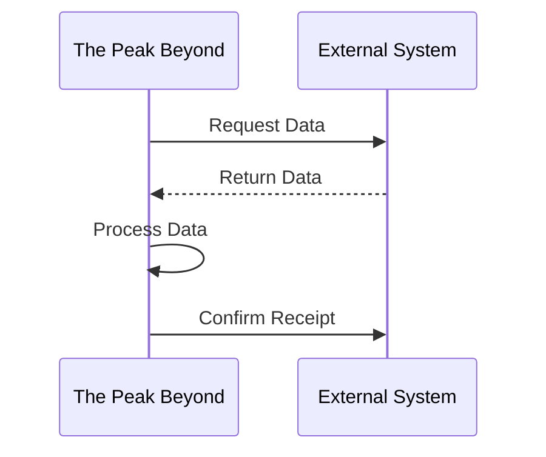

# [Integration Name] Integration

## Overview

[Provide a brief introduction to the integration, its purpose, and its role within the system. Keep this section concise but informative.]

## Integration Details

- **Integration Type**: [API, Webhook, Batch, Message Queue, etc.]
- **Direction**: [Inbound, Outbound, Bidirectional]
- **Frequency**: [Real-time, Scheduled, Event-driven, etc.]
- **Authentication**: [Authentication method used]
- **Data Format**: [JSON, XML, CSV, etc.]

## System Architecture

[Describe how this integration fits into the overall system architecture, including components involved and data flow.]

### Architecture Diagram



[Provide a text description of the diagram for accessibility.]

## Data Mapping

[Describe how data is mapped between The Peak Beyond's system and the external system.]

### Source to Target Mapping

| Source Field | Source Type | Target Field | Target Type | Transformation | Notes |
|--------------|-------------|--------------|-------------|----------------|-------|
| `source_field1` | [Type] | `target_field1` | [Type] | [Transformation if any] | [Notes] |
| `source_field2` | [Type] | `target_field2` | [Type] | [Transformation if any] | [Notes] |

## Integration Endpoints

[List and describe the endpoints used in this integration.]

### Inbound Endpoints

| Endpoint | Method | Purpose | Authentication |
|----------|--------|---------|----------------|
| `/api/v1/[endpoint1]` | [HTTP Method] | [Purpose] | [Auth Method] |
| `/api/v1/[endpoint2]` | [HTTP Method] | [Purpose] | [Auth Method] |

### Outbound Endpoints

| Endpoint | Method | Purpose | Authentication |
|----------|--------|---------|----------------|
| `https://external-system.com/api/[endpoint1]` | [HTTP Method] | [Purpose] | [Auth Method] |
| `https://external-system.com/api/[endpoint2]` | [HTTP Method] | [Purpose] | [Auth Method] |

## Authentication and Authorization

[Describe the authentication and authorization mechanisms used in this integration, including token management, credential storage, and security considerations.]

```ruby
# Example authentication code
def authenticate
  response = HTTP.post("https://external-system.com/oauth/token", json: {
    client_id: ENV["CLIENT_ID"],
    client_secret: ENV["CLIENT_SECRET"],
    grant_type: "client_credentials"
  })
  
  JSON.parse(response.body.to_s)["access_token"]
end
```

## Data Synchronization Process

[Describe the process of data synchronization, including initialization, incremental updates, and conflict resolution.]

### Synchronization Flow



[Provide a text description of the diagram for accessibility.]

## Error Handling and Resilience

[Describe how errors are handled in this integration, including retry strategies, circuit breakers, and fallback mechanisms.]

```ruby
# Example error handling code
def fetch_with_retry(url, max_retries = 3)
  retries = 0
  begin
    response = HTTP.get(url)
    response.parse
  rescue HTTP::Error => e
    retries += 1
    if retries <= max_retries
      sleep(2 ** retries) # Exponential backoff
      retry
    else
      raise e
    end
  end
end
```

## Rate Limiting and Throttling

[Describe any rate limiting or throttling mechanisms implemented for this integration, both for inbound and outbound requests.]

## Monitoring and Logging

[Describe how the integration is monitored, including logs, metrics, and alerting.]

### Key Metrics

| Metric | Description | Threshold | Alert |
|--------|-------------|-----------|-------|
| `integration_success_rate` | Percentage of successful integration calls | < 95% | Yes |
| `integration_latency` | Average response time | > 500ms | Yes |

## Testing

[Describe how to test this integration, including test environments, mock services, and validation procedures.]

```ruby
# Example test code
describe "Integration with [External System]" do
  it "successfully synchronizes products" do
    # Test implementation
  end
end
```

## Deployment and Configuration

[Describe how to deploy and configure this integration, including environment variables, feature flags, and infrastructure requirements.]

### Configuration Parameters

| Parameter | Description | Default | Required |
|-----------|-------------|---------|----------|
| `API_KEY` | API key for authentication | None | Yes |
| `API_URL` | Base URL for API calls | `https://api.example.com` | Yes |
| `SYNC_INTERVAL` | Interval between syncs (minutes) | 60 | No |

## Examples

### Example 1: [Brief Description]

[Provide a complete, working example of how the integration operates in a specific scenario.]

```ruby
# Example integration code
def sync_products
  external_products = fetch_external_products
  
  external_products.each do |external_product|
    local_product = Product.find_or_initialize_by(external_id: external_product["id"])
    local_product.update(
      name: external_product["name"],
      description: external_product["description"],
      price: external_product["price"]
    )
  end
end
```

### Example 2: [Brief Description]

[Provide another example if necessary, especially for different use cases or error scenarios.]

## Troubleshooting

[Provide guidance for troubleshooting common issues with this integration.]

| Issue | Possible Cause | Resolution |
|-------|----------------|------------|
| Authentication failures | Expired credentials | Refresh API token |
| Timeout errors | Network latency | Increase timeout settings |

## Changelog

| Date | Version | Changes |
|------|---------|---------|
| YYYY-MM-DD | v1.0 | Initial implementation |
| YYYY-MM-DD | v1.1 | [Description of changes] |

## AI Agent Notes

- **POSIntegrationSpecialistAgent**: [Specific guidance for POS integration specialist agent]
- **SystemArchitectAgent**: [Specific guidance for system architect agent]
- **Next documents**: Consider reviewing [related document 1] and [related document 2] for related information.

## References

- [Link to external system documentation]
- [Link to API specifications]
- [Link to related internal documentation] 