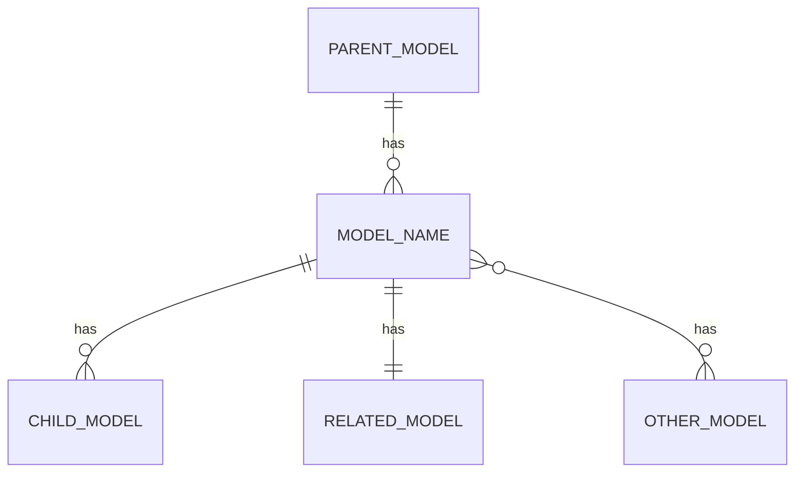

# [Model Name] Model

## Overview

[Provide a brief introduction to the model, its purpose, and its role within the system. Keep this section concise but informative.]

## Schema Definition

```ruby
# app/models/[model_file_name].rb
class ModelName < ApplicationRecord
  # Associations
  belongs_to :parent_model
  has_many :child_models
  has_one :related_model
  has_and_belongs_to_many :other_models
  
  # Validations
  validates :required_field, presence: true
  validates :email_field, format: { with: URI::MailTo::EMAIL_REGEXP }
  validates :numeric_field, numericality: { greater_than: 0 }
  
  # Scopes
  scope :active, -> { where(active: true) }
  scope :recent, -> { order(created_at: :desc).limit(10) }
  
  # Callbacks
  before_save :normalize_data
  after_create :send_notification
  
  # Other methods
  def full_name
    "#{first_name} #{last_name}"
  end
  
  private
  
  def normalize_data
    # Implementation
  end
  
  def send_notification
    # Implementation
  end
end
```

## Database Schema

```ruby
# db/schema.rb (relevant portion)
create_table "model_names", force: :cascade do |t|
  t.string "required_field", null: false
  t.string "email_field"
  t.integer "numeric_field"
  t.boolean "active", default: true
  t.references "parent_model", foreign_key: true
  t.timestamps
end

add_index "model_names", ["email_field"], unique: true
```

## Attributes

| Attribute | Type | Description | Constraints | Default |
|-----------|------|-------------|-------------|---------|
| `id` | Integer | Primary key | Auto-increment | N/A |
| `required_field` | String | [Description] | Not null | N/A |
| `email_field` | String | [Description] | Valid email format, Unique | N/A |
| `numeric_field` | Integer | [Description] | Greater than 0 | N/A |
| `active` | Boolean | [Description] | N/A | true |
| `parent_model_id` | Integer | Foreign key to parent_model | N/A | N/A |
| `created_at` | DateTime | Creation timestamp | N/A | Current time |
| `updated_at` | DateTime | Last update timestamp | N/A | Current time |

## Associations

### Belongs To

| Association | Model | Foreign Key | Description |
|-------------|-------|-------------|-------------|
| `parent_model` | ParentModel | parent_model_id | [Description of relationship] |

### Has Many

| Association | Model | Foreign Key | Description |
|-------------|-------|-------------|-------------|
| `child_models` | ChildModel | model_name_id | [Description of relationship] |

### Has One

| Association | Model | Foreign Key | Description |
|-------------|-------|-------------|-------------|
| `related_model` | RelatedModel | model_name_id | [Description of relationship] |

### Has And Belongs To Many

| Association | Model | Join Table | Description |
|-------------|-------|------------|-------------|
| `other_models` | OtherModel | model_names_other_models | [Description of relationship] |

## Validations

| Attribute | Validation | Error Message |
|-----------|------------|---------------|
| `required_field` | Presence | "can't be blank" |
| `email_field` | Format (email) | "is not a valid email address" |
| `numeric_field` | Numericality (> 0) | "must be greater than 0" |

## Scopes

| Scope | Definition | Description |
|-------|------------|-------------|
| `active` | `where(active: true)` | Returns only active records |
| `recent` | `order(created_at: :desc).limit(10)` | Returns 10 most recently created records |

## Callbacks

| Callback | Method | Description |
|----------|--------|-------------|
| `before_save` | `normalize_data` | [Description of what this callback does] |
| `after_create` | `send_notification` | [Description of what this callback does] |

## Business Logic

[Describe the key business logic implemented in this model, including important methods, calculations, and state transitions.]

### Key Methods

#### `full_name`

Returns the concatenated first and last name of the model.

```ruby
def full_name
  "#{first_name} #{last_name}"
end
```

#### `normalize_data` (private)

[Description of what this method does and when it's called.]

```ruby
def normalize_data
  # Implementation details
end
```

## Multi-tenant Considerations

[Describe how this model interacts with the multi-tenant architecture, including tenant scoping and data isolation.]

```ruby
# Example of tenant scoping
class ModelName < ApplicationRecord
  belongs_to :store
  
  # Ensure all queries are scoped to the current store
  default_scope { where(store_id: Store.current_id) if Store.current_id }
end
```

## Query Patterns

[Describe common query patterns for this model, including performance considerations and optimizations.]

### Common Queries

```ruby
# Find active records with eager loading
ModelName.active.includes(:related_model).where(numeric_field: 1..10)

# Complex query with joins
ModelName.joins(:parent_model)
         .where(parent_models: { status: 'active' })
         .order(created_at: :desc)
```

### Query Optimization

[Describe any specific optimizations for querying this model, such as indexes, caching strategies, or batch processing.]

## Testing

[Describe how to test this model, including example test cases and fixtures.]

```ruby
# spec/models/model_name_spec.rb
require 'rails_helper'

RSpec.describe ModelName, type: :model do
  describe "validations" do
    it "requires required_field to be present" do
      model = ModelName.new(required_field: nil)
      expect(model.valid?).to be false
      expect(model.errors[:required_field]).to include("can't be blank")
    end
  end
  
  describe "#full_name" do
    it "returns the concatenated first and last name" do
      model = ModelName.new(first_name: "John", last_name: "Doe")
      expect(model.full_name).to eq("John Doe")
    end
  end
end
```

## Common Patterns and Best Practices

[Describe recommended patterns and best practices for using or extending this model.]

## Known Issues and Limitations

[Document known issues, limitations, and constraints of the model.]

## Technical Debt

[Document areas of technical debt, planned improvements, and refactoring opportunities.]

## Examples

### Example 1: Creating a New Record

```ruby
# Create a new record
model = ModelName.new(
  required_field: "Value",
  email_field: "example@example.com",
  numeric_field: 42,
  parent_model: ParentModel.find(1)
)

if model.save
  # Success handling
else
  # Error handling
  puts model.errors.full_messages
end
```

### Example 2: Updating an Existing Record

```ruby
# Find and update a record
model = ModelName.find(1)
model.update(
  required_field: "New Value",
  numeric_field: 100
)
```

## Entity Relationship Diagram



[Provide a text description of the diagram for accessibility.]

## AI Agent Notes

- **DatabaseSpecialistAgent**: [Specific guidance for database specialist agent]
- **SystemArchitectAgent**: [Specific guidance for system architect agent]
- **Next documents**: Consider reviewing [related document 1] and [related document 2] for related information.

## References

- [Link to related model documentation]
- [Link to relevant business logic documentation]
- [Link to database schema documentation] 