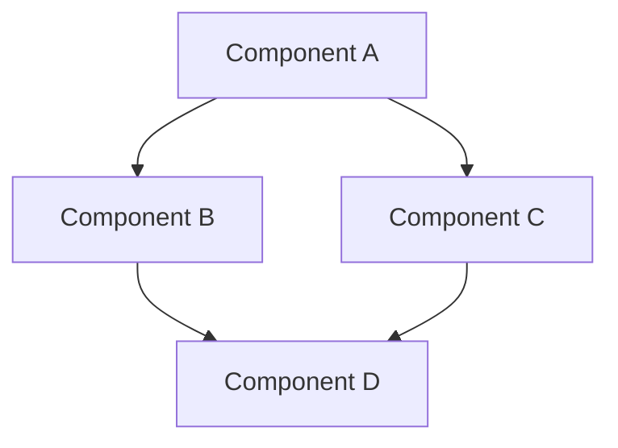
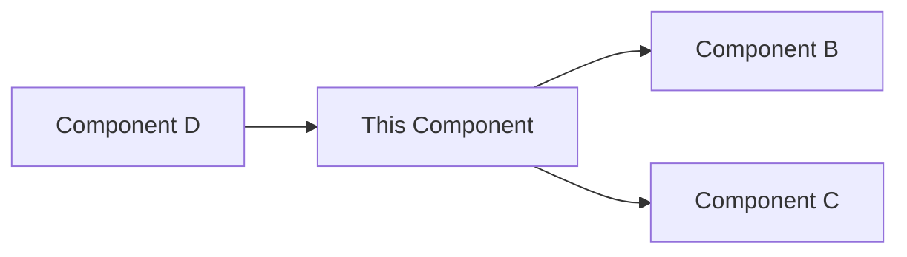

# [System Component Name]

## Overview

[Provide a brief introduction to the system component, its purpose, and its role within the overall system architecture. Keep this section concise (2-3 paragraphs) but informative.]

## Key Concepts

[Define the key concepts, terminology, and principles related to this system component. Use bullet points for clarity.]

- **[Concept 1]**: [Definition and explanation]
- **[Concept 2]**: [Definition and explanation]
- **[Concept 3]**: [Definition and explanation]

## Architecture

[Describe the internal architecture of the component, including its subcomponents, layers, and design patterns.]

### Component Diagram



[Provide a text description of the diagram for accessibility.]

## Implementation Details

[Describe the technical implementation of the component, including technologies, frameworks, and key classes or modules.]

### Key Classes/Modules

```ruby
class ExampleClass
  def example_method
    # Example implementation
  end
end
```

## Relationships with Other Components

[Describe how this component interacts with other components in the system. Include dependencies, interfaces, and communication patterns.]

### Dependency Diagram



[Provide a text description of the diagram for accessibility.]

## Configuration

[Describe how the component is configured, including configuration files, environment variables, and runtime configuration options.]

### Configuration Example

```yaml
component:
  setting1: value1
  setting2: value2
  nested:
    setting3: value3
```

## Deployment

[Describe how the component is deployed, including deployment topology, scaling considerations, and infrastructure requirements.]

## Performance Considerations

[Describe performance characteristics, bottlenecks, and optimization strategies for the component.]

## Security Considerations

[Describe security aspects of the component, including authentication, authorization, data protection, and potential vulnerabilities.]

## Error Handling and Resilience

[Describe how the component handles errors, failures, and exceptional conditions. Include retry strategies, circuit breakers, and fallback mechanisms.]

## Monitoring and Observability

[Describe how the component can be monitored, including metrics, logs, and health checks.]

## Common Patterns and Best Practices

[Describe recommended patterns and best practices for using or extending the component.]

## Known Issues and Limitations

[Document known issues, limitations, and constraints of the component.]

## Technical Debt

[Document areas of technical debt, planned improvements, and refactoring opportunities.]

## Examples

### Example 1: [Brief Description]

[Provide a complete, working example of how to use or interact with the component.]

```ruby
# Example code
```

### Example 2: [Brief Description]

[Provide another example if necessary.]

## AI Agent Notes

- **[Agent Type 1]**: [Specific guidance for this type of agent]
- **[Agent Type 2]**: [Specific guidance for this type of agent]
- **Next documents**: Consider reviewing [related document 1] and [related document 2] for related information.

## References

- [Link to reference 1]
- [Link to reference 2]
- [Link to reference 3] 