# Quick Reference Guide for Agents
Version: 1.0
Last Updated: March 13, 2024

## 🔍 How to Find Information Fast

### 1. Start Here Based on Your Task

#### Looking for Implementation Details?
➡️ Go to: `/implementation/patterns/README.md` (v1.7)
- Contains all implementation patterns
- Each pattern has its own detailed file
- All pattern files follow same structure:
  ```
  1. Overview
  2. Core Patterns
  3. Implementation
  4. Best Practices
  5. Integration Points
  6. Dependencies
  ```

#### Need Project Status?
➡️ Go to: `/tracking/progress/progress_tracking.md` (v5.6)
- Overall progress metrics
- Phase-by-phase status
- Current blockers
- Next steps

#### Taking Over Development?
➡️ Go to: `/documentation/HANDOFF.md` (v1.0)
- Current project context
- Priority tasks
- Known issues
- Version control guidelines

### 2. Quick Pattern Lookup

| If you need... | Go to... | Current Version |
|----------------|----------|-----------------|
| Authentication | `implementation/patterns/authentication-patterns.md` | 1.0 |
| HTTP Client | `implementation/patterns/http-client-patterns.md` | 1.0 |
| Error Handling | `implementation/patterns/error-handling-patterns.md` | 1.0 |
| Form Validation | `implementation/patterns/form-validation.md` | 1.0 |
| Components | `implementation/patterns/component-patterns.md` | 1.0 |
| Mobile | `implementation/patterns/mobile-patterns.md` | 1.0 |
| Theme Management | `implementation/patterns/theme-management.md` | 1.0 |
| Animation | `implementation/patterns/animation-patterns.md` | 1.0 |
| Testing | `implementation/patterns/testing-patterns.md` | 1.0 |

### 3. Current Project Phase Status

```mermaid
graph LR
    A[Documentation Structure] -->|100%| B[Security Analysis]
    B -->|100%| C[Core Implementation]
    C -->|100%| D[UI/UX Analysis]
    D -->|100%| E[Testing Analysis]
    E -->|75%| F[Business Logic]
    F -->|75% Blocked| G[Completion]
    
    style A fill:#90EE90
    style B fill:#90EE90
    style C fill:#90EE90
    style D fill:#90EE90
    style E fill:#FFB6C1
    style F fill:#FFB6C1
    style G fill:#FFFFFF
```



### 4. Known Blockers Quick View
1. 🚫 Store Management Module Access
   - Blocks: Business Logic Analysis
   - Status: Awaiting Access

2. 🚫 Testing Framework Requirements
   - Blocks: Performance & Load Testing
   - Status: Tools Needed

### 5. Common Tasks Reference

#### Adding New Documentation
1. Choose appropriate pattern file
2. Follow existing structure
3. Update version number
4. Update progress tracking
5. Update master index

#### Updating Existing Documentation
1. Increment version number
2. Update last modified date
3. Add to document history
4. Update progress tracking if significant

#### Finding Code Examples
- Each pattern file has a "Core Patterns" section
- Implementation examples in "Implementation Patterns"
- Best practices include practical examples

### 6. File Structure Map
```
documentation/
├── README.md                 # Master Index (v1.2)
├── HANDOFF.md               # Agent Handoff (v1.0)
├── QUICK_REFERENCE.md       # This Guide (v1.0)
├── implementation/
│   └── patterns/
│       ├── README.md       # Patterns Index (v2.1)
│       ├── authentication-patterns.md
│       ├── http-client-patterns.md
│       └── ...
└── tracking/
    └── progress/
        └── progress_tracking.md (v6.0)
```

### 7. Version Control Quick Reference
- Pattern Files: Start at 1.0
- README.md: Currently 2.1
- Progress Tracking: Currently 6.0

### 8. Emergency Checklist
If you're stuck, check these in order:
1. ✓ Master Index (`README.md`)
2. ✓ Quick Reference (this file)
3. ✓ Handoff Document
4. ✓ Progress Tracking
5. ✓ Specific Pattern File

### 9. Dependencies Quick List
- @angular/core, forms, common, router
- ngx-bootstrap
- ng-select
- styled-components
- Testing: jasmine-core, karma, protractor

## Document History
- Version 1.0 (March 13, 2024): Initial quick reference guide creation 