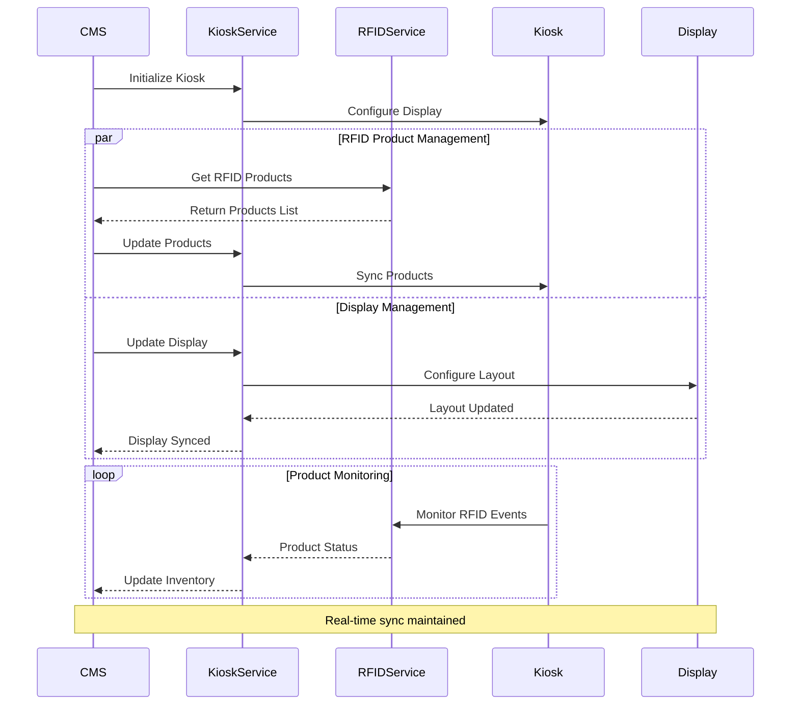

# Kiosk Integration Flow

## Overview
This diagram illustrates the integration flow between the CMS and Kiosk systems, including RFID product management and display synchronization.

## Flow Diagram

## Integration Points

1. **CMS to KioskService**
   - Kiosk initialization
   - Product updates
   - Display configuration
   - Inventory management

2. **KioskService to RFIDService**
   - Product tracking
   - Inventory updates
   - Event monitoring

3. **KioskService to Display**
   - Layout configuration
   - Content synchronization
   - Real-time updates

## Document History

| Version | Date | Description |
|---------|------|-------------|
| 1.0 | March 13, 2024 | Initial kiosk integration flow diagram | 