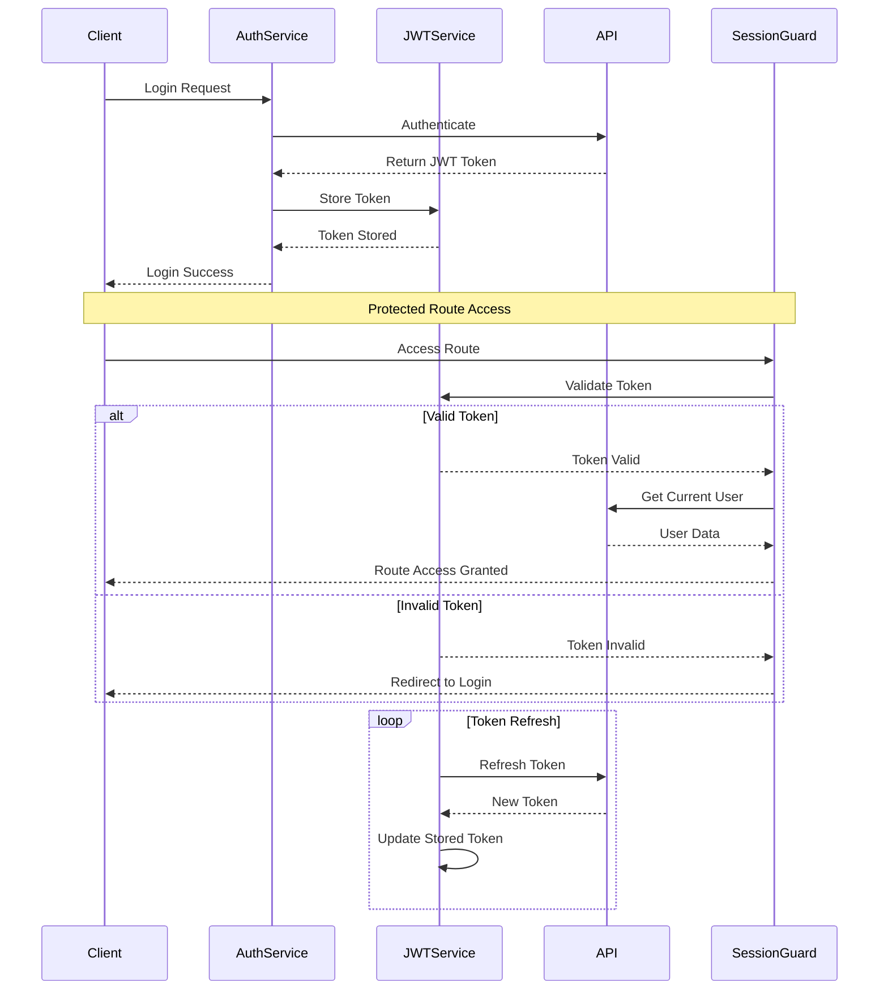

# Authentication Flow

## Overview
This diagram illustrates the authentication flow in the CMS, including JWT token management and session handling.

## Flow Diagram

## Authentication Steps

1. **Initial Login**
   - Client submits credentials
   - Server validates and returns JWT
   - Token stored in local storage
   - User redirected to dashboard

2. **Route Protection**
   - SessionGuard intercepts navigation
   - Token validation check
   - Current user verification
   - Route access control

3. **Token Management**
   - Automatic token refresh
   - Session persistence
   - Secure storage
   - Logout cleanup

## Document History

| Version | Date | Description |
|---------|------|-------------|
| 1.0 | March 13, 2024 | Initial authentication flow diagram | 