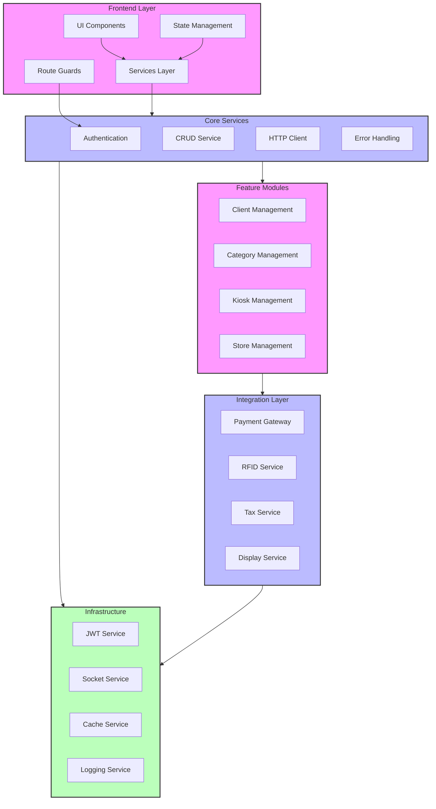

# System Architecture

## Overview
This diagram illustrates the overall system architecture of the CMS, including all major components and their interactions.

## Architecture Diagram

## Component Relationships

1. **Frontend Layer**
   - UI Components interact with Services Layer
   - Services Layer manages data flow
   - Route Guards protect navigation
   - State Management handles app state

2. **Core Services**
   - Authentication manages user sessions
   - CRUD Service handles data operations
   - HTTP Client manages API communication
   - Error Handling provides global error management

3. **Feature Modules**
   - Client Management for user/client data
   - Category Management for product categories
   - Kiosk Management for display systems
   - Store Management for retail locations

4. **Integration Layer**
   - Payment Gateway for transactions
   - RFID Service for product tracking
   - Tax Service for calculations
   - Display Service for kiosk management

5. **Infrastructure**
   - JWT Service for token management
   - Socket Service for real-time updates
   - Cache Service for data caching
   - Logging Service for system monitoring

## Dependencies

- Angular 13+
- RxJS
- NgRx
- Socket.io-client
- @auth0/angular-jwt

## Document History

| Version | Date | Description |
|---------|------|-------------|
| 1.0 | March 13, 2024 | Initial system architecture diagram | 