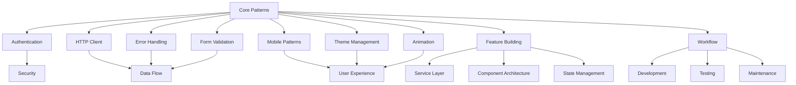
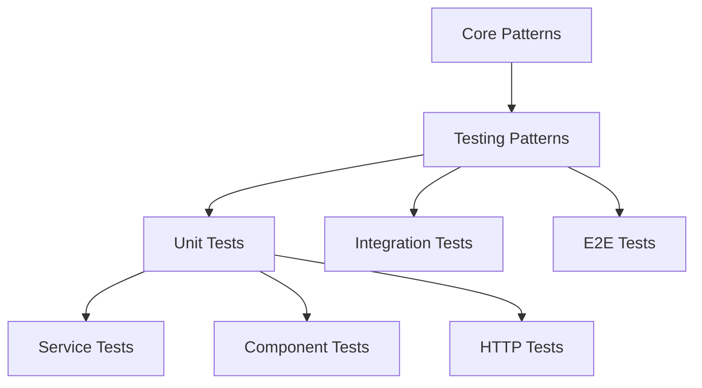

[Home](../../README.md) > Implementation Patterns

# Implementation Patterns
Version: 2.1
Last Updated: March 13, 2024

This document serves as an index for the core implementation patterns used in the CMS application.

## Core Patterns

### Authentication Patterns
- Token-based authentication
- Session management
- Access control
- Security best practices

### HTTP Client Patterns
- Request interceptors
- Response transformers
- Error handling
- Caching strategies

### Error Handling Patterns
- Global error interception
- Form validation errors
- Business logic errors
- Error recovery strategies

### Form Validation Patterns
- Field-level validation
- Form-level validation
- Remote validation
- Error display patterns

### Mobile Patterns
- Screen size detection
- Touch interactions
- Responsive navigation
- Mobile-first design
- Touch event handling
- Component adaptation

### Theme Management Patterns
- Theme Provider integration
- Color scheme management
- Typography system
- Responsive breakpoints
- Dynamic theme switching
- Accessibility compliance

### Animation Patterns
- Global transitions
- View animations
- Loading animations
- State-based animations
- Interactive feedback
- Performance optimization

### Feature Building
- Service layer patterns
- Component architecture
- State management
- Implementation workflow
- Best practices
- Common patterns

### Workflow Patterns
- Debugging workflows
  - Debug mode setup
  - State visualization
  - Service monitoring
  - Performance tracking
- Development workflows
  - Feature planning
  - Implementation process
  - Code organization
  - Testing integration
- Testing workflows
  - Unit testing
  - Integration testing
  - E2E testing
  - Performance testing
- Maintenance workflows
  - Code maintenance
  - Performance monitoring
  - Error tracking
  - Quality checks

## Common Implementation Features
- Modular architecture
- Dependency injection
- Error handling
- Mobile optimization
- Theme consistency
- Responsive design
- Animation system
- Test Coverage and Quality

## Pattern Relationships

## Document History
- Version 1.0 (March 13, 2024): Initial documentation structure
- Version 1.1 (March 13, 2024): Added error handling patterns
- Version 1.2 (March 13, 2024): Added form validation patterns
- Version 1.3 (March 13, 2024): Updated core implementation features
- Version 1.4 (March 13, 2024): Added mobile patterns
- Version 1.5 (March 13, 2024): Updated pattern relationships
- Version 1.6 (March 13, 2024): Added theme management patterns and Testing Patterns section
- Version 1.7 (March 13, 2024): Added animation patterns
- Version 1.8 (March 13, 2024): Added documentation improvement plan
- Version 1.9 (March 13, 2024): Added reference to error handling guide
- Version 2.0 (March 13, 2024): Added feature building patterns documentation
- Version 2.1 (March 13, 2024): Added workflow patterns documentation

## Testing Patterns
- Unit Testing
  - Service Testing
  - Component Testing
  - HTTP Testing
- Test Implementation
  - Mock Services
  - Test Utilities
  - Test Data Factory
- Best Practices
  - Test Organization
  - Coverage Guidelines
  - Maintenance
  - Performance

## Pattern Relationships

## Documentation Improvement Plan

### 1. Bug Fixing Enhancement (Target: 9/10)
#### A. Error Handling Guide
1. Core Error Patterns
   - HTTP error interceptors from CrudService
   - Service-level error handling
   - Form validation errors
   - Remote error processing

2. Debugging Workflows
   - Type safety checks
   - Error state management
   - Service hierarchy debugging
   - Component lifecycle debugging

3. Testing Framework Guide
   - Service testing patterns
   - Component testing patterns
   - Error scenario coverage
   - Integration test patterns

#### B. Troubleshooting Patterns
1. Common Error Scenarios
   - API integration errors
   - Form validation failures
   - State management issues
   - Component lifecycle problems

2. Debug Tools Integration
   - Browser DevTools usage
   - Angular debugging tools
   - RxJS debugging
   - Network request debugging

### 2. Feature Building Enhancement (Target: 9/10)
#### A. Service Layer Guide
1. CrudService Extensions
   - Type-safe implementations
   - Resource management
   - Custom endpoints
   - State management

2. Component Architecture
   - Base component patterns
   - List component patterns
   - Form component patterns
   - State management patterns

3. Business Logic Implementation
   - Category management patterns
   - Product management patterns
   - Store integration patterns
   - Data flow patterns

#### B. Implementation Workflows
1. Feature Planning
   - Component hierarchy design
   - Service layer design
   - State management design
   - API integration design

2. Development Patterns
   - Service implementation
   - Component implementation
   - Testing implementation
   - Documentation

## Implementation Timeline
1. Phase 1: Error Handling Documentation
   - Error interceptor patterns
   - Service error patterns
   - Component error patterns
   - Testing patterns

2. Phase 2: Feature Building Documentation
   - Service layer patterns
   - Component patterns
   - Business logic patterns
   - Integration patterns

3. Phase 3: Workflow Documentation
   - Debug workflows
   - Development workflows
   - Testing workflows
   - Documentation workflows
