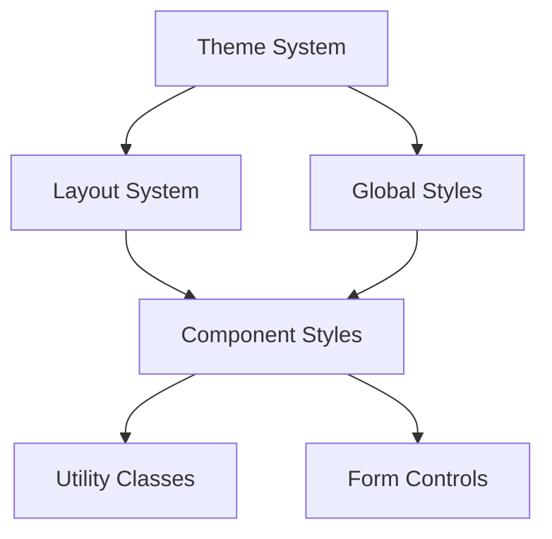

# Pattern Relationships

#[section:pattern-relationships]
#[type:ai-rules]
#[complexity:high]
#[confidence:0.90]

## Overview
This document defines the relationships between different style patterns and their dependencies, helping AI agents understand the interconnected nature of style transformations.

## Theme Dependencies

- Color schemes
- Typography scales
- Spacing units
- Breakpoints

## Component Dependencies

- Shared styles
- Theme variables
- Layout patterns
- Utility classes

## Layout Dependencies

- Grid system
- Flexbox patterns
- Positioning rules
- Responsive breakpoints

## Utility Dependencies

- Color utilities
- Spacing helpers
- Typography classes
- Layout utilities

## Pattern Dependencies

```yaml
dependencies:
  theme:
    provides:
      - colors
      - typography
      - spacing
      - breakpoints
    consumed_by:
      - components
      - utilities
      - layouts
    migration_order: 1

  layout:
    provides:
      - grid_system
      - flex_patterns
      - spacing_utilities
    consumed_by:
      - components
      - pages
    migration_order: 2

  components:
    provides:
      - styled_elements
      - form_controls
      - buttons
    consumed_by:
      - pages
      - features
    migration_order: 3
```

## Pattern Inheritance

```yaml
inheritance:
  base_styles:
    - global_reset
    - typography_base
    - color_schemes
    
  component_base:
    extends: base_styles
    adds:
      - component_specific_reset
      - theme_context
    
  form_controls:
    extends: component_base
    adds:
      - form_validation
      - input_states
```

## Pattern Conflicts

```yaml
conflicts:
  theme_variables:
    with: inline_styles
    resolution: "prefer theme variables"
    
  global_styles:
    with: scoped_styles
    resolution: "convert to styled-components"
    
  utility_classes:
    with: css_in_js
    resolution: "create styled utility components"
```

## Migration Order



## Pattern Transformations

```yaml
transformations:
  theme_variables:
    before:
      type: "SCSS"
      pattern: "$primary-color: #007bff;"
    after:
      type: "TypeScript"
      pattern: "export const theme = { colors: { primary: '#007bff' } }"
    dependencies:
      - ThemeProvider
      - styled-components

  component_styles:
    before:
      type: "SCSS"
      pattern: |
        .component {
          @include theme-colors;
          padding: $spacing-unit;
        }
    after:
      type: "TypeScript"
      pattern: |
        const StyledComponent = styled.div`
          ${props => props.theme.colors};
          padding: ${props => props.theme.spacing.unit};
        `
    dependencies:
      - theme
      - styled-components
```

## Validation Matrix

```yaml
validation:
  theme_consistency:
    check: "all theme variables are properly transformed"
    severity: "error"
    
  component_isolation:
    check: "no style leakage between components"
    severity: "error"
    
  accessibility:
    check: "color contrast and typography scales maintained"
    severity: "warning"
```

## Success Metrics

```yaml
metrics:
  pattern_coverage:
    threshold: 0.95
    measurement: "percentage of patterns successfully transformed"
    
  style_consistency:
    threshold: 0.90
    measurement: "consistency of theme usage across components"
    
  performance:
    threshold: "< 100ms"
    measurement: "style calculation and application time"
```

## AI Agent Guidelines

1. **Order of Operations**
   - Always transform theme variables first
   - Handle global styles before component-specific styles
   - Transform layout patterns before dependent components

2. **Conflict Resolution**
   - Prefer theme variables over hard-coded values
   - Convert global styles to component-scoped styles
   - Use styled-components for utility classes

3. **Validation Steps**
   - Verify theme consistency
   - Check component isolation
   - Validate accessibility standards
   - Measure performance metrics 