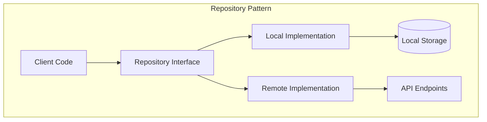
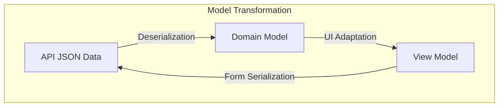
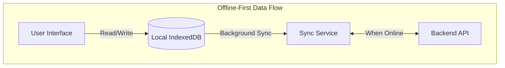
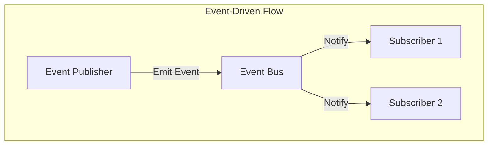
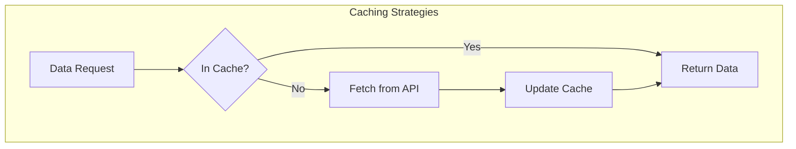

# Data Flow Patterns

## Overview
This document identifies and analyzes common patterns in data flows across the three repositories (Backend, Frontend, and CMS). It synthesizes findings from previous data flow analyses including transformation, storage, caching, and queue patterns to provide a comprehensive view of how data moves through the system.

**Sources Reviewed:**
- [Transform Analysis](../../data-flows/transforms/transform-analysis.md)
- [Storage Analysis](../../data-flows/storage/storage-analysis.md) 
- [Cache Analysis](../../data-flows/cache/cache-analysis.md)
- [Source/Sink Mapping](../../data-flows/mapping/source-sink-mapping.md)
- Source code implementation across repositories

## Key Pattern Categories

### 1. Repository Pattern
The system implements a consistent Repository Pattern across repositories to abstract data access and transformation.

#### Pattern Implementation


**Frontend Implementation:**
```javascript
// src/api/repo.js
export class Repo {
  remote
  local
  dataName = ''

  constructor (remote, local, dataName) {
    this.remote = remote
    this.local = local
    this.dataName = dataName
  }

  index (options = {}) {
    return new Observable(async (subscriber) => {
      try {
        // Get from remote, update local, notify subscribers
        let items = await this.remote.index(options)
        subscriber.next(items)
        // Update local cache
        items = await this.updateLocalItems(items)
        subscriber.next(items)
        subscriber.complete()
      } catch (e) {
        // Fallback to local on failure
        let items = await this.local.index()
        subscriber.next(items)
      }
    })
  }
}
```

**CMS Implementation:**
```typescript
// Angular services follow repository pattern
@Injectable()
export class ProductService extends CrudService<Product> {
  constructor(http: HttpClient) {
    super(http, 'products');
  }
  
  // Specialized methods for products
  forCategory(categoryId: number): Observable<Pagination<Product>> {
    return this.http.get<any>(`${this.endpoint}?category_id=${categoryId}`)
      .pipe(map(response => new Pagination<Product>(response, Product)));
  }
}
```

**Backend Implementation:**
```ruby
# Backend uses Controller/Model separation with ActiveModel Serializers
class Api::V1::ProductsController < Api::V1::ApplicationController
  def index
    products = Product.all
    render json: products, each_serializer: ProductSerializer
  end
end
```

#### Benefits
- **Consistent Data Access:** Standardized approach to data retrieval
- **Abstraction:** Client code doesn't need to know data source
- **Testability:** Easy to mock repositories for testing
- **Offline Support:** Seamless fallback to local data on network failure

#### Challenges
- **Synchronization:** Keeping local and remote data in sync
- **Conflict Resolution:** Handling conflicts between local and remote data
- **Implementation Overhead:** Requires separate implementations for each data source

### 2. Model Transformation Pattern
The system employs specific patterns for transforming data between different representations.

#### Pattern Implementation


**Backend (Rails):**
```ruby
# ActiveModel Serializers for API responses
class StoreProductSerializer < ActiveModel::Serializer
  attributes :id, :sku, :name, :weight, :tag_list
  belongs_to :product_variant
  belongs_to :brand
  
  # Custom transformations
  def store_taxes
    object.store.store_taxes.map(&:itself)
  end
end
```

**Frontend (Vue):**
```javascript
// Transformation in component methods
parseProducts: function() {
  var products = Object.values(this.fetchedProducts)
  
  products.forEach(function(product) {
    // Transform API data to view model
    product.isFeatured = product.featured || 
      product.tag_list.includes('featured')
      
    // Create derived data
    if (tagsPerCategories[product.catalog_category.id] === undefined) {
      tagsPerCategories[product.catalog_category.id] = []
    }
  })
}
```

**CMS (Angular):**
```typescript
// Type-safe model transformations
export class AttributeDef {
  id: number;
  name: string;
  restricted: boolean;
  values: string[] = [];

  constructor(json: any) {
    this.id = json.id;
    this.name = json.name;
    this.restricted = json.restricted;
    this.values = json.values || [];
    this.group = new AttributeGroup(json.attribute_group || {});
  }
}
```

#### Benefits
- **Type Safety:** Especially in Angular with TypeScript
- **Data Validation:** Validation during transformation
- **Separation of Concerns:** API format separated from UI format
- **Computed Properties:** Derived data calculated during transformation

#### Challenges
- **Duplication:** Similar transformation logic in multiple places
- **Consistency:** Maintaining consistent transformations
- **Performance:** Complex transformations can impact performance
- **Versioning:** Adapting to API schema changes

### 3. Offline-First Data Flow Pattern
The frontend implements an offline-first approach to data flow, prioritizing local data access with asynchronous syncing.

#### Pattern Implementation


**Local Cache Configuration:**
```javascript
// src/api/db.js
const dbConfig = {
  name: 'local',
  stores: [
    {
      name: 'brands',
      keyPath: 'id'
    },
    {
      name: 'categories',
      keyPath: 'id'
    },
    {
      name: 'products',
      keyPath: 'id'
    }
  ]
}
```

**Sync Implementation:**
```javascript
// Updates local items from remote data
updateLocalItems (remoteItems) {
  return new Promise(async (resolve) => {
    let localItems = await this.local.index()
    let toDelete = []
    
    // Delete items not found in remote
    if (remoteItems && remoteItems.length > 0) {
      localItems.forEach(item => {
        const exist = remoteItems.find(b => b.id === item.id)
        if (exist === undefined) {
          toDelete.push(item)
        }
      })
      
      // Update all remote items to local
      remoteItems.forEach(async (item) => {
        await this.local.save(item)
      })
    }

    // Delete removed items
    toDelete.forEach(item => {
      this.local.delete(item)
    })
    
    // Return updated local items
    let items = await this.local.index()
    resolve(items)
  })
}
```

#### Benefits
- **Resilience:** Application works offline
- **Performance:** Fast local data access
- **User Experience:** No loading states for cached data
- **Battery Efficiency:** Reduced network calls

#### Challenges
- **Sync Conflicts:** Resolving conflicts between local and remote
- **Stale Data:** Local data may become outdated
- **Storage Limits:** Browser storage limitations
- **Complexity:** Additional sync logic required

### 4. Event-Driven Data Flow Pattern
The system uses event-driven architecture for certain data flows, particularly for realtime updates.

#### Pattern Implementation


**Frontend Implementation:**
```javascript
// Event-based communication between components
export default {
  methods: {
    onProductSelected(product) {
      // Emit event to parent components
      this.$emit('product-selected', product)
    }
  },
  created() {
    // Listen for events from child components
    this.$on('cart-updated', this.refreshCart)
  }
}
```

**CMS Implementation:**
```typescript
// RxJS-based event communication
@Injectable()
export class ProductEventService {
  private productUpdated = new Subject<Product>();
  
  productUpdated$ = this.productUpdated.asObservable();
  
  notifyProductUpdate(product: Product) {
    this.productUpdated.next(product);
  }
}

// Component subscribes to events
this.productEvent.productUpdated$
  .pipe(takeUntil(this.destroyed$))
  .subscribe(product => {
    this.refreshProductList();
  });
```

#### Benefits
- **Loose Coupling:** Components don't need direct references
- **Scalability:** Easy to add new subscribers
- **Flexibility:** Publishers don't know who's listening
- **Reactivity:** UI updates automatically with data changes

#### Challenges
- **Debugging:** Hard to trace event flows
- **Complexity:** Can create "event soup" if overused
- **Memory Leaks:** Forgotten subscriptions cause leaks
- **Order Dependency:** Events may arrive in unexpected order

### 5. Caching Strategy Pattern
The system implements various caching strategies for different data types.

#### Pattern Implementation


**Frontend Implementation:**
```javascript
// localStorage for configuration
localStorage.setItem('kiosk_config', JSON.stringify(mergedConfig))

// IndexedDB for product data
async save (item) {
  return new Promise((resolve, reject) => {
    try {
      const store = this.db.transaction(this.storeName, 'readwrite').objectStore(this.storeName)
      const request = store.put(item)

      request.onsuccess = (event) => {
        resolve(item)
      }

      request.onerror = (event) => {
        reject(event)
      }
    } catch (e) {
      reject(e)
    }
  })
}
```

**Backend Implementation:**
```ruby
# Redis caching for API responses
Rails.application.configure do
  config.cache_store = :redis_store, ENV['REDIS_URL']
  config.action_controller.perform_caching = true
end

# Controller with caching
def index
  products = Rails.cache.fetch("products", expires_in: 1.hour) do
    Product.all.to_a
  end
  render json: products
end
```

#### Benefits
- **Performance:** Faster data access
- **Reduced Load:** Less backend API load
- **Offline Support:** Access to data without network
- **Battery Efficiency:** Fewer network requests on mobile

#### Challenges
- **Invalidation:** When to invalidate cache entries
- **Staleness:** Cached data may become outdated
- **Storage Limits:** Browser/memory storage limitations
- **Complexity:** Cache management logic required

## Anti-Patterns Identified

### 1. Inconsistent Data Transformation
The system sometimes applies inconsistent transformation logic across repositories.

**Example:**
- Backend uses snake_case (Ruby convention)
- Frontend expects camelCase (JavaScript convention)
- Manual transformation required in multiple places

**Impact:**
- Error-prone manual transformations
- Duplicated transformation logic
- Maintenance overhead when API changes

**Recommended Pattern:**
- Adopt consistent transformation libraries
- Centralize transformation logic
- Implement automated tests for transformations

### 2. Direct API Access Bypass
Some components bypass the repository pattern and access APIs directly.

**Example:**
```javascript
// Direct API call bypassing repository
axios.get('/api/v1/products')
  .then(response => {
    this.products = response.data.products
  })
```

**Impact:**
- Inconsistent caching
- No offline support
- Duplicate business logic
- Harder testing

**Recommended Pattern:**
- Consistently use repository pattern
- Abstract API access behind services
- Enforce through code reviews

### 3. Excessive Data Transformation
Some components perform excessive or redundant data transformations.

**Example:**
```javascript
// Multiple transformations of the same data
const products = this.rawProducts.map(p => ({
  id: p.id,
  name: p.name,
  // Transform to component format
}))

// Later in another component
const displayProducts = products.map(p => ({
  id: p.id,
  displayName: p.name,
  // Transform again to display format
}))
```

**Impact:**
- Performance overhead
- Memory consumption
- Increased complexity
- Potential inconsistencies

**Recommended Pattern:**
- Single source of truth for data
- Transform once, close to data source
- Use memoization for derived properties

## Best Practice Recommendations

### 1. Standardize Transformation Approach
- **Recommendation:** Implement consistent transformation libraries
- **Implementation:**
  - Backend: Continue using ActiveModel Serializers with consistent attribute selection
  - Frontend: Create dedicated transformation services
  - CMS: Leverage TypeScript interfaces for type-safe transformations

### 2. Enhance Repository Pattern
- **Recommendation:** Extend and enforce repository pattern usage
- **Implementation:**
  - Create base repository classes
  - Implement consistent caching strategies
  - Add conflict resolution mechanisms
  - Enforce usage through code reviews

### 3. Optimize Offline-First Strategy
- **Recommendation:** Improve offline capabilities and sync
- **Implementation:**
  - Implement queue for offline changes
  - Add conflict resolution UI
  - Optimize storage usage
  - Add data expiration policies

### 4. Implement Cross-Repository Schema Validation
- **Recommendation:** Add schema validation for data flows
- **Implementation:**
  - Define JSON schema for API
  - Validate input/output in repositories
  - Create TypeScript interfaces matching schema
  - Add runtime validation in JavaScript

### 5. Document Data Flow Patterns
- **Recommendation:** Maintain data flow documentation
- **Implementation:**
  - Create flow diagrams for major data paths
  - Document transformation logic
  - Provide examples for common patterns
  - Update documentation with schema changes

## Cross-References
- Related to: [Integration Patterns](../integration/integration-patterns.md)
- Related to: [Dependency Patterns](../dependencies/dependency-patterns.md)
- Related to: [Security Patterns](../security/security-patterns.md)
- Related to: [Transform Analysis](../../data-flows/transforms/transform-analysis.md)

## Version History
- 1.0.0 (2024-03-22): Initial data flow patterns document created 