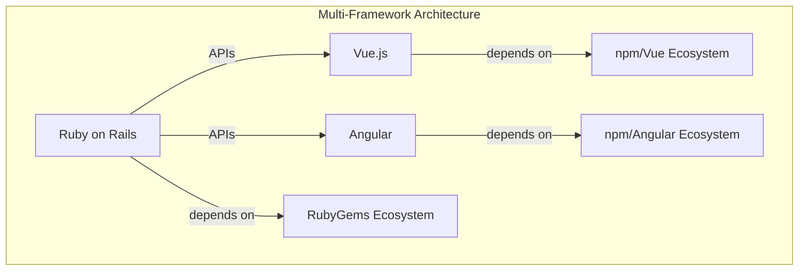
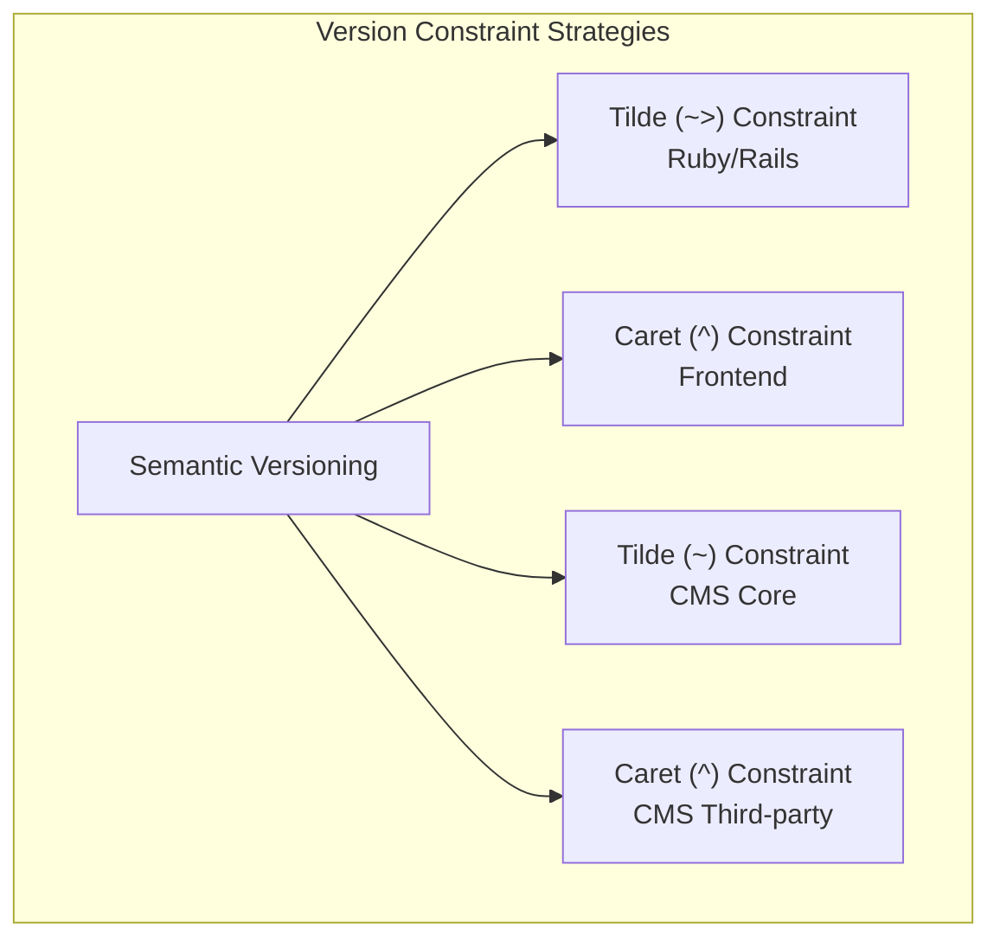
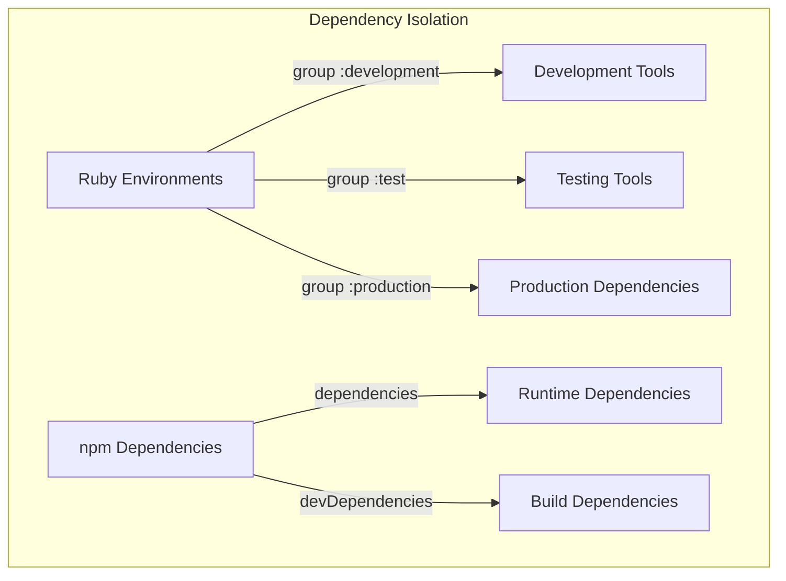
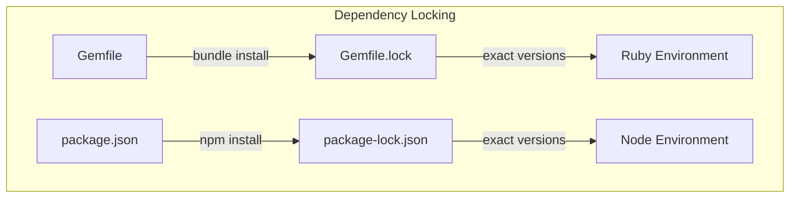
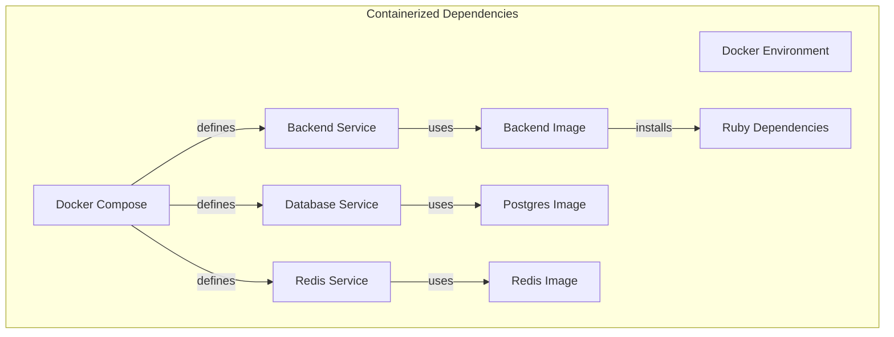
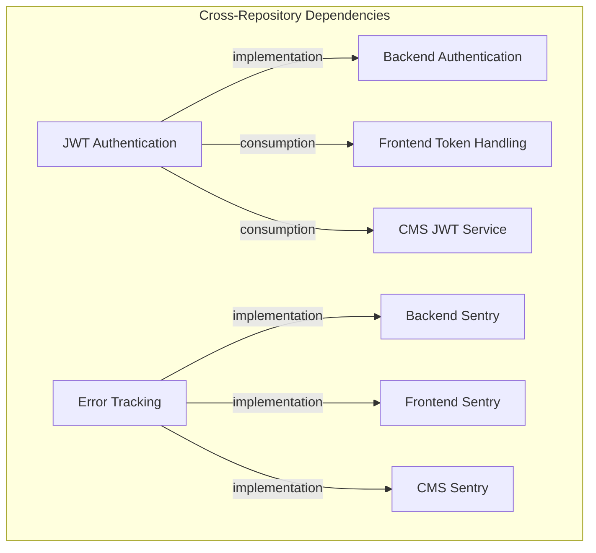

# Dependency Patterns

## Overview
This document identifies and analyzes common dependency management patterns across the three repositories (Backend, Frontend, and CMS). It synthesizes findings from previous dependency analyses to provide a comprehensive view of how dependencies are defined, managed, and maintained throughout the system.

**Sources Reviewed:**
- [Dependency Management Analysis](../../detailed-analysis/dependency-management-findings.md)
- [Package Version Analysis](../../detailed-analysis/package-version-analysis.md)
- [Transitive Dependencies Analysis](../../detailed-analysis/transitive-dependencies.md)
- [Dependency Update Strategy](../../detailed-analysis/dependency-update-strategy.md)
- Source code implementation across repositories

## Key Dependency Pattern Categories

### 1. Multi-Framework Dependency Pattern
The system implements a multi-framework architecture with different dependency ecosystems across repositories.

#### Pattern Implementation


**Backend Implementation (Ruby/Rails):**
```ruby
# Gemfile
source 'https://rubygems.org'
ruby '~> 3.0.0'

gem 'rails', '~> 6.1.0'
gem 'pg'
gem 'puma', '~> 5.6'
gem 'active_model_serializers', '~> 0.10.0'
gem 'knock'
gem 'sidekiq'
```

**Frontend Implementation (Vue.js):**
```json
// package.json
{
  "dependencies": {
    "vue": "^2.5.2",
    "vue-router": "^3.0.1",
    "vuex": "^3.6.2",
    "axios": "^0.18.0",
    "dexie": "^3.2.0"
  },
  "engines": {
    "node": ">= 14.0.0",
    "npm": ">= 6.0.0"
  },
  "volta": {
    "node": "14.20.1"
  }
}
```

**CMS Implementation (Angular):**
```json
// package.json
{
  "dependencies": {
    "@angular/core": "~8.2.14",
    "@angular/forms": "~8.2.14",
    "@angular/router": "~8.2.14",
    "@auth0/angular-jwt": "^3.0.1",
    "rxjs": "~6.5.4",
    "bootstrap": "^4.4.1"
  }
}
```

#### Benefits
- **Specialized Tooling:** Each repository uses framework-optimized libraries
- **Independent Evolution:** Repositories can evolve at different rates
- **Clear Separation:** Well-defined boundaries between systems
- **Technology Optimization:** Best-fit technologies for each component

#### Challenges
- **Knowledge Fragmentation:** Developers need expertise in multiple ecosystems
- **Dependency Duplication:** Similar functionality implemented with different libraries
- **Coordination Overhead:** Framework upgrades require cross-repository coordination
- **Inconsistent Patterns:** Different dependency management approaches across repositories

### 2. Version Constraint Pattern
The system implements different versioning strategies for dependency constraints across repositories.

#### Pattern Implementation


**Backend Implementation (Ruby):**
```ruby
# Strict major.minor version constraints (allows patch updates)
ruby '~> 3.0.0'              # Allows 3.0.x, not 3.1.0
gem 'rails', '~> 6.1.0'       # Allows 6.1.x, not 6.2.0
gem 'puma', '~> 5.6'          # Allows 5.6.x, not 5.7.0

# No version constraints (latest available)
gem 'pg'                     # Any version
gem 'knock'                  # Any version
```

**Frontend Implementation (npm):**
```json
{
  "dependencies": {
    "vue": "^2.5.2",          // Allows 2.5.2 to <3.0.0
    "axios": "^0.18.0",       // Allows 0.18.0 to <0.19.0
    "firebase": "^9.6.9"      // Allows 9.6.9 to <10.0.0
  }
}
```

**CMS Implementation (Angular):**
```json
{
  "dependencies": {
    "@angular/core": "~8.2.14",    // Allows 8.2.14 to <8.3.0
    "@angular/forms": "~8.2.14",   // Allows 8.2.14 to <8.3.0
    "bootstrap": "^4.4.1",         // Allows 4.4.1 to <5.0.0
    "rxjs": "~6.5.4"               // Allows 6.5.4 to <6.6.0
  }
}
```

#### Benefits
- **Update Flexibility Control:** Different constraints for different types of dependencies
- **Core Framework Stability:** Stricter constraints on core frameworks
- **Security Patching:** Allows patch updates for security fixes
- **Ecosystem Alignment:** Constraint patterns match ecosystem conventions

#### Challenges
- **Inconsistent Approaches:** Different constraint strategies between repositories
- **Overly Permissive:** Some dependencies allow too many updates
- **Dependency Resolution Complexity:** Different constraint types require different resolution strategies
- **Version Drift:** Flexible constraints may lead to environment differences

### 3. Dependency Isolation Pattern
The system implements isolation between runtime and development dependencies.

#### Pattern Implementation


**Backend Implementation (Ruby):**
```ruby
# Production dependencies
gem 'rails', '~> 6.1.0'
gem 'pg'
gem 'puma', '~> 5.6'

# Development dependencies
group :development, :test do
  gem 'byebug'
  gem 'rspec-rails', '~> 5.0'
  gem 'factory_bot_rails', '~> 6.2'
end

# Development-only dependencies
group :development do
  gem 'listen', '~> 3.3'
  gem 'rubocop-rails', require: false
end

# Test-only dependencies
group :test do
  gem 'simplecov'
  gem 'database_cleaner-active_record'
end
```

**Frontend/CMS Implementation (npm):**
```json
{
  "dependencies": {
    "vue": "^2.5.2",
    "axios": "^0.18.0"
  },
  "devDependencies": {
    "babel-core": "^6.22.1",
    "eslint": "^4.15.0",
    "webpack": "^3.6.0",
    "jest": "^22.0.4"
  }
}
```

#### Benefits
- **Clear Separation:** Runtime vs. development dependencies clearly separated
- **Minimal Production Footprint:** Production environments only include necessary dependencies
- **Environment Optimization:** Development-specific tools only installed when needed
- **Deployment Efficiency:** Smaller dependency footprint in production

#### Challenges
- **Configuration Complexity:** Requires proper environment configuration
- **Environment Parity:** Development may not exactly match production
- **Dependency Switching:** Some dependencies might be needed in multiple environments
- **Testing Accuracy:** Test environments need to closely match production

### 4. Dependency Lock Pattern
The system implements dependency locking to ensure consistent environments.

#### Pattern Implementation


**Backend Implementation (Gemfile.lock):**
```ruby
GEM
  remote: https://rubygems.org/
  specs:
    actioncable (6.1.7.10)
      actionpack (= 6.1.7.10)
      activesupport (= 6.1.7.10)
      nio4r (~> 2.0)
      websocket-driver (>= 0.6.1)
    # Many more exact gem versions...
    
PLATFORMS
  x86_64-darwin-21
  x86_64-linux

RUBY VERSION
   ruby 3.0.6p216

BUNDLED WITH
   2.4.10
```

**Frontend/CMS Implementation (package-lock.json):**
```json
{
  "name": "tpb-kiosk",
  "version": "1.0.0",
  "lockfileVersion": 2,
  "requires": true,
  "packages": {
    "": {
      "name": "tpb-kiosk",
      "version": "1.0.0",
      "dependencies": {
        "vue": "^2.5.2",
        "axios": "^0.18.0"
      }
    },
    "node_modules/vue": {
      "version": "2.5.17",
      "resolved": "https://registry.npmjs.org/vue/-/vue-2.5.17.tgz",
      "integrity": "sha512-mFbG3..."
    }
    // Many more exact dependency versions...
  }
}
```

#### Benefits
- **Reproducible Environments:** Exact versions ensure consistent installs
- **Dependency Resolution:** Pre-resolved dependency tree prevents "works on my machine"
- **Stability:** Protection against unexpected updates
- **Conflict Prevention:** Prevents dependency resolution conflicts

#### Challenges
- **Size Concerns:** Lock files can become very large
- **Merge Conflicts:** Frequent lock file changes can lead to merge conflicts
- **Update Complexity:** Updating single dependencies requires lock file regeneration
- **Transitive Dependency Risks:** Changes to sub-dependencies may be hidden

### 5. Containerized Dependency Pattern
The system implements containerization to standardize development environments.

#### Pattern Implementation


**Docker Implementation:**
```yaml
# docker-compose.yml
version: '3'
services:
  web:
    build: .
    environment:
      - DATABASE_URL=postgres://postgres:postgres@db:5432/tpb_development
      - REDIS_URL=redis://redis:6379/0
    volumes:
      - .:/app
    ports:
      - "3000:3000"
    depends_on:
      - db
      - redis
    command: bundle exec rails s -p 3000 -b '0.0.0.0'

  db:
    image: postgres:13
    volumes:
      - postgres_data:/var/lib/postgresql/data
    environment:
      - POSTGRES_PASSWORD=postgres

  redis:
    image: redis:6
    volumes:
      - redis_data:/data

volumes:
  postgres_data:
  redis_data:
```

**Dockerfile Implementation:**
```dockerfile
FROM ruby:3.0.6

WORKDIR /app

# Install system dependencies
RUN apt-get update -qq && apt-get install -y nodejs postgresql-client

# Install Ruby dependencies
COPY Gemfile Gemfile.lock ./
RUN bundle install

# Copy application code
COPY . .

# Start the Rails server
CMD ["rails", "server", "-b", "0.0.0.0"]
```

#### Benefits
- **Environment Consistency:** Same dependencies across all development environments
- **Isolation:** Dependencies contained within containers
- **Dependency Documentation:** Infrastructure dependencies explicitly defined
- **Cross-Platform Compatibility:** Works consistently across different operating systems

#### Challenges
- **Resource Overhead:** Containers add system resource requirements
- **Complexity:** Additional docker configuration needed
- **Performance:** Slower file system on some platforms
- **Learning Curve:** Developers need Docker expertise

### 6. Cross-Repository Shared Dependency Pattern
The system implements shared dependencies across repositories for consistent functionality.

#### Pattern Implementation


**Backend Implementation:**
```ruby
# Authentication
gem 'knock'
gem 'jwt'
gem 'bcrypt'

# Error tracking
gem 'sentry-ruby'
gem 'sentry-rails'

# File storage
gem 'aws-sdk-s3'
```

**Frontend Implementation:**
```json
{
  "dependencies": {
    "axios": "^0.18.0",
    "@sentry/vue": "^5.28.0",
    "aws-sdk": "^2.231.1"
  }
}
```

**CMS Implementation:**
```json
{
  "dependencies": {
    "@auth0/angular-jwt": "^3.0.1",
    "@sentry/angular": "^5.30.0"
  }
}
```

#### Benefits
- **Consistent Functionality:** Same core services across repositories
- **Knowledge Reuse:** Developers can apply knowledge across repositories
- **Service Compatibility:** APIs and services designed for cross-repository use
- **Centralized Management:** Core dependencies managed as logical units

#### Challenges
- **Version Synchronization:** Keeping versions compatible across repositories
- **Implementation Differences:** Different libraries for same functionality
- **Update Coordination:** Updates require cross-repository coordination
- **Knowledge Requirements:** Developers need to understand multiple implementations

## Common Anti-Patterns

### 1. Outdated Framework Dependencies
Both frontend frameworks are on end-of-life versions.

**Example:**
```json
// Vue.js (EOL December 2023)
"vue": "^2.5.2"

// Angular (EOL November 2020)
"@angular/core": "~8.2.14"
```

**Impact:**
- Security vulnerabilities
- Missing modern features
- Reduced developer productivity
- Limited ecosystem compatibility

**Recommended Pattern:**
- Implement framework upgrade strategy
- Stay within active support windows
- Plan regular major version updates
- Maintain compatibility with ecosystem

### 2. Inconsistent Version Constraints
Some dependencies have overly permissive or missing version constraints.

**Example:**
```ruby
# No version constraints
gem 'pg'
gem 'knock'
gem 'bcrypt'
```

**Impact:**
- Unpredictable updates
- Potential breaking changes
- Environment inconsistencies
- Difficult debugging

**Recommended Pattern:**
- Use appropriate version constraints for all dependencies
- Follow ecosystem conventions for versioning
- Document version constraint policy
- Review constraints regularly

### 3. Dependency Duplication
Similar functionality implemented with different libraries across repositories.

**Example:**
- Backend uses Pusher gem
- Frontend uses Pusher-js
- CMS uses Socket.io

**Impact:**
- Knowledge fragmentation
- Inconsistent behavior
- Increased maintenance burden
- Wasted learning effort

**Recommended Pattern:**
- Standardize on common libraries where possible
- Document reasons for different implementations
- Create abstraction layers for consistent interfaces
- Manage technology transitions explicitly

## Best Practice Recommendations

### 1. Framework Upgrade Strategy
- **Recommendation:** Implement a regular framework upgrade strategy
- **Implementation:**
  - Plan Vue.js 2 to 3 migration
  - Plan Angular 8 to 15+ migration
  - Develop cross-repository testing strategy
  - Prioritize security updates

### 2. Dependency Governance
- **Recommendation:** Establish dependency governance policy
- **Implementation:**
  - Document version constraint strategy
  - Implement automated dependency scanning
  - Create approval process for new dependencies
  - Develop dependency update cadence

### 3. Container-Based Development
- **Recommendation:** Expand container-based development
- **Implementation:**
  - Standardize Docker configurations
  - Document container-based workflows
  - Create consistent environment variables
  - Implement multi-service Docker Compose

### 4. Shared Library Strategy
- **Recommendation:** Create shared library strategy for cross-repository functionality
- **Implementation:**
  - Identify common functionality
  - Create shared TypeScript/JavaScript libraries
  - Develop consistent API clients
  - Standardize authentication implementations

### 5. Dependency Monitoring
- **Recommendation:** Implement dependency monitoring
- **Implementation:**
  - Set up automated vulnerability scanning
  - Create dependency health dashboards
  - Schedule regular dependency reviews
  - Document dependency end-of-life dates

## Cross-References
- Related to: [Integration Patterns](../integration/integration-patterns.md)
- Related to: [Data Flow Patterns](../data-flows/data-flow-patterns.md)
- Related to: [Security Patterns](../security/security-patterns.md)
- Related to: [Deployment Patterns](../deployment/deployment-patterns.md)

## Version History
- 1.0.0 (2024-03-22): Initial dependency patterns document created 