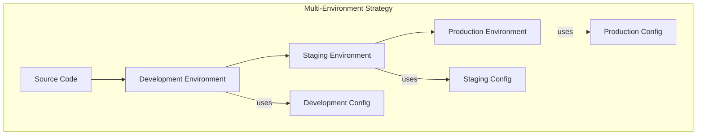
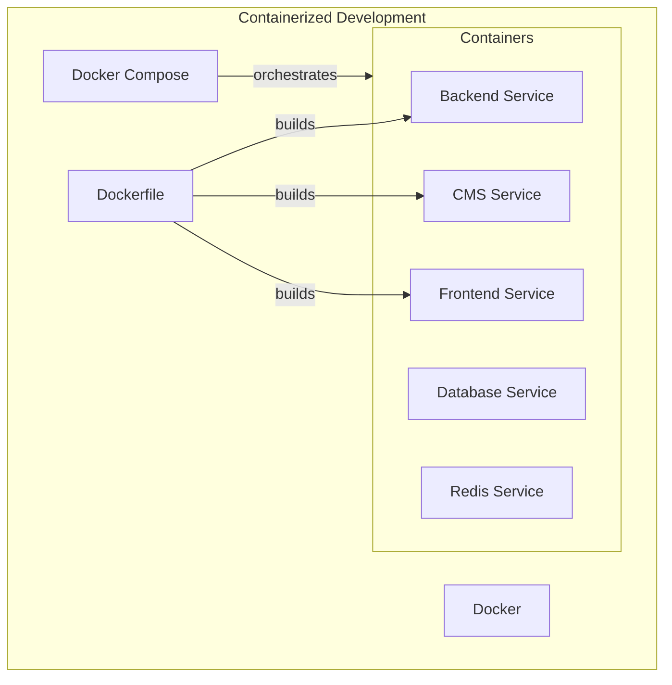
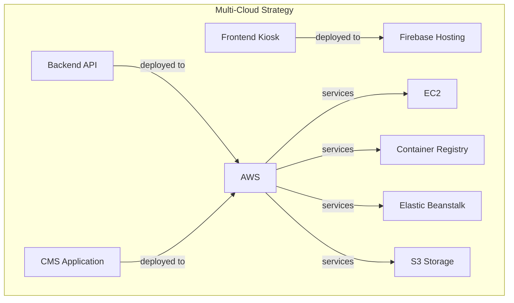
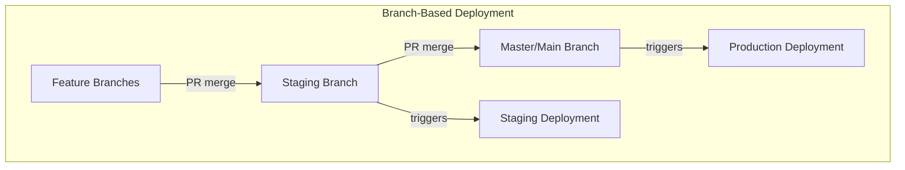
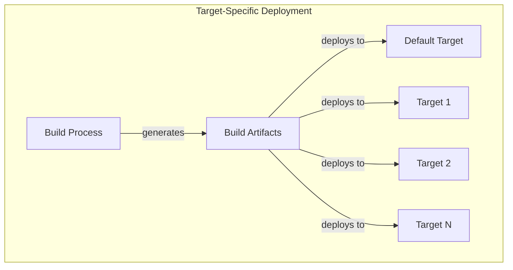
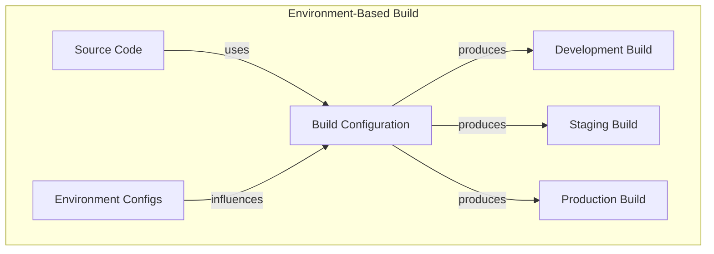
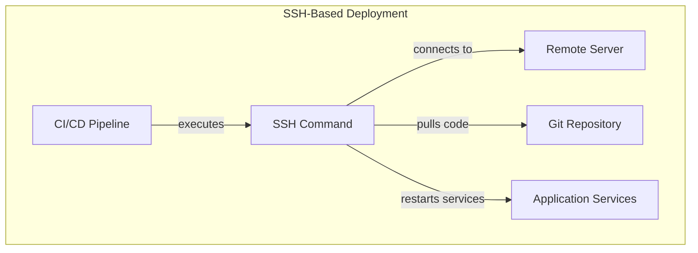

# Deployment Patterns

## Overview
This document identifies and analyzes deployment patterns implemented across the three repositories (Backend, Frontend, and CMS). It focuses on infrastructure configurations, containerization strategies, environment management, and CI/CD approaches used throughout the system.

**Sources Reviewed:**
- Docker configurations
- Build pipelines
- Environment configurations
- Deployment scripts
- Infrastructure setup
- Cross-repository deployment strategies

## Key Deployment Pattern Categories

### 1. Multi-Environment Deployment Pattern
The system implements a tiered environment approach with development, staging, and production environments.

#### Pattern Implementation


**Backend Implementation (Rails):**
```yaml
# bitbucket-pipelines.yml
pipelines:
  branches:
    # Production deployment
    master:
      - step:
          name: Build image and push to ECR
          deployment: Production
          # Configuration for production deployment

    # Staging deployment
    staging:
      - step:
          name: Updating API Staging
          script:
            - ssh -t centos@cms-stage.thepeakbeyond.com "cd /srv/cms && sudo systemctl stop puma && sudo systemctl stop sidekiq && git pull origin staging && bundle install && rails db:migrate && sudo systemctl start puma && sudo systemctl start sidekiq"
```

**CMS Implementation (Angular):**
```typescript
// Environment configuration for AWS production
// environment.aws.ts
export const environment = {
  production: true,
  apiUrl: 'https://api-prod.thepeakbeyond.com',
  rfidSensorUrl: 'http://localhost:3000',
  SENTRY_DSN: 'https://622aeb4aab07f48c64a53b53174fa50f@o410977.ingest.sentry.io/4506020893229056'
};

// Environment configuration for AWS staging
// environment.staging-aws.ts
export const environment = {
  production: true,
  apiUrl: 'https://tpb-api-stage.thepeakbeyond.com',
  rfidSensorUrl: 'http://localhost:3000',
  SENTRY_DSN: 'https://622aeb4aab07f48c64a53b53174fa50f@o410977.ingest.sentry.io/4506020893229056'
};
```

**Frontend Implementation (Vue.js):**
```javascript
// README.md configuration references
staging URL: `https://tpb-api-stage.thepeakbeyond.com/api/v1`
production URL: `https://api-prod.thepeakbeyond.com/api/v1`

// Configuration structure in config.js
URL: "http://localhost:3000/api/v1",
CATALOG_ID: 1,
TOKEN: "your-generated-token-here",
```

#### Benefits
- **Environment Isolation:** Separates development, testing, and production
- **Staged Releases:** Allows progressive validation before production
- **Configuration Separation:** Environment-specific settings kept separate
- **Risk Mitigation:** Issues caught before reaching production

#### Challenges
- **Configuration Drift:** Settings may not be identical across environments
- **Environment Maintenance:** Multiple environments to maintain
- **Deployment Complexity:** Additional coordination for promotion between environments
- **Resource Overhead:** Multiple environments require more resources

### 2. Containerized Development Pattern
The system implements Docker containerization for consistent local development.

#### Pattern Implementation


**Backend Implementation (Docker Compose):**
```yaml
# docker-compose.yml
version: '3.8'
services:
  db:
    image: postgres:12.19
    ports:
      - "5432:5432"
    environment:
      POSTGRES_USER: tpb
      POSTGRES_PASSWORD: tpb    
      POSTGRES_DB: tpb_api
    volumes:
      - ~/.postgres/data/tpb:/var/lib/postgresql/data
  redis:
      build:
        context: ./redis
      image: myredis
      privileged: true
      command: sh -c "./init.sh"      
      ports:
        - 6379:6379
  api:
    build: .
    command: bash -c "rm -f tmp/pids/server.pid && bundle exec rails s -p 3000 -b '0.0.0.0'"
    volumes:
      - .:/TPB-API
    ports:
      - "3000:3000"
    depends_on:
      - db
```

**CMS Implementation (Docker Compose):**
```yaml
# docker-compose.yml
version: "3.9"
services:
  web:
    build:
      context: ./
    volumes:
      - ./:/cms
      - /cms/node_modules
    ports:
      - "4200:4200"
```

**Frontend Implementation (Docker Compose):**
```yaml
# docker-compose.yml
version: "3.9"
services:
  web:
    build:
      context: ./
    volumes:
      - ./:/kiosk
      - /kiosk/node_modules
    ports:
      - "8080:8080"
    environment: 
      - CHOKIDAR_USEPOLLING=true
```

#### Benefits
- **Development Consistency:** Same environment for all developers
- **Quick Onboarding:** Fast setup of complete environment
- **Dependency Isolation:** Services run in isolated containers
- **Infrastructure as Code:** Environment definitions versioned with code

#### Challenges
- **Learning Curve:** Requires Docker knowledge
- **Performance Overhead:** Container usage can impact performance on some systems
- **Configuration Complexity:** Multiple configuration files to maintain
- **Resource Usage:** Uses more system resources than native development

### 3. Multi-Cloud Deployment Pattern
The system implements deployments to multiple cloud providers.

#### Pattern Implementation


**Backend Implementation (AWS):**
```yaml
# bitbucket-pipelines.yml - AWS deployment
- step:
    name: Build image and push to ECR
    deployment: Production
    image: amazon/aws-cli:2.3.3
    services:
      - docker
    script:
      - export BUILD_ID=$BITBUCKET_BRANCH_$BITBUCKET_COMMIT_$BITBUCKET_BUILD_NUMBER
      - docker build -t api-tpb-ecr .
      - pipe: atlassian/aws-ecr-push-image:1.6.2
        variables:
          AWS_ACCESS_KEY_ID: $AWS_ACCESS_KEY_ID
          AWS_SECRET_ACCESS_KEY: $AWS_SECRET_ACCESS_KEY
          AWS_DEFAULT_REGION: us-west-2
          IMAGE_NAME: api-tpb-ecr
          TAGS: latest $BUILD_ID

- step:
    name: "Deploy to Production"
    script:
      - pipe: atlassian/aws-elasticbeanstalk-deploy:0.2.3
        variables:
          AWS_ACCESS_KEY_ID: $AWS_ACCESS_KEY_ID
          AWS_SECRET_ACCESS_KEY: $AWS_SECRET_ACCESS_KEY
          AWS_DEFAULT_REGION: us-west-2
          APPLICATION_NAME: 'tpb-api-be'
          COMMAND: 'deploy-only'
          ENVIRONMENT_NAME: 'api-prod'
          VERSION_LABEL: 'api-prod-stable'
          WAIT: 'true'
```

**CMS Implementation (AWS):**
```yaml
# bitbucket-pipelines.yml - AWS deployment
- step:
    name: Deploy to AWS
    script:
      - export BITBUCKET_COMMIT_SHORT="${BITBUCKET_COMMIT::7}"
      - ssh -t centos@cms.thepeakbeyond.com "mv /var/www/cms-prod /var/www/cms-prod-$BITBUCKET_COMMIT_SHORT && mkdir /var/www/cms-prod/"
      - scp -r dist/ centos@cms.thepeakbeyond.com:/var/www/cms-prod
```

**Frontend Implementation (Firebase):**
```markdown
# Firebase deployment process from how-to-make-a-deploy.md
1. Add site in Firebase console
2. Configure .firebaserc and firebase.json files
3. Build the project with npm run build
4. Deploy with firebase deploy command
```

#### Benefits
- **Provider Flexibility:** Different services use appropriate providers
- **Service Optimization:** Each component uses best-fit cloud services
- **Risk Distribution:** Not dependent on a single cloud provider
- **Cost Optimization:** Can optimize costs across providers

#### Challenges
- **Management Complexity:** Multiple cloud providers to manage
- **Skill Requirements:** Team needs expertise in multiple cloud platforms
- **Integration Complexity:** More work to ensure cross-cloud compatibility
- **Credential Management:** Security credentials across multiple platforms

### 4. Branch-Based Deployment Pattern
The system implements automatic deployments based on Git branches.

#### Pattern Implementation


**Backend Implementation:**
```yaml
# bitbucket-pipelines.yml
pipelines:
  branches:
    master:
      # Steps for production deployment
    staging:
      # Steps for staging deployment
```

**CMS Implementation:**
```yaml
# bitbucket-pipelines.yml
pipelines:
  branches:
    main:
      # Steps for production deployment
    staging:
      # Steps for staging deployment
```

#### Benefits
- **Automated Flow:** Automatic deployment based on branch activity
- **Environment Alignment:** Branches mapped to environments
- **Process Enforcement:** Encourages proper staging workflow
- **Predictable Deployments:** Clear path from code to deployment

#### Challenges
- **Branch Management:** Requires strict branch maintenance
- **Merge Conflicts:** Can lead to deployment delays due to conflicts
- **Testing Bottlenecks:** Staging can become congested with features
- **Emergency Fixes:** May need special handling for urgent fixes

### 5. Target-Specific Deployment Pattern
The system implements target-specific deployments for the frontend applications.

#### Pattern Implementation


**Frontend Implementation (Firebase):**
```json
// firebase.json - Multiple hosting targets
{
  "hosting": [
    {
      "public": "dist",
      "target": "default",
      "hosting": {
        "public": "dist",
        "target": "",
        "ignore": [
          "firebase.json",
          "**/.*",
          "**/node_modules/**"
        ],
        "rewrites": [
          {
            "source": "**",
            "destination": "/index.html"
          }
        ]
      }
    },
    {
      "public": "dist",
      "target": "offline",
      // Additional configuration
    },
    // Many more target-specific configurations
  ]
}
```

```json
// .firebaserc - Target mapping
{
  "projects": {
    "staging": "tpb-kiosk-fe-vue"
  },
  "targets": {
    "tpb-kiosk-fe-vue": {
      "hosting": {
        "purchase-limit": [
          "purchase-limit"
        ],
        "jarupa": [
          "tpb-kiosk-jarupa"
        ],
        // Other target mappings
      }
    }
  }
}
```

#### Benefits
- **Customized Deployments:** Same codebase deployed to different targets
- **Independent Management:** Each target can be updated separately
- **Resource Isolation:** Each target has dedicated resources
- **Client Separation:** Different clients can have isolated instances

#### Challenges
- **Configuration Management:** Many target configurations to maintain
- **Deployment Complexity:** More complex deployment process
- **Testing Burden:** Need to verify each target configuration
- **Artifact Duplication:** Same artifacts across multiple targets

### 6. Environment-Based Build Configuration Pattern
The system implements environment-specific build configurations.

#### Pattern Implementation


**CMS Implementation (Angular):**
```json
// angular.json - Environment-specific builds
"configurations": {
  "dev": {
    "fileReplacements": [
      {
        "replace": "src/environments/environment.ts",
        "with": "src/environments/environment.dev.ts"
      }
    ],
    // Additional configuration
  },
  "aws": {
    "fileReplacements": [
      {
        "replace": "src/environments/environment.ts",
        "with": "src/environments/environment.aws.ts"
      }
    ],
    // Additional configuration
  },
  "staging": {
    "fileReplacements": [
      {
        "replace": "src/environments/environment.ts",
        "with": "src/environments/environment.staging.ts"
      }
    ],
    // Additional configuration
  },
  "staging-aws": {
    "fileReplacements": [
      {
        "replace": "src/environments/environment.ts",
        "with": "src/environments/environment.staging-aws.ts"
      }
    ],
    // Additional configuration
  }
}
```

**Pipeline Implementation:**
```yaml
# bitbucket-pipelines.yml
- step:
    name: Build
    script:
      - npm install --legacy-peer-deps
      - npm run build --  --configuration=aws
```

#### Benefits
- **Configuration Separation:** Environment settings kept separate from code
- **Build-Time Optimization:** Environment-specific optimizations
- **Environment Targeting:** Builds tailored to target environments
- **Consistent Source:** Single codebase with environment variations

#### Challenges
- **Configuration Proliferation:** Many environment files to maintain
- **Build Complexity:** Need to manage multiple build configurations
- **Configuration Duplication:** Similar settings across environments
- **Build Time:** Longer build times for multiple configurations

### 7. Manual SSH Deployment Pattern
The system implements manual SSH-based deployments for some components.

#### Pattern Implementation


**Backend Implementation:**
```yaml
# bitbucket-pipelines.yml
- step:
    name: Updating Sidekiq Production
    script:
      - ssh -t centos@sidekiq.thepeakbeyond.com "cd /srv/cms && sudo systemctl stop puma && sudo systemctl stop sidekiq && git pull origin master && bundle install && rails db:migrate && sudo systemctl start puma && sudo systemctl start sidekiq"
      - ssh -t centos@sidekiq2.thepeakbeyond.com "cd /srv/cms && sudo systemctl stop puma && sudo systemctl stop sidekiq && git pull origin master && bundle install && rails db:migrate && sudo systemctl start puma && sudo systemctl start sidekiq"
```

**CMS Implementation:**
```yaml
# bitbucket-pipelines.yml
- step:
    name: Deploy to AWS
    script:
      - export BITBUCKET_COMMIT_SHORT="${BITBUCKET_COMMIT::7}"
      - ssh -t centos@cms.thepeakbeyond.com "mv /var/www/cms-prod /var/www/cms-prod-$BITBUCKET_COMMIT_SHORT && mkdir /var/www/cms-prod/"
      - scp -r dist/ centos@cms.thepeakbeyond.com:/var/www/cms-prod
```

#### Benefits
- **Direct Control:** Explicit control over deployment steps
- **Server Access:** Full access to deployment environment
- **Immediate Feedback:** Direct visibility of deployment process
- **Simple Rollback:** Can keep previous versions as backups

#### Challenges
- **Security Risks:** SSH key management and server access vulnerabilities
- **Manual Steps:** More prone to human error
- **Limited Scalability:** Challenging to scale to many servers
- **Dependency on SSH:** Requires SSH access to servers

## Common Anti-Patterns

### 1. Direct SSH Deployment Commands
The pipeline contains direct SSH commands for deployment.

**Example:**
```yaml
# Hardcoded SSH deployment
- ssh -t centos@sidekiq.thepeakbeyond.com "cd /srv/cms && sudo systemctl stop puma && sudo systemctl stop sidekiq && git pull origin master && bundle install && rails db:migrate && sudo systemctl start puma && sudo systemctl start sidekiq"
```

**Impact:**
- Security risks with direct SSH access
- Manual intervention required for failures
- Lack of deployment history
- No standardized deployment process

**Recommended Pattern:**
- Use infrastructure as code (Terraform, CloudFormation)
- Implement blue/green or canary deployments
- Standardize deployment process across repositories
- Use container orchestration for deployments

### 2. Long-Running SSH Commands
SSH commands perform multiple critical actions in a single line.

**Example:**
```yaml
# Multiple actions in one command
ssh -t centos@cms-stage.thepeakbeyond.com "cd /srv/cms && sudo systemctl stop puma && sudo systemctl stop sidekiq && git pull origin staging && bundle install && rails db:migrate && sudo systemctl start puma && sudo systemctl start sidekiq"
```

**Impact:**
- No partial failure handling
- All-or-nothing deployments
- Difficult to debug failures
- Downtime during deployment

**Recommended Pattern:**
- Break deployments into distinct stages
- Implement pre-flight checks
- Use deployment tools (Capistrano, Ansible)
- Implement zero-downtime deployments

### 3. Environment Configuration Duplication
Environment configurations contain duplicate values across files.

**Example:**
```typescript
// Duplicate Sentry DSN across environments
export const environment = {
  production: true,
  apiUrl: 'https://api-prod.thepeakbeyond.com',
  rfidSensorUrl: 'http://localhost:3000',
  SENTRY_DSN: 'https://622aeb4aab07f48c64a53b53174fa50f@o410977.ingest.sentry.io/4506020893229056'
};
```

**Impact:**
- Maintenance overhead for changes
- Risk of inconsistent configurations
- Difficult to track configuration changes
- Configuration errors across environments

**Recommended Pattern:**
- Use configuration hierarchies
- Implement shared base configurations
- Use environment variables
- Create configuration management system

### 4. Inconsistent Deployment Methods
Each repository uses different deployment approaches.

**Example:**
- Backend: AWS Elastic Beanstalk + SSH
- CMS: Direct SSH file copy
- Frontend: Firebase CLI

**Impact:**
- Increased maintenance complexity
- Different skills required for each system
- Inconsistent deployment practices
- Difficult to standardize and improve

**Recommended Pattern:**
- Standardize on container-based deployments
- Use consistent CI/CD pipeline patterns
- Implement infrastructure as code across repositories
- Document deployment processes comprehensively

## Best Practice Recommendations

### 1. Containerized Deployment Strategy
- **Recommendation:** Standardize on container-based deployments
- **Implementation:**
  - Create Dockerfiles for all applications
  - Implement container orchestration (Kubernetes)
  - Use container registries for all images
  - Define deployment manifests
  - Implement zero-downtime deployments

### 2. Infrastructure as Code
- **Recommendation:** Define infrastructure using code
- **Implementation:**
  - Use Terraform or CloudFormation for AWS resources
  - Version infrastructure code alongside application
  - Implement environment-specific configurations
  - Automate infrastructure provisioning
  - Include database migrations in deployment process

### 3. Standardized CI/CD Pipeline
- **Recommendation:** Create consistent pipelines across repositories
- **Implementation:**
  - Define standard pipeline stages
  - Implement automated testing in all pipelines
  - Create deployment approval process
  - Add post-deployment verification
  - Implement automated rollback capability

### 4. Configuration Management
- **Recommendation:** Improve management of environment configurations
- **Implementation:**
  - Centralize configuration management
  - Use environment variables for sensitive values
  - Implement configuration validation
  - Create base configurations with environment overrides
  - Document all configuration options

### 5. Deployment Monitoring
- **Recommendation:** Add comprehensive deployment monitoring
- **Implementation:**
  - Implement deployment event logging
  - Add health checks for all deployments
  - Create deployment dashboards
  - Set up alerts for deployment failures
  - Track deployment metrics and success rates

## Cross-References
- Related to: [Infrastructure Findings](../../detailed-analysis/infrastructure-findings.md)
- Related to: [Dependency Patterns](../dependencies/dependency-patterns.md)
- Related to: [Security Patterns](../security/security-patterns.md)
- Related to: [Integration Patterns](../integration/integration-patterns.md)

## Version History
- 1.0.0 (2024-03-22): Initial deployment patterns document created 