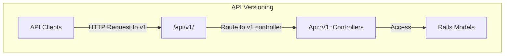
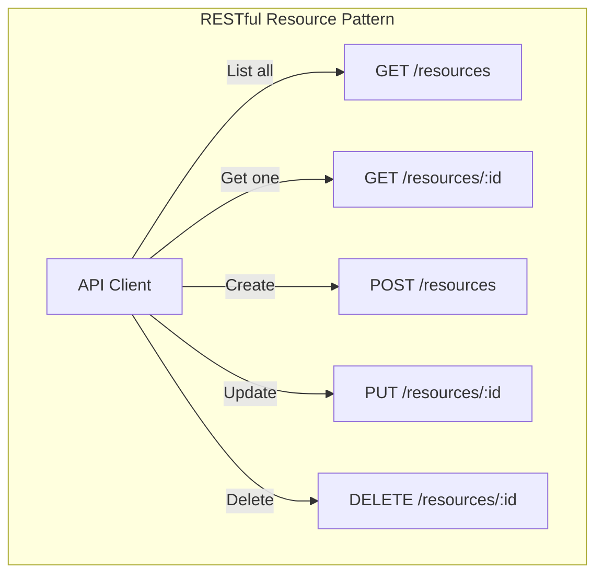
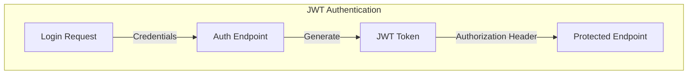
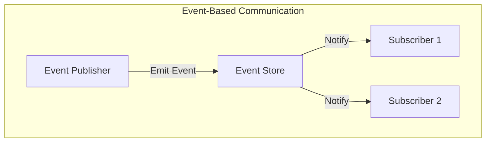
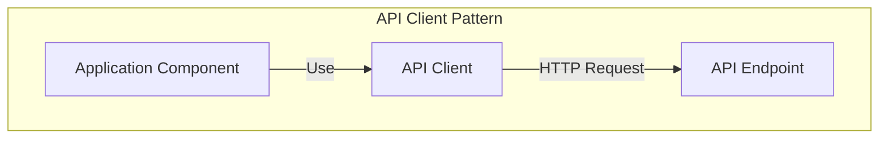
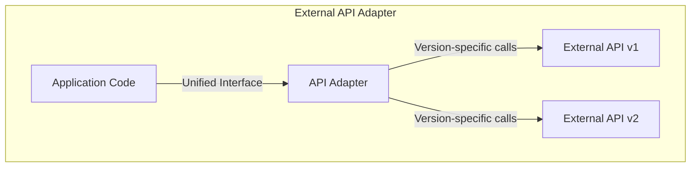

# Integration Patterns

## Overview
This document identifies and analyzes common integration patterns across the three repositories (Backend, Frontend, and CMS). It synthesizes findings from previous integration analyses including API integration, event handling, and cross-repository communication to provide a comprehensive view of how the repositories interact.

**Sources Reviewed:**
- [API Integration Analysis](../../detailed-analysis/api-integration-findings.md)
- [Event Integration Analysis](../../detailed-analysis/event-integration-findings.md)
- [Auth Flow Analysis](../../detailed-analysis/auth-flow-findings.md)
- [Data Store Analysis](../../detailed-analysis/data-store-findings.md)
- [Data Flow Patterns](../data-flows/data-flow-patterns.md)
- Source code implementation across repositories

## Key Integration Pattern Categories

### 1. API Versioning Pattern
The system implements a consistent API versioning strategy to manage API evolution while maintaining backward compatibility.

#### Pattern Implementation


**Backend Implementation:**
```ruby
# config/routes.rb
namespace :api do
  namespace :v1 do
    resources :products, only: %i[index show], path: ':catalog_id/products' do
      # ...
    end
    # Other API resources
  end
end
```

**Frontend Implementation:**
```javascript
// src/const/globals.js
export const API_ENVIROMENTS = [
  {
    name: 'prod',
    url: 'https://api-prod.thepeakbeyond.com/api/v1'
  },
  {
    name: 'stage',
    url: 'https://api-stage.thepeakbeyond.com/api/v1'
  }
  // Other environments
]
```

**CMS Implementation:**
```typescript
// src/environments/environment.ts
export const environment = {
  production: false,
  apiUrl: 'http://localhost:3000/api/v1',
  // Other configuration
};
```

#### Benefits
- **Backward Compatibility:** API version namespace provides clear compatibility boundaries
- **Client Stability:** Clients can depend on stable API contract
- **Progressive Enhancement:** New features can be added without breaking existing functionality
- **Clear Migration Path:** Version-specific clients and endpoints

#### Challenges
- **Maintenance Overhead:** Supporting multiple API versions increases maintenance cost
- **Code Duplication:** Some logic may be duplicated across versions
- **Version Proliferation:** Risk of supporting too many versions simultaneously
- **Migration Complexity:** Moving clients to new API versions can be challenging

### 2. RESTful Resource Pattern
The system implements a consistent RESTful resource pattern for all API endpoints.

#### Pattern Implementation


**Backend Implementation:**
```ruby
# app/controllers/api/v1/products_controller.rb
class Api::V1::ProductsController < Api::V1::ApplicationController
  def index
    products = Product.all
    render json: products, each_serializer: ProductSerializer
  end
  
  def show
    product = Product.find(params[:id])
    render json: product, serializer: ProductSerializer
  end
  
  # Other CRUD actions
end
```

**CMS Implementation:**
```typescript
// src/app/core/services/crud.service.ts
@Injectable()
export class CrudService<T> {
  constructor(protected http: HttpClient) {}
  
  all(params: any = {}): Observable<Pagination<T>> {
    return this.http.get<any>(this.endpoint, { params })
      .pipe(map(response => new Pagination<T>(response, this.createResource)));
  }
  
  get(id: number): Observable<T> {
    return this.http.get<any>(`${this.endpoint}/${id}`)
      .pipe(map(response => this.createResource(response)));
  }
  
  // Other CRUD methods
}
```

**Frontend Implementation:**
```javascript
// src/api/products/ProductsRemote.js
class ProductsRemote {
  constructor (api) {
    this.api = api
  }

  index (options) {
    return this.api.get(`products`, { params: options })
  }

  show (id) {
    return this.api.get(`products/${id}`)
  }
  
  // Other resource methods
}
```

#### Benefits
- **Consistency:** Uniform API structure across all resources
- **Predictability:** Clients can predict endpoint URLs and behaviors
- **Self-Documentation:** RESTful conventions are widely understood
- **Scalability:** Clear separation of resource concerns

#### Challenges
- **Complex Operations:** Some operations don't fit the CRUD model cleanly
- **Chatty APIs:** May require multiple requests for complex operations
- **Overloaded POSTs:** Complex creation operations may overload POST semantics
- **Limited Relationship Expression:** Resource relationships require additional conventions

### 3. JWT Authentication Pattern
The system implements JSON Web Token (JWT) authentication for secure cross-repository communication.

#### Pattern Implementation


**Backend Implementation:**
```ruby
# config/initializers/knock.rb
Knock.setup do |config|
  config.token_lifetime = 2.weeks
  config.token_signature_algorithm = 'HS256'
  config.token_secret_signature_key = -> { Rails.application.credentials.secret_key_base }
  config.not_found_exception_class_name = 'ActiveRecord::RecordNotFound'
end
```

**Frontend Implementation:**
```javascript
// src/api/http.js
const http = axios.create({
  baseURL: TPB_API_URL,
  headers: {
    'Content-Type': 'application/json',
    'Authorization': `Bearer ${TOKEN}`
  }
})
```

**CMS Implementation:**
```typescript
// src/app/core/services/jwt-auth.service.ts
@Injectable()
export class JwtAuthService {
  login(email: string, password: string): Observable<any> {
    return this.http.post<any>(`${this.config.apiUrl}/user_token`, {
      auth: { email, password }
    }).pipe(
      tap(response => {
        localStorage.setItem('token', response.jwt);
      })
    );
  }
  
  // Other auth methods
}
```

#### Benefits
- **Stateless Authentication:** No server-side session storage required
- **Cross-Domain:** Works across different domains
- **Mobile-Friendly:** Easy to use in mobile applications
- **Performance:** Reduced database lookups for authentication

#### Challenges
- **Token Revocation:** Difficult to invalidate tokens before expiration
- **Token Size:** JWTs can become large with many claims
- **Secret Management:** Token signing keys must be secured
- **Client Storage:** Secure token storage in clients is challenging

### 4. Event-Based Communication Pattern
The system implements event-based communication patterns for loose coupling between components and repositories.

#### Pattern Implementation


**Frontend Implementation:**
```javascript
// Vue component events
export default {
  methods: {
    onProductSelected(product) {
      // Emit event to parent components
      this.$emit('product-selected', product)
    }
  },
  created() {
    // Listen for events from child components
    this.$on('cart-updated', this.refreshCart)
  }
}

// Analytics events
// From analytics.js
track(eventName, eventParams = {}, eventResponse = {}) {
  let event = {
    event_datetime: new Date(),
    event_name: eventName,
    event_params: JSON.stringify(eventParams),
    event_resp: JSON.stringify(eventResponse),
    session_id: '',
    user_id: ''
  }
  return Events.save(event)
}
```

**CMS Implementation:**
```typescript
// Angular component events
@Component({
  selector: 'app-product-layout-tab',
  templateUrl: './product-layout-tab.component.html'
})
export class ProductLayoutTabComponent implements OnInit {
  @Output() addElement = new EventEmitter<AddElementEvent>();
  
  onAddElement(type: string) {
    this.addElement.emit({
      elements: this.elements,
      type: type
    });
  }
}

// RxJS event communication
@Injectable()
export class ProductEventService {
  private productUpdated = new Subject<Product>();
  
  productUpdated$ = this.productUpdated.asObservable();
  
  notifyProductUpdate(product: Product) {
    this.productUpdated.next(product);
  }
}
```

#### Benefits
- **Loose Coupling:** Components don't need direct references
- **Scalability:** Easy to add new subscribers
- **Flexibility:** Publishers don't know who's listening
- **Extensibility:** New functionality can be added through new subscribers

#### Challenges
- **Debugging Complexity:** Event flows can be difficult to trace
- **Race Conditions:** Events may arrive in unexpected order
- **Memory Leaks:** Forgotten subscriptions can cause memory leaks
- **Observability:** Difficult to monitor event-based systems

### 5. API Client Pattern
The system implements centralized API clients for communicating with backend services.

#### Pattern Implementation


**Frontend Implementation:**
```javascript
// src/api/api.js
class API {
  constructor (options = {}) {
    // Set up API client
    this.http = http
    // Configure options
  }
  
  get(path, options) {
    return this.http.get(path, options)
  }
  
  post(path, data, options) {
    return this.http.post(path, data, options)
  }
  
  // Other HTTP methods
}
```

**CMS Implementation:**
```typescript
// src/app/core/services/http.service.ts
@Injectable()
export class HttpService {
  constructor(private http: HttpClient) {}
  
  get<T>(url: string, options?: any): Observable<T> {
    return this.http.get<T>(url, options).pipe(
      catchError(this.handleError)
    );
  }
  
  post<T>(url: string, data: any, options?: any): Observable<T> {
    return this.http.post<T>(url, data, options).pipe(
      catchError(this.handleError)
    );
  }
  
  // Other HTTP methods
  
  private handleError(error: HttpErrorResponse) {
    // Centralized error handling
    return throwError(error);
  }
}
```

#### Benefits
- **Centralized Configuration:** API configuration in one place
- **Consistent Error Handling:** Centralized error handling
- **Reusability:** API client shared across components
- **Testability:** Easy to mock API client for testing

#### Challenges
- **Abstraction Leakage:** HTTP details may leak through abstraction
- **Overhead:** Additional layer between component and HTTP client
- **Configuration Management:** Handling different API configurations
- **Versioning Complexity:** Managing multiple API versions

### 6. External API Adapter Pattern
The system implements adapter patterns for integrating with external third-party APIs.

#### Pattern Implementation


**Backend Implementation:**
```ruby
# From api_client.rb
def products(type_name:, limit: api_v1? ? 500 : 50)
  if api_version == 'v2.5'
    productsv25(type_name: type_name)
  else
    products_old(type_name: type_name, limit: limit)
  end
end

# Version-specific implementation
def productsv25(type_name:)
  # Implementation for v2.5
end

def products_old(type_name:, limit:)
  # Implementation for older versions
end
```

**CMS Implementation:**
```typescript
// API version selection in UI
<ng-select
  formControlName="api_version"
  [items]="
    this.isTreez()
      ? [
          { id: 'v1.0', text: 'v1.0' },
          { id: 'v2.0', text: 'v2.0' },
          { id: 'v2.5', text: 'v2.5' }
        ]
      : [{ id: '2022-01', text: '2022-01' }]
  "
>
</ng-select>
```

#### Benefits
- **Version Isolation:** Changes in external APIs are isolated
- **Unified Interface:** Application uses consistent interface regardless of external API version
- **Graceful Degradation:** Can fall back to older API versions
- **Progressive Enhancement:** Can leverage new API features when available

#### Challenges
- **Implementation Complexity:** Maintaining multiple API version adapters
- **Feature Parity:** Ensuring consistent features across different API versions
- **Testing Burden:** Testing multiple external API version integrations
- **Version Proliferation:** Managing too many supported versions

## Common Anti-Patterns

### 1. Direct External API Access
Sometimes components bypass adapters and access external APIs directly.

**Example:**
```typescript
// Direct API call without adapter
this.http.get('https://external-api.com/v1/resource')
  .subscribe(response => {
    // Handle response directly
  });
```

**Impact:**
- No version isolation
- Inconsistent error handling
- Tightly coupled to external API structure
- Difficult to test

**Recommended Pattern:**
- Always use adapter pattern for external APIs
- Centralize external API access
- Create unified interfaces that abstract version details

### 2. Inconsistent API Path Structure
Some endpoints don't follow the established RESTful pattern.

**Example:**
```ruby
# Inconsistent with RESTful convention
get '/custom_action/:id', to: 'resources#custom_action'
```

**Impact:**
- Reduces API predictability
- Complicates client implementation
- Inconsistent resource representation
- Harder to document

**Recommended Pattern:**
- Consistently use RESTful endpoints
- Model custom actions as sub-resources
- Use query parameters for filtering
- Document any necessary exceptions clearly

### 3. Token Handling in Frontend
Insecure handling of authentication tokens in frontend applications.

**Example:**
```javascript
// Storing tokens insecurely
localStorage.setItem('auth_token', token)
```

**Impact:**
- Vulnerable to XSS attacks
- No token expiration handling
- Difficult token refresh
- Potential for token leakage

**Recommended Pattern:**
- Use HttpOnly cookies where possible
- Implement token refresh mechanism
- Store tokens in more secure storage
- Clear tokens on session end

## Best Practice Recommendations

### 1. Standardize API Integration Approach
- **Recommendation:** Implement consistent API client pattern
- **Implementation:**
  - Create base API client classes
  - Standardize error handling
  - Implement consistent authentication
  - Establish request/response logging

### 2. Enhance Event Integration
- **Recommendation:** Standardize event handling across repositories
- **Implementation:**
  - Define common event schema
  - Implement event validation
  - Create central event documentation
  - Add event monitoring

### 3. Improve External API Version Management
- **Recommendation:** Formalize external API version handling
- **Implementation:**
  - Create explicit adapter interfaces
  - Document supported versions
  - Implement version capability detection
  - Plan version deprecation strategy

### 4. Strengthen Authentication Integration
- **Recommendation:** Enhance JWT authentication implementation
- **Implementation:**
  - Add token refresh mechanism
  - Implement token revocation
  - Secure token storage in clients
  - Add token validation metrics

### 5. Document Integration Points
- **Recommendation:** Create comprehensive integration documentation
- **Implementation:**
  - Document all API endpoints
  - Create integration sequence diagrams
  - Maintain API version compatibility matrix
  - Document event schemas and flows

## Cross-References
- Related to: [Data Flow Patterns](../data-flows/data-flow-patterns.md)
- Related to: [Dependency Patterns](../dependencies/dependency-patterns.md)
- Related to: [Security Patterns](../security/security-patterns.md)
- Related to: [API Integration Analysis](../../detailed-analysis/api-integration-findings.md)

## Version History
- 1.0.0 (2024-03-22): Initial integration patterns document created 