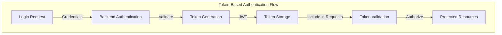
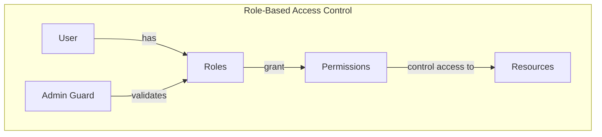
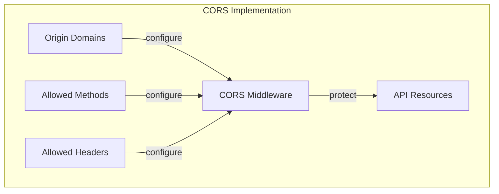
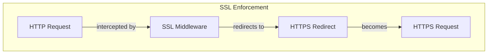
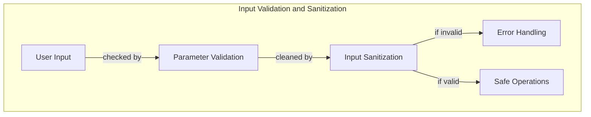
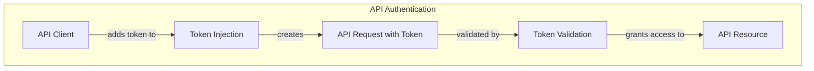
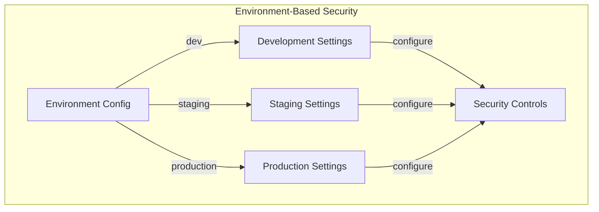

# Security Patterns

## Overview
This document identifies and analyzes security patterns implemented across the three repositories (Backend, Frontend, and CMS). It focuses on authentication mechanisms, authorization strategies, data protection approaches, and other security measures implemented throughout the system.

**Sources Reviewed:**
- Security analysis documents in each repository
- Authentication implementations
- Authorization controls
- Data protection mechanisms
- Input validation strategies
- Cross-repository security patterns

## Key Security Pattern Categories

### 1. Token-Based Authentication Pattern
The system implements JWT (JSON Web Token) based authentication across all repositories.

#### Pattern Implementation


**Backend Implementation (Ruby/Rails):**
```ruby
# Knock configuration in config/initializers/knock.rb
Knock.setup do |config|
  # Extremely long token lifetime (security concern)
  config.token_lifetime = 100.years
end

# UserTokenController for authentication
class UserTokenController < Knock::AuthTokenController
  skip_before_action :verify_authenticity_token

  def create
    render json: auth_response, status: :created
  end

  private

  def auth_response
    user_serializer = ActiveModelSerializers::SerializableResource.new(entity)
    { jwt: auth_token.token }.merge user_serializer.as_json
  end
end

# Application controller with authentication
class ApplicationController < ActionController::API
  include Knock::Authenticable
  before_action :authenticate_user
end
```

**CMS Implementation (Angular):**
```typescript
// Core module with JWT configuration
export const JWT_TOKEN_ID = 'jwt';

export function jwtOptionsFactory() {
  return {
    tokenGetter: () => {
      return localStorage.getItem(JWT_TOKEN_ID);
    },
    whitelistedDomains: [
      environment.apiUrl.replace(/((http)|(https)):\/\//, '')
    ]
  };
}

@NgModule({
  imports: [
    JwtModule.forRoot({
      jwtOptionsProvider: {
        provide: JWT_OPTIONS,
        useFactory: jwtOptionsFactory,
      }
    }),
    JwtAuthModule.forRoot({
      jwtAuthOptionsProvider: {
        provide: JWT_AUTH_OPTIONS,
        useFactory: jwtAuthOptionsFactory,
      }
    })
  ]
})
```

**Frontend Implementation (Vue.js):**
```javascript
// HTTP client configuration in api/http.js
import axios from 'axios'

const TPB_API_URL = process.env.TPB_API_URL || self.kioskConfig.API.URL
const TPB_CATALOG_ID = process.env.TPB_CATALOG_ID || self.kioskConfig.API.CATALOG_ID
const TPB_STORE_TOKEN = process.env.TPB_STORE_TOKEN || self.kioskConfig.API.TOKEN

export const HTTP = axios.create({
  baseURL: TPB_API_URL + '/' + TPB_CATALOG_ID,
  params: {
    token: TPB_STORE_TOKEN
  }
})
```

#### Benefits
- **Stateless Authentication:** No server-side session storage required
- **Cross-Domain Compatibility:** Works across different domains/services
- **Scalability:** Supports distributed architecture
- **Self-Contained:** Contains all necessary authentication information

#### Challenges
- **Token Lifetime:** Extremely long token lifetime (100 years) is a security vulnerability
- **Token Storage:** Frontend stores tokens in localStorage, risking XSS attacks
- **Missing Refresh Mechanism:** No token refresh strategy implemented
- **Limited Revocation:** Difficult to revoke tokens before expiration

### 2. Role-Based Access Control Pattern
The system implements role-based authorization to control access to resources.

#### Pattern Implementation


**Backend Implementation (Rails):**
```ruby
# Using Pundit for authorization
class ApplicationController < ActionController::API
  include Knock::Authenticable
  include Pundit
  
  before_action :authenticate_user
end

# Policy example (implied from code analysis)
class StorePolicy
  attr_reader :user, :store
  
  def initialize(user, store)
    @user = user
    @store = store
  end
  
  def show?
    user.admin? || user.stores.include?(store)
  end
end
```

**CMS Implementation (Angular):**
```typescript
// Admin guard service
@Injectable()
export class AdminGuard implements CanActivate {
  constructor(private router: Router, private authService: JwtAuthService) {}
  
  canActivate(): Observable<boolean> {
    return this.authService.getCurrentUser().pipe(
      map(user => {
        if (user && user.admin) {
          return true;
        }
        
        this.router.navigate(['/login']);
        return false;
      }),
      catchError(() => {
        this.router.navigate(['/login']);
        return of(false);
      })
    );
  }
}

// Module registration
@NgModule({
  providers: [
    AdminGuard,
    // Other services
  ]
})
```

**Frontend Implementation (Vue.js):**
```javascript
// Role-based routing (implied from code analysis)
router.beforeEach((to, from, next) => {
  if (to.matched.some(record => record.meta.requiresAuth)) {
    // Check if user is authenticated and has appropriate role
    if (!store.getters.isAuthenticated) {
      next({ path: '/login' })
    } else if (to.matched.some(record => record.meta.requiresAdmin) && 
              !store.getters.isAdmin) {
      next({ path: '/unauthorized' })
    } else {
      next()
    }
  } else {
    next()
  }
})
```

#### Benefits
- **Centralized Access Control:** Access decisions in one place
- **Simplified Management:** Group permissions by role
- **Business Alignment:** Roles match business concepts
- **Scalable:** Easy to add new roles and permissions

#### Challenges
- **Role Explosion:** Proliferation of roles for special cases
- **Limited Granularity:** May not handle fine-grained permissions well
- **Cross-Repository Consistency:** Keeping role definitions consistent
- **Missing Least Privilege:** No evidence of principle of least privilege

### 3. CORS Security Pattern
The system implements Cross-Origin Resource Sharing (CORS) to control API access.

#### Pattern Implementation


**Backend Implementation (Rails):**
```ruby
# CORS configuration in config/initializers/cors.rb
Rails.application.config.middleware.insert_before 0, Rack::Cors do
  allow do
    origins '*'
    resource '*', headers: :any, methods: %i[get post put patch delete options]
  end
end
```

**CMS Implementation (Angular):**
```typescript
// JWT configuration specifies allowed domains
export function jwtOptionsFactory() {
  return {
    tokenGetter: () => {
      return localStorage.getItem(JWT_TOKEN_ID);
    },
    whitelistedDomains: [
      environment.apiUrl.replace(/((http)|(https)):\/\//, '')
    ]
  };
}
```

#### Benefits
- **API Access Control:** Restricts which origins can access API
- **Flexible Configuration:** Can be configured per route/resource
- **Standard Implementation:** Uses web standard mechanisms
- **Pre-Flight Support:** Handles OPTIONS requests automatically

#### Challenges
- **Overly Permissive:** Backend allows all origins ('*') which is insecure
- **Missing Credentials Control:** No explicit credentials handling
- **Inconsistent Implementation:** Different approaches between repos
- **Security Risk:** Current implementation doesn't provide real security

### 4. SSL/HTTPS Enforcement Pattern
The system implements forced SSL redirection for secure communications.

#### Pattern Implementation


**CMS Implementation (Node.js):**
```javascript
// SSL enforcement in server.js
var forceSsl = function (req, res, next) {
  if (process.env.FORCE_HTTPS === 'true' && 
      process.env.CONFIG_ENV == 'production' && 
      req.headers['x-forwarded-proto'] !== 'https' && 
      (!process.env.LE_URL || req.path !== process.env.LE_URL)) {
    return res.redirect(['https://', req.get('Host'), req.url].join(''));
  }
  return next();
};

app.use(forceSsl);
```

#### Benefits
- **Transport Security:** Encrypts all communications
- **Data Integrity:** Prevents data tampering in transit
- **Authentication:** Validates server identity
- **Environment Specific:** Only enforced in production

#### Challenges
- **Configuration Dependent:** Relies on environment variables
- **Not Universal:** Only implemented in CMS, not consistently
- **Manual Implementation:** Custom middleware instead of standard
- **Incomplete Coverage:** Limited evidence of SSL across all services

### 5. Input Validation and Sanitization Pattern
The system implements validation and sanitization of inputs across repositories.

#### Pattern Implementation


**Backend Implementation (Rails):**
```ruby
# Implied from standard Rails practices
class UsersController < ApplicationController
  def create
    @user = User.new(user_params)
    
    if @user.save
      render json: @user, status: :created
    else
      render json: @user.errors, status: :unprocessable_entity
    end
  end
  
  private
  
  def user_params
    params.require(:user).permit(:name, :email, :password, :role)
  end
end
```

**CMS Implementation (Angular):**
```typescript
// HTTP error interception
@Injectable()
export class RequestErrorsInterceptor implements HttpInterceptor {
  intercept(req: HttpRequest<any>, next: HttpHandler): Observable<HttpEvent<any>> {
    return next.handle(req).pipe(
      catchError(data => {
        if (data instanceof HttpErrorResponse) {
          return this.handleError(data);
        }
        return observableThrowError(data);
      })
    );
  }
  
  private handleError(data) {
    if (/application\/json/.test(data.headers.get('Content-Type'))) {
      return this.parseError(data);
    } else {
      return observableThrowError(data);
    }
  }
  
  private parseError(data) {
    let error = {};
    try {
      error = JSON.parse(data.error);
    } catch (e) { }
    
    if (Object.keys(error).length === 0) {
      return observableThrowError(data);
    } else {
      const newError = {...data, error: error};
      return observableThrowError(newError);
    }
  }
}
```

#### Benefits
- **Data Integrity:** Ensures only valid data enters the system
- **Security Protection:** Guards against injection attacks
- **Consistent Validation:** Server-side validation regardless of client
- **Friendly Errors:** Structured error messages

#### Challenges
- **Incomplete Implementation:** Not consistently applied across codebase
- **Missing Frontend Validation:** Limited evidence of client-side validation
- **Error Handling Focus:** More focus on error handling than prevention
- **Limited XSS Protection:** No explicit XSS protection visible

### 6. API Request Authentication Pattern
The system implements request authentication for API endpoints.

#### Pattern Implementation


**Backend Implementation (Rails):**
```ruby
# API controller authentication
class Api::V1::ApplicationController < ActionController::API
  include Knock::Authenticable
  include Rescuable
  
  before_action :render_error_when_invalid_auth_token, :except => [:ping]
  before_action :authenticate_store, :except => [:ping]
  
  protected

  def render_error_when_invalid_auth_token
    auth = params[:token] || request.headers['Authorization']
    if auth.blank?
      render(
        json: { error: { message: 'Authorization token not present' } },
        status: :unauthorized
      )
    end
  end
end
```

**Frontend Implementation (Vue.js):**
```javascript
// API client with token
import axios from 'axios'

const TPB_API_URL = process.env.TPB_API_URL || self.kioskConfig.API.URL
const TPB_CATALOG_ID = process.env.TPB_CATALOG_ID || self.kioskConfig.API.CATALOG_ID
const TPB_STORE_TOKEN = process.env.TPB_STORE_TOKEN || self.kioskConfig.API.TOKEN

export const HTTP = axios.create({
  baseURL: TPB_API_URL + '/' + TPB_CATALOG_ID,
  params: {
    token: TPB_STORE_TOKEN
  }
})
```

**CMS Implementation (Angular):**
```typescript
// Store service for token generation
@Injectable()
export class StoreService extends CrudService<Store> {
  generateToken(id: number): Observable<string> {
    const url = `${environment.apiUrl}/${this.resourcePath()}/${id}/generate_token`;

    return this.http.post<any>(url, {}).pipe(
      map(response => response.jwt)
    );
  }
}
```

#### Benefits
- **Stateless Authentication:** No sessions required
- **Flexible Token Delivery:** Supports header and parameter tokens
- **API-Specific Controls:** Authentication tailored for API needs
- **Separate Store Auth:** Dedicated flow for store/kiosk authentication

#### Challenges
- **Multiple Auth Methods:** Inconsistent token delivery (headers vs params)
- **Static Tokens:** Frontend uses static tokens with no rotation
- **Limited Error Information:** Generic error messages
- **Token Exposure:** Tokens possibly exposed in URL parameters

### 7. Environment-Based Security Configuration Pattern
The system implements different security settings based on environment.

#### Pattern Implementation


**CMS Implementation (Node.js):**
```javascript
// Environment-based SSL in server.js
var forceSsl = function (req, res, next) {
  if (process.env.FORCE_HTTPS === 'true' && 
      process.env.CONFIG_ENV == 'production' && 
      req.headers['x-forwarded-proto'] !== 'https') {
    return res.redirect(['https://', req.get('Host'), req.url].join(''));
  }
  return next();
};
```

**Frontend Implementation (Vue.js):**
```javascript
// Environment-based API configuration
const TPB_API_URL = process.env.TPB_API_URL ? process.env.TPB_API_URL : self.kioskConfig.API.URL
const TPB_CATALOG_ID = process.env.TPB_CATALOG_ID ? process.env.TPB_CATALOG_ID : self.kioskConfig.API.CATALOG_ID
const TPB_STORE_TOKEN = process.env.TPB_STORE_TOKEN ? process.env.TPB_STORE_TOKEN : self.kioskConfig.API.TOKEN
```

#### Benefits
- **Environment-Appropriate Security:** Different controls per environment
- **Production Hardening:** Stricter security in production
- **Development Flexibility:** Relaxed security for local development
- **Configuration Separation:** Security config independent of code

#### Challenges
- **Configuration Sprawl:** Settings scattered across files
- **Manual Enforcement:** No automated environment validation
- **Inconsistent Implementation:** Not uniformly applied across repos
- **Documentation Gaps:** Limited documentation of security differences

## Common Anti-Patterns

### 1. Excessive Token Lifetime
The JWT tokens are configured with a 100-year lifetime.

**Example:**
```ruby
# Knock configuration
Knock.setup do |config|
  config.token_lifetime = 100.years
end
```

**Impact:**
- Effectively non-expiring tokens
- No forced re-authentication
- Difficult to revoke compromised credentials
- Increased security risk if tokens leaked

**Recommended Pattern:**
- Implement reasonable token lifetime (hours/days)
- Add token refresh mechanism
- Implement token revocation capability
- Monitor token usage for suspicious activity

### 2. Permissive CORS Policy
The backend allows requests from any origin.

**Example:**
```ruby
# CORS configuration
Rails.application.config.middleware.insert_before 0, Rack::Cors do
  allow do
    origins '*'
    resource '*', headers: :any, methods: %i[get post put patch delete options]
  end
end
```

**Impact:**
- Any website can make requests to the API
- Increases risk of CSRF attacks
- Bypasses same-origin policy protection
- Violates principle of least privilege

**Recommended Pattern:**
- Restrict to specific origins
- Limit allowed methods per resource
- Implement proper credentials handling
- Apply different policies per endpoint

### 3. Hardcoded Credentials
The CMS contains hardcoded basic auth credentials.

**Example:**
```javascript
// Server.js basic auth
if (user.name === 'desing2dev-team' && user.pass === 'desing2dev2017!') {
  return next();
} else {
  return unauthorized(res);
}
```

**Impact:**
- Credentials in source code
- Same credentials across environments
- Difficult to rotate credentials
- Potential for credential leakage

**Recommended Pattern:**
- Use environment variables for credentials
- Implement credential rotation
- Use secure credential storage
- Avoid basic auth when possible

### 4. Client-Side Token Storage
Tokens are stored in localStorage without additional protection.

**Example:**
```typescript
// JWT token storage
export function jwtOptionsFactory() {
  return {
    tokenGetter: () => {
      return localStorage.getItem(JWT_TOKEN_ID);
    },
    // other config
  };
}
```

**Impact:**
- Vulnerable to XSS attacks
- Accessible by any JavaScript in the domain
- No protection from client-side scripts
- Persists across sessions indefinitely

**Recommended Pattern:**
- Consider HttpOnly cookies for tokens
- Implement token encryption
- Add XSS protection headers
- Use shorter token lifetimes

## Best Practice Recommendations

### 1. Token Security Improvements
- **Recommendation:** Implement proper JWT token security
- **Implementation:**
  - Reduce token lifetime to hours instead of years
  - Implement token refresh mechanism
  - Add token revocation capability
  - Use HttpOnly cookies where appropriate
  - Implement token rotation strategy

### 2. CORS Policy Hardening
- **Recommendation:** Restrict CORS policy to specific origins
- **Implementation:**
  - List specific allowed origins
  - Limit methods per resource
  - Implement proper credentials handling
  - Apply different policies by environment
  - Document CORS strategy

### 3. Authentication Standardization
- **Recommendation:** Standardize authentication methods
- **Implementation:**
  - Use consistent token delivery (headers)
  - Implement consistent validation
  - Centralize authentication logic
  - Document authentication flows
  - Remove hardcoded credentials

### 4. Security Headers Implementation
- **Recommendation:** Add security headers to all responses
- **Implementation:**
  - Add Content-Security-Policy
  - Implement X-XSS-Protection
  - Set X-Content-Type-Options: nosniff
  - Add Strict-Transport-Security
  - Configure Referrer-Policy

### 5. Security Monitoring
- **Recommendation:** Implement security monitoring
- **Implementation:**
  - Add request/response logging
  - Implement security event monitoring
  - Log authentication attempts
  - Track authorization failures
  - Create security dashboards

## Cross-References
- Related to: [Authentication Flow Findings](../../detailed-analysis/auth-flow-findings.md)
- Related to: [API Integration Findings](../../detailed-analysis/api-integration-findings.md)
- Related to: [Integration Patterns](../integration/integration-patterns.md)
- Related to: [Dependency Patterns](../dependencies/dependency-patterns.md)
- Related to: [Data Flow Patterns](../data-flows/data-flow-patterns.md)

## Version History
- 1.0.0 (2024-03-22): Initial security patterns document created 