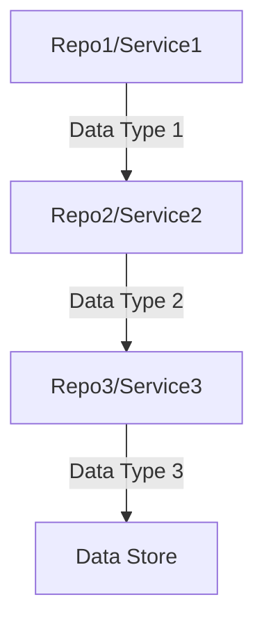

# Cross-Repository Data Flow Analysis

## Metadata
- **Analysis Date**: [YYYY-MM-DD]
- **Version**: [version]
- **Analysts**: [names]
- **Repositories**:
  - [repo1_name] ([version])
  - [repo2_name] ([version])
  - [repo3_name] ([version])

## Data Flow Overview

### High-Level Flow

### Key Data Flows
| ID | Source | Target | Data Type | Flow Type | Status |
|----|--------|--------|-----------|-----------|--------|
| DF001 | [source] | [target] | [type] | [sync/async] | [status] |

## Data Sources

### Primary Data Sources
| Source | Repository | Type | Purpose | Access Pattern |
|--------|------------|------|---------|----------------|
| [source] | [repo] | [type] | [purpose] | [pattern] |

### Derived Data Sources
| Source | Base Sources | Transformation | Purpose | Freshness |
|--------|--------------|----------------|---------|-----------|
| [source] | [sources] | [transform] | [purpose] | [freshness] |

### External Data Sources
| Source | Integration | Data Type | SLA | Status |
|--------|-------------|-----------|-----|--------|
| [source] | [integration] | [type] | [sla] | [status] |

## Data Models

### Shared Data Models
| Model | Version | Repositories | Purpose | Status |
|-------|---------|--------------|---------|--------|
| [model] | [version] | [repos] | [purpose] | [status] |

### Data Transformations
| Source Model | Target Model | Transform | Validation | Status |
|--------------|--------------|-----------|------------|--------|
| [source] | [target] | [transform] | [validation] | [status] |

### Schema Evolution
| Model | Version | Changes | Impact | Migration |
|-------|---------|---------|--------|-----------|
| [model] | [version] | [changes] | [impact] | [migration] |

## Data Storage

### Databases
| Database | Type | Repositories | Purpose | Isolation |
|----------|------|--------------|---------|-----------|
| [db] | [type] | [repos] | [purpose] | [isolation] |

### Caching Layers
| Cache | Type | Data Types | TTL | Invalidation |
|-------|------|------------|-----|--------------|
| [cache] | [type] | [types] | [ttl] | [invalidation] |

### Message Queues
| Queue | Protocol | Publishers | Subscribers | Retention |
|-------|----------|------------|-------------|-----------|
| [queue] | [protocol] | [pubs] | [subs] | [retention] |

## Data Access Patterns

### Read Patterns
| Pattern | Repositories | Data Types | Volume | Latency |
|---------|--------------|------------|--------|----------|
| [pattern] | [repos] | [types] | [volume] | [latency] |

### Write Patterns
| Pattern | Repositories | Data Types | Volume | Consistency |
|---------|--------------|------------|--------|-------------|
| [pattern] | [repos] | [types] | [volume] | [consistency] |

### Access Control
| Data Type | Access Level | Repositories | Enforcement | Audit |
|-----------|--------------|--------------|-------------|-------|
| [type] | [level] | [repos] | [enforcement] | [audit] |

## Data Quality

### Validation Rules
| Rule | Data Types | Repositories | Enforcement | Action |
|------|------------|--------------|-------------|--------|
| [rule] | [types] | [repos] | [enforcement] | [action] |

### Data Integrity
| Check | Scope | Frequency | Threshold | Action |
|-------|-------|-----------|-----------|--------|
| [check] | [scope] | [frequency] | [threshold] | [action] |

### Data Consistency
| Type | Strategy | Scope | Verification | Resolution |
|------|----------|-------|--------------|------------|
| [type] | [strategy] | [scope] | [verification] | [resolution] |

## Performance

### Throughput
| Flow | Average | Peak | Capacity | Scaling |
|------|---------|------|----------|----------|
| [flow] | [avg] | [peak] | [capacity] | [scaling] |

### Latency
| Operation | Average | P95 | P99 | SLA |
|-----------|---------|-----|-----|-----|
| [operation] | [avg] | [p95] | [p99] | [sla] |

### Resource Usage
| Component | CPU | Memory | Storage | Network |
|-----------|-----|---------|----------|----------|
| [component] | [cpu] | [memory] | [storage] | [network] |

## Error Handling

### Data Validation Errors
| Error Type | Detection | Impact | Recovery | Prevention |
|------------|-----------|--------|----------|------------|
| [type] | [detection] | [impact] | [recovery] | [prevention] |

### Processing Errors
| Error Type | Detection | Impact | Recovery | Prevention |
|------------|-----------|--------|----------|------------|
| [type] | [detection] | [impact] | [recovery] | [prevention] |

### Data Recovery
| Scenario | Detection | RTO | RPO | Procedure |
|----------|-----------|-----|-----|-----------|
| [scenario] | [detection] | [rto] | [rpo] | [procedure] |

## Monitoring

### Data Flow Monitoring
| Metric | Source | Aggregation | Threshold | Alert |
|--------|--------|-------------|-----------|-------|
| [metric] | [source] | [aggregation] | [threshold] | [alert] |

### Quality Monitoring
| Metric | Source | Aggregation | Threshold | Alert |
|--------|--------|-------------|-----------|-------|
| [metric] | [source] | [aggregation] | [threshold] | [alert] |

### Performance Monitoring
| Metric | Source | Aggregation | Threshold | Alert |
|--------|--------|-------------|-----------|-------|
| [metric] | [source] | [aggregation] | [threshold] | [alert] |

## Testing

### Data Flow Tests
| Test | Scope | Coverage | Frequency | Environment |
|------|-------|----------|-----------|-------------|
| [test] | [scope] | [coverage] | [frequency] | [env] |

### Quality Tests
| Test | Scope | Coverage | Frequency | Environment |
|------|-------|----------|-----------|-------------|
| [test] | [scope] | [coverage] | [frequency] | [env] |

### Performance Tests
| Test | Scope | Coverage | Frequency | Environment |
|------|-------|----------|-----------|-------------|
| [test] | [scope] | [coverage] | [frequency] | [env] |

## Documentation

### Data Flow Documentation
| Document | Purpose | Audience | Location | Status |
|----------|---------|----------|----------|--------|
| [doc] | [purpose] | [audience] | [location] | [status] |

### Schema Documentation
| Schema | Version | Format | Location | Status |
|--------|---------|--------|----------|--------|
| [schema] | [version] | [format] | [location] | [status] |

### Runbooks
| Scenario | Runbook | Last Updated | Tested | Status |
|----------|---------|--------------|--------|--------|
| [scenario] | [runbook] | [date] | [tested] | [status] |

## Known Issues

### Current Issues
| Issue | Impact | Repositories | Mitigation | Status |
|-------|---------|--------------|------------|--------|
| [issue] | [impact] | [repos] | [mitigation] | [status] |

### Data Quality Issues
| Issue | Impact | Detection | Resolution | Status |
|-------|---------|-----------|------------|--------|
| [issue] | [impact] | [detection] | [resolution] | [status] |

## Future Considerations

### Planned Changes
| Change | Motivation | Impact | Timeline | Status |
|--------|------------|--------|----------|--------|
| [change] | [motivation] | [impact] | [timeline] | [status] |

### Data Evolution
| Aspect | Current | Target | Strategy | Timeline |
|--------|---------|--------|----------|----------|
| [aspect] | [current] | [target] | [strategy] | [timeline] |

## Version History
- [version] ([date]): [changes] 