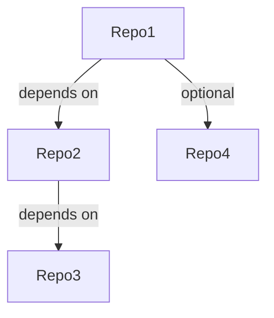

# Cross-Repository Dependency Analysis

## Metadata
- **Analysis Date**: [YYYY-MM-DD]
- **Version**: [version]
- **Analysts**: [names]
- **Repositories**:
  - [repo1_name] ([version])
  - [repo2_name] ([version])
  - [repo3_name] ([version])

## Dependency Overview

### High-Level Dependencies

### Key Dependencies
| ID | Source Repo | Target Repo | Type | Criticality | Status |
|-------|-------------|-------------|------|-------------|--------|
| DEP001 | [source] | [target] | [type] | [critical/optional] | [status] |

## Package Dependencies

### Shared Libraries
| Library | Version | Used By | Purpose | Status |
|---------|---------|---------|---------|--------|
| [lib] | [version] | [repos] | [purpose] | [status] |

### Version Constraints
| Library | Repo | Version Constraint | Reason | Status |
|---------|------|-------------------|--------|--------|
| [lib] | [repo] | [constraint] | [reason] | [status] |

### Conflicts
| Library | Repos | Versions | Impact | Resolution |
|---------|-------|----------|---------|------------|
| [lib] | [repos] | [versions] | [impact] | [resolution] |

## API Dependencies

### Service Dependencies
| Service | Provider | Consumers | Version | Status |
|---------|----------|-----------|---------|--------|
| [service] | [provider] | [consumers] | [version] | [status] |

### API Contracts
| Contract | Version | Provider | Consumers | Status |
|----------|---------|----------|-----------|--------|
| [contract] | [version] | [provider] | [consumers] | [status] |

### Breaking Changes
| Change | Version | Impact | Migration | Status |
|--------|---------|--------|-----------|--------|
| [change] | [version] | [impact] | [migration] | [status] |

## Data Dependencies

### Shared Data Models
| Model | Version | Used By | Purpose | Status |
|-------|---------|---------|---------|--------|
| [model] | [version] | [repos] | [purpose] | [status] |

### Schema Dependencies
| Schema | Version | Used By | Validation | Status |
|--------|---------|---------|------------|--------|
| [schema] | [version] | [repos] | [validation] | [status] |

### Data Flow Dependencies
| Flow | Source | Target | Type | Status |
|------|--------|--------|------|--------|
| [flow] | [source] | [target] | [type] | [status] |

## Infrastructure Dependencies

### Shared Resources
| Resource | Type | Used By | Purpose | Status |
|----------|------|---------|---------|--------|
| [resource] | [type] | [repos] | [purpose] | [status] |

### Environment Dependencies
| Environment | Resource | Used By | Configuration | Status |
|-------------|----------|---------|---------------|--------|
| [env] | [resource] | [repos] | [config] | [status] |

### Deployment Dependencies
| Stage | Dependencies | Order | Impact | Status |
|-------|--------------|-------|--------|--------|
| [stage] | [deps] | [order] | [impact] | [status] |

## Build Dependencies

### Build Tools
| Tool | Version | Used By | Purpose | Status |
|------|---------|---------|---------|--------|
| [tool] | [version] | [repos] | [purpose] | [status] |

### Build Order
| Stage | Dependencies | Order | Impact | Status |
|-------|--------------|-------|--------|--------|
| [stage] | [deps] | [order] | [impact] | [status] |

### Shared Scripts
| Script | Purpose | Used By | Location | Status |
|--------|---------|---------|----------|--------|
| [script] | [purpose] | [repos] | [location] | [status] |

## Test Dependencies

### Test Libraries
| Library | Version | Used By | Purpose | Status |
|---------|---------|---------|---------|--------|
| [lib] | [version] | [repos] | [purpose] | [status] |

### Shared Test Resources
| Resource | Type | Used By | Purpose | Status |
|----------|------|---------|---------|--------|
| [resource] | [type] | [repos] | [purpose] | [status] |

### Integration Tests
| Test Suite | Scope | Dependencies | Environment | Status |
|------------|-------|--------------|-------------|--------|
| [suite] | [scope] | [deps] | [env] | [status] |

## Security Dependencies

### Authentication
| System | Used By | Integration | Risk Level | Status |
|--------|---------|-------------|------------|--------|
| [system] | [repos] | [integration] | [risk] | [status] |

### Authorization
| System | Used By | Integration | Risk Level | Status |
|--------|---------|-------------|------------|--------|
| [system] | [repos] | [integration] | [risk] | [status] |

### Shared Secrets
| Secret | Type | Used By | Storage | Status |
|--------|------|---------|---------|--------|
| [secret] | [type] | [repos] | [storage] | [status] |

## Monitoring Dependencies

### Logging
| System | Used By | Integration | Purpose | Status |
|--------|---------|-------------|---------|--------|
| [system] | [repos] | [integration] | [purpose] | [status] |

### Metrics
| System | Used By | Integration | Purpose | Status |
|--------|---------|-------------|---------|--------|
| [system] | [repos] | [integration] | [purpose] | [status] |

### Alerts
| Alert | Source | Consumers | Severity | Status |
|-------|--------|-----------|----------|--------|
| [alert] | [source] | [consumers] | [severity] | [status] |

## Documentation Dependencies

### Shared Documentation
| Document | Type | Used By | Location | Status |
|----------|------|---------|----------|--------|
| [doc] | [type] | [repos] | [location] | [status] |

### API Documentation
| API | Version | Format | Location | Status |
|-----|---------|--------|----------|--------|
| [api] | [version] | [format] | [location] | [status] |

### Architecture Documentation
| Document | Scope | Used By | Location | Status |
|----------|-------|---------|----------|--------|
| [doc] | [scope] | [repos] | [location] | [status] |

## Known Issues

### Current Issues
| Issue | Impact | Dependencies | Resolution | Status |
|-------|---------|--------------|------------|--------|
| [issue] | [impact] | [deps] | [resolution] | [status] |

### Dependency Conflicts
| Conflict | Repos | Impact | Resolution | Status |
|----------|-------|--------|------------|--------|
| [conflict] | [repos] | [impact] | [resolution] | [status] |

## Future Considerations

### Planned Changes
| Change | Dependencies | Impact | Timeline | Status |
|--------|--------------|--------|----------|--------|
| [change] | [deps] | [impact] | [timeline] | [status] |

### Dependency Evolution
| Dependency | Current | Target | Strategy | Timeline |
|------------|---------|--------|----------|----------|
| [dep] | [current] | [target] | [strategy] | [timeline] |

## Version History
- [version] ([date]): [changes] 