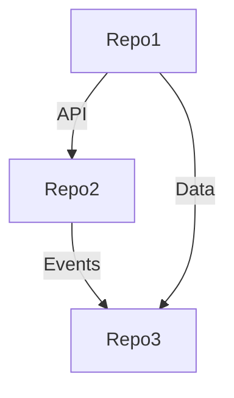

# Cross-Repository Integration Points Analysis

## Metadata
- **Analysis Date**: [YYYY-MM-DD]
- **Version**: [version]
- **Analysts**: [names]
- **Repositories**:
  - [repo1_name] ([version])
  - [repo2_name] ([version])
  - [repo3_name] ([version])

## Integration Overview

### Integration Map

### Key Integration Points
| From | To | Type | Purpose | Status |
|------|-----|------|---------|--------|
| [repo] | [repo] | [API/Event/Data] | [purpose] | [status] |

## API Integrations

### REST APIs
| Provider | Consumer | Endpoint | Purpose | Contract Status |
|----------|----------|----------|---------|-----------------|
| [repo] | [repo] | [endpoint] | [purpose] | [status] |

### GraphQL APIs
| Provider | Consumer | Operation | Purpose | Contract Status |
|----------|----------|-----------|---------|-----------------|
| [repo] | [repo] | [operation] | [purpose] | [status] |

### gRPC Services
| Provider | Consumer | Service | Purpose | Contract Status |
|----------|----------|---------|---------|-----------------|
| [repo] | [repo] | [service] | [purpose] | [status] |

## Event Integrations

### Event Flows
| Producer | Event | Consumers | Purpose | Schema Status |
|----------|-------|-----------|---------|---------------|
| [repo] | [event] | [repos] | [purpose] | [status] |

### Message Brokers
| Broker | Publishers | Subscribers | Purpose | Health |
|--------|------------|-------------|---------|---------|
| [broker] | [repos] | [repos] | [purpose] | [status] |

### Event Schemas
| Event Type | Schema Version | Validation | Compatibility |
|------------|----------------|------------|---------------|
| [type] | [version] | [validation] | [compatibility] |

## Data Integrations

### Shared Databases
| Database | Access Type | Repositories | Purpose | Isolation |
|----------|-------------|--------------|---------|-----------|
| [db] | [type] | [repos] | [purpose] | [level] |

### Data Flows
| Source | Target | Data Type | Flow Type | Frequency |
|--------|--------|-----------|-----------|-----------|
| [repo] | [repo] | [type] | [type] | [frequency] |

### Data Contracts
| Contract | Version | Repositories | Validation | Status |
|----------|---------|--------------|------------|--------|
| [contract] | [version] | [repos] | [validation] | [status] |

## Authentication & Authorization

### Auth Flows
| Flow Type | Provider | Consumers | Method | Status |
|-----------|----------|-----------|--------|--------|
| [type] | [repo] | [repos] | [method] | [status] |

### Shared Identity
| Identity Provider | Repositories | Auth Method | Token Type |
|------------------|--------------|-------------|------------|
| [provider] | [repos] | [method] | [type] |

### Access Control
| Resource | Provider | Consumers | Permissions | Enforcement |
|----------|----------|-----------|-------------|-------------|
| [resource] | [repo] | [repos] | [permissions] | [method] |

## Performance Characteristics

### Response Times
| Integration Point | Average | P95 | P99 | SLA |
|------------------|---------|-----|-----|-----|
| [point] | [avg] | [p95] | [p99] | [sla] |

### Throughput
| Integration Point | Average RPS | Peak RPS | Capacity | Scaling |
|------------------|-------------|-----------|----------|---------|
| [point] | [avg] | [peak] | [capacity] | [scaling] |

### Resource Usage
| Integration Point | CPU | Memory | Network | Storage |
|------------------|-----|---------|----------|----------|
| [point] | [cpu] | [memory] | [network] | [storage] |

## Error Handling

### Failure Scenarios
| Scenario | Impact | Detection | Recovery | MTTR |
|----------|--------|-----------|----------|------|
| [scenario] | [impact] | [detection] | [recovery] | [mttr] |

### Circuit Breakers
| Integration | Threshold | Window | Fallback | Reset |
|------------|-----------|--------|----------|-------|
| [integration] | [threshold] | [window] | [fallback] | [reset] |

### Retry Policies
| Integration | Strategy | Attempts | Backoff | Timeout |
|------------|----------|----------|---------|---------|
| [integration] | [strategy] | [attempts] | [backoff] | [timeout] |

## Monitoring & Observability

### Health Checks
| Integration | Check Type | Frequency | Threshold | Action |
|------------|------------|-----------|-----------|--------|
| [integration] | [type] | [frequency] | [threshold] | [action] |

### Metrics
| Category | Metric | Source | Aggregation | Alert |
|----------|--------|--------|-------------|-------|
| [category] | [metric] | [source] | [aggregation] | [alert] |

### Tracing
| Flow | Trace Points | Sampling | Retention | Analysis |
|------|--------------|----------|-----------|----------|
| [flow] | [points] | [sampling] | [retention] | [analysis] |

## Testing Strategy

### Integration Tests
| Test Suite | Scope | Coverage | Frequency | Environment |
|------------|-------|----------|-----------|-------------|
| [suite] | [scope] | [coverage] | [frequency] | [env] |

### Contract Tests
| Contract | Provider | Consumer | Tool | Status |
|----------|----------|----------|------|--------|
| [contract] | [repo] | [repo] | [tool] | [status] |

### Load Tests
| Scenario | Load Pattern | Success Criteria | Results |
|----------|--------------|------------------|---------|
| [scenario] | [pattern] | [criteria] | [results] |

## Documentation

### API Documentation
| API | Documentation | Format | Location | Status |
|-----|--------------|--------|----------|--------|
| [api] | [docs] | [format] | [location] | [status] |

### Integration Guides
| Guide | Audience | Last Updated | Location | Status |
|-------|----------|--------------|----------|--------|
| [guide] | [audience] | [date] | [location] | [status] |

### Runbooks
| Scenario | Runbook | Last Updated | Tested | Status |
|----------|---------|--------------|--------|--------|
| [scenario] | [runbook] | [date] | [tested] | [status] |

## Known Issues

### Current Issues
| Issue | Repositories | Impact | Mitigation | Status |
|-------|--------------|--------|------------|--------|
| [issue] | [repos] | [impact] | [mitigation] | [status] |

### Risks
| Risk | Likelihood | Impact | Mitigation | Owner |
|------|------------|--------|------------|-------|
| [risk] | [likelihood] | [impact] | [mitigation] | [owner] |

## Future Considerations

### Planned Changes
| Change | Motivation | Impact | Timeline | Status |
|--------|------------|--------|----------|--------|
| [change] | [motivation] | [impact] | [timeline] | [status] |

### Technical Debt
| Item | Repositories | Impact | Resolution | Priority |
|------|--------------|--------|------------|----------|
| [item] | [repos] | [impact] | [resolution] | [priority] |

## Version History
- [version] ([date]): [changes] 