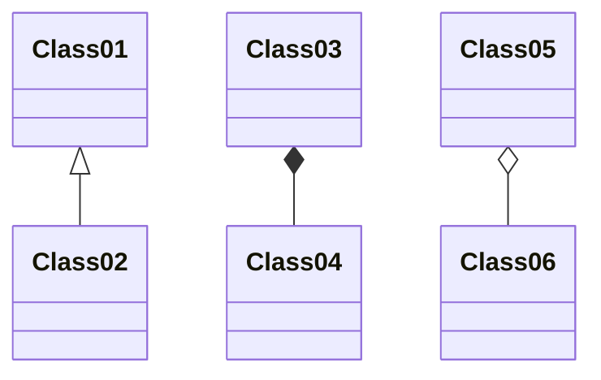

# Component Documentation Template

## Metadata
- **Component Name**: [name]
- **Version**: [version]
- **Repository**: [repository]
- **Last Updated**: [YYYY-MM-DD]
- **Status**: [Active/Deprecated/Planned]
- **Methodology Reference**: [Link to methodology section]

## Overview
Brief description of the component's purpose and role (1-2 paragraphs)

## Technical Details

### Implementation
```
Location: [path/to/component]
Primary Language: [language]
Framework/Library: [framework]
```

### Dependencies
| Dependency | Version | Purpose | Status |
|------------|---------|---------|--------|
| [name] | [version] | [purpose] | [status] |

### APIs and Interfaces
| Interface | Type | Purpose | Consumers |
|-----------|------|---------|-----------|
| [name] | [type] | [purpose] | [consumers] |

### Data Model


## Integration Points

### Incoming Integrations
| Source | Type | Data Flow | Status |
|--------|------|-----------|--------|
| [source] | [type] | [flow] | [status] |

### Outgoing Integrations
| Target | Type | Data Flow | Status |
|--------|------|-----------|--------|
| [target] | [type] | [flow] | [status] |

## Performance Characteristics

### Resource Usage
- CPU: [typical/peak]
- Memory: [typical/peak]
- Storage: [requirements]
- Network: [bandwidth/latency]

### Scalability
- Scaling limits
- Bottlenecks
- Optimization opportunities

## Security

### Authentication
- Auth methods
- Access control
- Security patterns

### Data Protection
- Encryption methods
- Data classification
- Security controls

## Testing

### Test Coverage
| Type | Coverage | Location | Status |
|------|----------|----------|--------|
| [type] | [%] | [path] | [status] |

### Test Requirements
- Setup requirements
- Test data needs
- Environment needs

## Monitoring

### Health Checks
| Check | Type | Frequency | Threshold |
|-------|------|-----------|-----------|
| [check] | [type] | [freq] | [threshold] |

### Metrics
| Metric | Type | Source | Alert |
|--------|------|--------|-------|
| [metric] | [type] | [source] | [alert] |

### Logging
| Log | Level | Purpose | Retention |
|-----|-------|---------|-----------|
| [log] | [level] | [purpose] | [retention] |

## Maintenance

### Deployment
- Deployment process
- Configuration needs
- Environment requirements

### Backup/Recovery
- Backup strategy
- Recovery process
- Data retention

### Troubleshooting
- Common issues
- Debug process
- Support contacts

## Known Issues

### Current Issues
| Issue | Impact | Status | Resolution |
|-------|---------|--------|------------|
| [issue] | [impact] | [status] | [resolution] |

### Technical Debt
| Item | Impact | Priority | Plan |
|------|---------|----------|------|
| [item] | [impact] | [priority] | [plan] |

## Future Plans

### Planned Improvements
| Improvement | Impact | Priority | Timeline |
|-------------|---------|----------|----------|
| [improvement] | [impact] | [priority] | [timeline] |

### Migration Plans
- Upgrade paths
- Breaking changes
- Migration steps

## References
- Design docs: [links]
- API docs: [links]
- Related components: [links]

## Review History
| Version | Reviewer | Date | Status |
|---------|----------|------|--------|
| [version] | [name] | [date] | [status] |

## Version History
- [version] ([date]): [changes] 