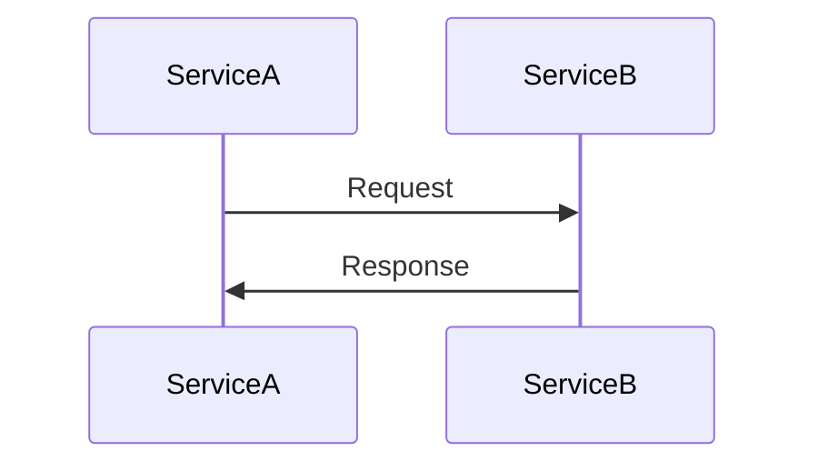

# Integration Documentation Template

## Metadata
- **Integration Name**: [name]
- **Version**: [version]
- **Status**: [Active/Deprecated/Planned]
- **Last Updated**: [YYYY-MM-DD]
- **Methodology Reference**: [Link to methodology section]

## Overview
Brief description of the integration's purpose and role (1-2 paragraphs)

## Integration Details

### Endpoints
| Name | Method | Path | Purpose |
|------|--------|------|---------|
| [name] | [GET/POST/etc] | [path] | [purpose] |

### Authentication
- Auth type: [type]
- Auth flow: [description]
- Required credentials: [list]

### Request/Response Format

#### Request Format
```json
{
  "field1": "type",
  "field2": "type"
}
```

#### Response Format
```json
{
  "field1": "type",
  "field2": "type"
}
```

## Data Flow

### Flow Diagram


### Data Transformations
| Source Format | Target Format | Transform Logic | Validation |
|---------------|---------------|-----------------|------------|
| [format] | [format] | [logic] | [validation] |

### Error Handling
| Error Code | Meaning | Handling Strategy |
|------------|---------|------------------|
| [code] | [meaning] | [strategy] |

## Performance

### SLAs
- Response time: [target]
- Throughput: [target]
- Error rate: [target]

### Rate Limiting
- Limits: [limits]
- Throttling strategy: [strategy]
- Burst handling: [handling]

### Caching
- Cache strategy: [strategy]
- TTL: [time]
- Invalidation: [method]

## Security

### Security Controls
| Control | Type | Purpose | Implementation |
|---------|------|---------|----------------|
| [control] | [type] | [purpose] | [implementation] |

### Data Protection
- In-transit: [method]
- At-rest: [method]
- Classification: [level]

### Compliance
| Requirement | Status | Validation | Evidence |
|------------|--------|------------|----------|
| [req] | [status] | [validation] | [evidence] |

## Testing

### Test Cases
| Case | Type | Coverage | Status |
|------|------|----------|--------|
| [case] | [type] | [coverage] | [status] |

### Test Environment
- Setup requirements
- Test data
- Mock services

## Monitoring

### Health Checks
| Check | Type | Frequency | Threshold |
|-------|------|-----------|-----------|
| [check] | [type] | [freq] | [threshold] |

### Metrics
| Metric | Type | Source | Alert |
|--------|------|--------|-------|
| [metric] | [type] | [source] | [alert] |

### Logging
| Log | Level | Purpose | Retention |
|-----|-------|---------|-----------|
| [log] | [level] | [purpose] | [retention] |

## Dependencies

### Service Dependencies
| Service | Version | Purpose | Status |
|---------|---------|---------|--------|
| [service] | [version] | [purpose] | [status] |

### Infrastructure Dependencies
| Component | Type | Purpose | Status |
|-----------|------|---------|--------|
| [component] | [type] | [purpose] | [status] |

## Maintenance

### Deployment
- Deployment process
- Configuration
- Environment setup

### Troubleshooting
- Common issues
- Debug process
- Support contacts

## Known Issues

### Current Issues
| Issue | Impact | Status | Resolution |
|-------|---------|--------|------------|
| [issue] | [impact] | [status] | [resolution] |

### Limitations
| Limitation | Impact | Workaround | Future Plan |
|------------|--------|------------|-------------|
| [limitation] | [impact] | [workaround] | [plan] |

## Future Plans

### Planned Changes
| Change | Impact | Priority | Timeline |
|--------|---------|----------|----------|
| [change] | [impact] | [priority] | [timeline] |

### Migration Plans
- Breaking changes
- Migration steps
- Rollback plan

## References
- API docs: [links]
- Design docs: [links]
- Related integrations: [links]

## Review History
| Version | Reviewer | Date | Status |
|---------|----------|------|--------|
| [version] | [name] | [date] | [status] |

## Version History
- [version] ([date]): [changes] 