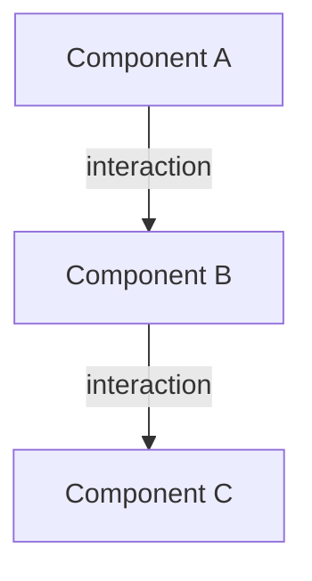

# Pattern Documentation Template

## Metadata
- **Pattern Name**: [name]
- **Pattern Type**: [Implementation/Architecture/Integration/etc]
- **Status**: [Recommended/Discouraged/Legacy]
- **Last Updated**: [YYYY-MM-DD]
- **Methodology Reference**: [Link to methodology section]

## Pattern Overview

### Purpose
Brief description of what the pattern accomplishes (1-2 paragraphs)

### Context
When and where this pattern should be applied

### Problem Statement
What specific problem this pattern solves

## Pattern Details

### Structure


### Components
| Component | Role | Responsibility |
|-----------|------|----------------|
| [component] | [role] | [responsibility] |

### Interactions
| From | To | Type | Purpose |
|------|-----|------|---------|
| [source] | [target] | [type] | [purpose] |

## Implementation

### Code Example
```[language]
// Example implementation
```

### Key Considerations
- Implementation guidelines
- Best practices
- Common pitfalls

### Variants
| Variant | Use Case | Trade-offs |
|---------|----------|------------|
| [variant] | [use case] | [trade-offs] |

## Analysis

### Benefits
- Benefit 1
- Benefit 2
- Benefit 3

### Trade-offs
- Trade-off 1
- Trade-off 2
- Trade-off 3

### Performance Impact
| Aspect | Impact | Mitigation |
|--------|--------|------------|
| [aspect] | [impact] | [mitigation] |

## Usage

### Where Used
| Repository | Component | Implementation | Status |
|------------|-----------|----------------|--------|
| [repo] | [component] | [details] | [status] |

### Prerequisites
- Technical requirements
- Environmental requirements
- Knowledge requirements

### Configuration
| Parameter | Purpose | Default | Valid Values |
|-----------|---------|---------|--------------|
| [param] | [purpose] | [default] | [values] |

## Testing

### Test Approach
- Unit test strategy
- Integration test strategy
- Performance test strategy

### Test Cases
| Scenario | Test Type | Validation |
|----------|-----------|------------|
| [scenario] | [type] | [validation] |

## Security

### Security Implications
| Aspect | Risk | Mitigation |
|--------|------|------------|
| [aspect] | [risk] | [mitigation] |

### Compliance
| Requirement | Status | Validation |
|------------|--------|------------|
| [req] | [status] | [validation] |

## Maintenance

### Evolution Strategy
- Growth path
- Scaling considerations
- Migration strategy

### Known Issues
| Issue | Impact | Workaround |
|-------|--------|------------|
| [issue] | [impact] | [workaround] |

## Related Patterns

### Similar Patterns
| Pattern | Comparison | When to Use |
|---------|------------|-------------|
| [pattern] | [comparison] | [when] |

### Anti-patterns
| Anti-pattern | Why Avoid | Alternative |
|--------------|-----------|-------------|
| [pattern] | [reason] | [alternative] |

## Examples

### Good Examples
| Example | Repository | Notes |
|---------|------------|-------|
| [example] | [repo] | [notes] |

### Bad Examples
| Example | Repository | Issues |
|---------|------------|--------|
| [example] | [repo] | [issues] |

## References
- Design patterns: [links]
- Architecture docs: [links]
- Related patterns: [links]

## Review History
| Version | Reviewer | Date | Status |
|---------|----------|------|--------|
| [version] | [name] | [date] | [status] |

## Version History
- [version] ([date]): [changes] 