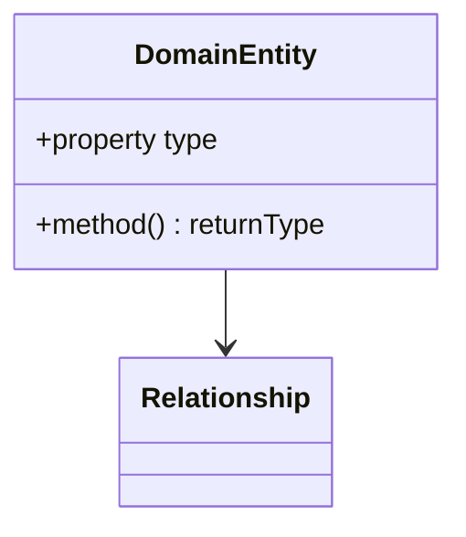
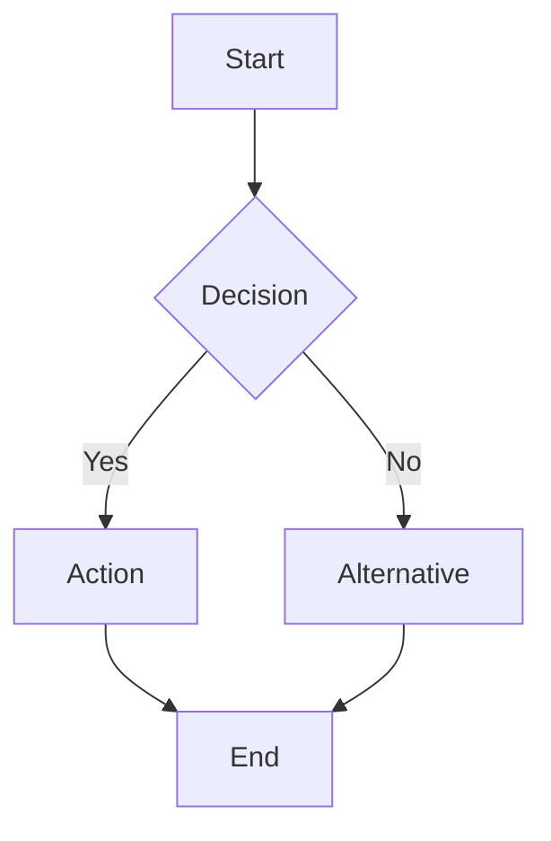

# Business Logic Analysis Template

## Metadata
- **Version**: 1.0
- **Last Updated**: [date]
- **Domain**: [domain_name]
- **Repository**: [repository_name]
- **Status**: [active|deprecated|planned]

## Business Context

### Domain Overview
Brief description of the business domain and its significance.

### Key Stakeholders
| Role | Responsibility | Requirements |
|------|---------------|--------------|
| [role] | [responsibility] | [requirements] |

### Business Rules
| Rule ID | Description | Priority | Validation |
|---------|-------------|----------|------------|
| BR001 | [description] | [high/medium/low] | [validation] |

## Implementation Analysis

### Domain Model


### Business Processes


### Data Flow
| Source | Transformation | Destination | Business Impact |
|--------|---------------|-------------|-----------------|
| [source] | [transform] | [destination] | [impact] |

## Validation & Rules

### Input Validation
| Field | Rules | Error Messages | Business Impact |
|-------|-------|----------------|-----------------|
| [field] | [rules] | [messages] | [impact] |

### Business Constraints
| Constraint | Description | Implementation | Validation |
|------------|-------------|----------------|------------|
| [constraint] | [description] | [implementation] | [validation] |

### State Transitions
| From State | To State | Trigger | Conditions | Actions |
|------------|----------|---------|------------|---------|
| [from] | [to] | [trigger] | [conditions] | [actions] |

## Integration Points

### External Systems
| System | Purpose | Integration Type | Data Exchange |
|--------|---------|-----------------|---------------|
| [system] | [purpose] | [type] | [data] |

### Events
| Event | Business Trigger | Subscribers | Impact |
|-------|-----------------|-------------|---------|
| [event] | [trigger] | [subscribers] | [impact] |

## Calculations & Algorithms

### Business Calculations
| Calculation | Formula | Variables | Usage |
|-------------|---------|-----------|--------|
| [name] | [formula] | [variables] | [usage] |

### Key Algorithms
```typescript
// Pseudocode for key business algorithms
function businessAlgorithm() {
    // Algorithm implementation
}
```

## Error Handling

### Business Exceptions
| Exception | Scenario | Impact | Resolution |
|-----------|----------|--------|------------|
| [exception] | [scenario] | [impact] | [resolution] |

### Edge Cases
| Case | Handling | Business Impact |
|------|----------|----------------|
| [case] | [handling] | [impact] |

## Compliance & Regulations

### Regulatory Requirements
| Requirement | Source | Implementation | Validation |
|-------------|--------|----------------|------------|
| [requirement] | [source] | [implementation] | [validation] |

### Audit Trail
| Action | Data Captured | Retention | Purpose |
|--------|---------------|-----------|---------|
| [action] | [data] | [retention] | [purpose] |

## Testing Strategy

### Business Scenarios
| Scenario | Test Cases | Expected Results | Validation |
|----------|------------|------------------|------------|
| [scenario] | [cases] | [results] | [validation] |

### Data Requirements
| Test Case | Test Data | Conditions | Expected Output |
|-----------|-----------|------------|-----------------|
| [case] | [data] | [conditions] | [output] |

## Performance Considerations

### Business SLAs
| Operation | Target Time | Current Performance | Impact |
|-----------|-------------|-------------------|---------|
| [operation] | [target] | [current] | [impact] |

### Optimization Opportunities
| Area | Current State | Proposed Improvement | Business Value |
|------|--------------|---------------------|----------------|
| [area] | [current] | [improvement] | [value] |

## Documentation

### Business Process Documentation
- [Link to process flows]
- [Link to business requirements]
- [Link to user stories]

### Technical Documentation
- [Link to API docs]
- [Link to implementation guides]
- [Link to architecture diagrams]

## Future Considerations

### Business Roadmap
| Feature | Business Value | Timeline | Dependencies |
|---------|---------------|----------|--------------|
| [feature] | [value] | [timeline] | [dependencies] |

### Technical Debt
| Item | Business Impact | Priority | Resolution Plan |
|------|----------------|----------|-----------------|
| [item] | [impact] | [priority] | [plan] |

## Version History
- 1.0 (2024-03-21): Initial template creation 