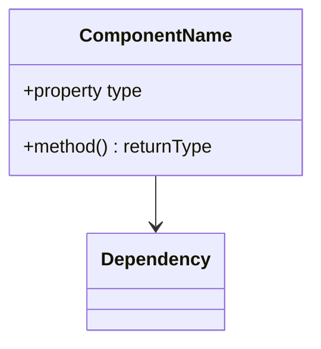
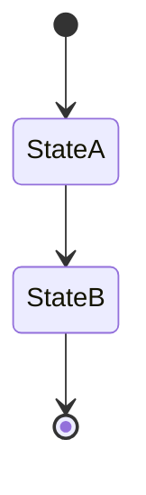

# Component Analysis Template

## Metadata
- **Version**: 1.0
- **Last Updated**: [date]
- **Component**: [component_name]
- **Repository**: [repository_name]
- **Type**: [UI|Service|Controller|Model|etc]
- **Status**: [active|deprecated|planned]

## Overview
Brief description of the component's purpose and role in the system.

## Technical Implementation

### Basic Information
| Property | Value |
|----------|-------|
| **File Location** | [path/to/component] |
| **Primary Language** | [language] |
| **Framework/Library** | [framework] |
| **Created Date** | [YYYY-MM-DD] |
| **Last Modified** | [YYYY-MM-DD] |

### Component Structure


### Dependencies
| Dependency | Type | Purpose | Required |
|------------|------|---------|-----------|
| [name] | [internal/external] | [purpose] | [yes/no] |

## Interface

### Inputs/Props
| Name | Type | Required | Default | Description |
|------|------|----------|---------|-------------|
| [name] | [type] | [yes/no] | [default] | [description] |

### Outputs/Events
| Name | Type | Trigger | Data | Description |
|------|------|---------|------|-------------|
| [name] | [type] | [trigger] | [data] | [description] |

### Public Methods
| Method | Parameters | Return Type | Description |
|--------|------------|-------------|-------------|
| [name] | [params] | [type] | [description] |

## State Management

### Internal State
| State | Type | Purpose | Persistence |
|-------|------|---------|-------------|
| [name] | [type] | [purpose] | [persistence] |

### State Flow


## Integration Points

### API Endpoints
| Endpoint | Method | Purpose | Request Data | Response |
|----------|--------|---------|--------------|-----------|
| [path] | [method] | [purpose] | [request] | [response] |

### Event Handling
| Event | Source | Handler | Action |
|-------|--------|---------|--------|
| [event] | [source] | [handler] | [action] |

## Performance

### Critical Operations
| Operation | Average Time | Optimization Status |
|-----------|--------------|-------------------|
| [operation] | [time] | [status] |

### Resource Usage
- **Memory**: [typical usage]
- **CPU**: [typical usage]
- **Network**: [typical usage]

## Error Handling

### Error Scenarios
| Scenario | Detection | Response | Recovery |
|----------|-----------|----------|-----------|
| [scenario] | [detection] | [response] | [recovery] |

### Error Prevention
- **Validation**: [approach]
- **Guards**: [approach]
- **Fallbacks**: [approach]

## Testing

### Test Coverage
| Type | Coverage | Key Scenarios |
|------|----------|---------------|
| Unit | [%] | [scenarios] |
| Integration | [%] | [scenarios] |
| E2E | [%] | [scenarios] |

### Test Examples
```typescript
// Key test examples
describe('ComponentName', () => {
    it('should ...', () => {
        // Test implementation
    });
});
```

## Security

### Access Control
- **Required Permissions**: [list]
- **Authentication**: [requirements]
- **Authorization**: [checks]

### Data Protection
- **Sensitive Data**: [list]
- **Protection Methods**: [methods]
- **Validation**: [approach]

## Usage Examples

### Basic Usage
```typescript
// Basic implementation example
```

### Advanced Usage
```typescript
// Advanced implementation example
```

## Known Issues

### Current Issues
| Issue | Impact | Workaround | Status |
|-------|--------|------------|--------|
| [issue] | [impact] | [workaround] | [status] |

### Limitations
- [Limitation 1]
- [Limitation 2]
- [Limitation 3]

## Documentation

### Related Documentation
- [Link to API docs]
- [Link to design docs]
- [Link to usage guides]

### Code Examples
```typescript
// Additional code examples
```

## Future Improvements

### Planned Enhancements
| Enhancement | Priority | Effort | Status |
|-------------|----------|--------|--------|
| [enhancement] | [priority] | [effort] | [status] |

### Technical Debt
- [Debt item 1]
- [Debt item 2]
- [Debt item 3]

## Version History
- 1.0 (2024-03-21): Initial template creation 