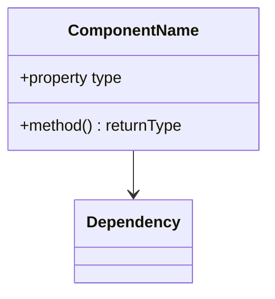

# Component Analysis Template

## Metadata
- **Component Name**: [name]
- **Repository**: [repository_name]
- **Path**: [path/to/component]
- **Last Updated**: [YYYY-MM-DD]
- **Version**: [version]
- **Maintainers**: [names]

## Component Overview

### Purpose & Responsibility
Brief description of the component's primary purpose and responsibilities.

### Key Features
- [Feature 1]
- [Feature 2]
- [Feature 3]

### Component Type
- [ ] Business Logic
- [ ] Data Access
- [ ] Service Integration
- [ ] Utility
- [ ] Infrastructure
- [ ] Other: [specify]

## Technical Implementation

### Code Structure


### Key Methods
| Method | Purpose | Parameters | Return | Complexity |
|--------|---------|------------|--------|------------|
| [name] | [purpose] | [params] | [return] | [O(n)] |

### State Management
| State | Type | Purpose | Lifecycle |
|-------|------|---------|-----------|
| [name] | [type] | [purpose] | [lifecycle] |

### Error Handling
| Error Scenario | Detection | Recovery | Impact |
|----------------|-----------|----------|---------|
| [scenario] | [detection] | [recovery] | [impact] |

## Dependencies

### Internal Dependencies
| Component | Purpose | Type | Criticality |
|-----------|---------|------|-------------|
| [component] | [purpose] | [type] | [criticality] |

### External Dependencies
| Dependency | Version | Purpose | Type |
|------------|---------|---------|------|
| [name] | [version] | [purpose] | [type] |

### Configuration
| Parameter | Type | Purpose | Default |
|-----------|------|---------|---------|
| [param] | [type] | [purpose] | [default] |

## Testing

### Test Coverage
| Category | Coverage | Critical Paths | Gaps |
|----------|----------|----------------|------|
| Unit | [%] | [paths] | [gaps] |
| Integration | [%] | [paths] | [gaps] |
| E2E | [%] | [paths] | [gaps] |

### Test Cases
| Scenario | Test Type | Status | Location |
|----------|-----------|--------|-----------|
| [scenario] | [type] | [status] | [location] |

### Mocking Strategy
| Dependency | Mock Type | Purpose | Location |
|------------|-----------|---------|-----------|
| [dependency] | [type] | [purpose] | [location] |

## Performance

### Critical Paths
| Operation | Average Time | Threshold | Bottlenecks |
|-----------|--------------|-----------|-------------|
| [operation] | [time] | [threshold] | [bottlenecks] |

### Resource Usage
| Resource | Average | Peak | Limit |
|----------|---------|------|-------|
| CPU | [avg] | [peak] | [limit] |
| Memory | [avg] | [peak] | [limit] |
| I/O | [avg] | [peak] | [limit] |

### Caching Strategy
| Data | Strategy | TTL | Invalidation |
|------|----------|-----|--------------|
| [data] | [strategy] | [ttl] | [invalidation] |

## Security

### Access Control
| Operation | Role | Permission | Validation |
|-----------|------|------------|------------|
| [operation] | [role] | [permission] | [validation] |

### Data Protection
| Data | Classification | Protection | Encryption |
|------|----------------|------------|------------|
| [data] | [class] | [protection] | [encryption] |

### Security Considerations
- [ ] Input validation
- [ ] Output encoding
- [ ] Authentication
- [ ] Authorization
- [ ] Data encryption
- [ ] Audit logging
- [ ] Error handling
- [ ] Rate limiting

## Monitoring

### Health Checks
| Check | Frequency | Threshold | Action |
|-------|-----------|-----------|--------|
| [check] | [frequency] | [threshold] | [action] |

### Metrics
| Metric | Purpose | Alert Condition | Response |
|--------|---------|----------------|----------|
| [metric] | [purpose] | [condition] | [response] |

### Logging
| Log Level | Usage | Retention | Sensitive Data |
|-----------|-------|-----------|----------------|
| [level] | [usage] | [retention] | [sensitive] |

## Documentation

### API Documentation
| Endpoint | Method | Purpose | Authentication |
|----------|--------|---------|----------------|
| [endpoint] | [method] | [purpose] | [auth] |

### Usage Examples
```typescript
// Basic usage example
```

### Integration Guide
1. [Setup steps]
2. [Configuration]
3. [Usage patterns]
4. [Common issues]

## Known Issues

### Current Issues
| Issue | Impact | Workaround | Status |
|-------|--------|------------|--------|
| [issue] | [impact] | [workaround] | [status] |

### Technical Debt
| Item | Impact | Priority | Plan |
|------|--------|----------|------|
| [item] | [impact] | [priority] | [plan] |

## Future Considerations

### Planned Improvements
| Improvement | Benefit | Effort | Timeline |
|-------------|---------|--------|----------|
| [improvement] | [benefit] | [effort] | [timeline] |

### Migration Notes
| Aspect | Current | Target | Strategy |
|--------|---------|--------|----------|
| [aspect] | [current] | [target] | [strategy] |

## Cross-Repository Impact
- Integration points with other repositories
- Shared patterns and implementations
- Cross-cutting concerns

## Version History
- [version] ([date]): [changes] 