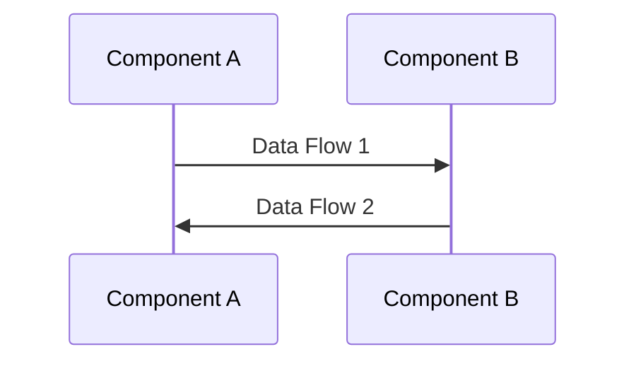
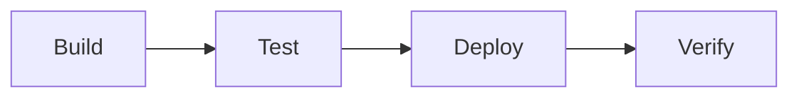

# Repository Overview Template

## Metadata
- **Version**: 1.0
- **Last Updated**: [date]
- **Repository**: [repository_name]
- **Type**: [Frontend|Backend|CMS]
- **Primary Technology**: [Vue.js|Rails|Angular]

## Overview
Brief description of the repository's purpose and role in the overall system.

## Architecture Overview

### System Context
- **Role**: [Primary role in the system]
- **Users**: [Primary users/consumers]
- **Dependencies**: [Key external dependencies]
- **Integration Points**: [Major integration points]

### Technical Stack
| Component | Technology | Version | Purpose |
|-----------|------------|---------|----------|
| [component] | [tech] | [version] | [purpose] |

### Key Patterns
- **Architectural Patterns**: [List of patterns]
- **Design Patterns**: [List of patterns]
- **Integration Patterns**: [List of patterns]

## Core Components

### Component Map
```mermaid
graph TD
    A[Component A] --> B[Component B]
    B --> C[Component C]
    // Add more components and relationships
```

### Critical Paths
| Path | Purpose | Components Involved |
|------|---------|-------------------|
| [path] | [purpose] | [components] |

## Integration Points

### External Systems
| System | Integration Type | Purpose | Status |
|--------|-----------------|---------|--------|
| [system] | [type] | [purpose] | [status] |

### Internal Dependencies
| Repository | Dependency Type | Integration Method |
|------------|----------------|-------------------|
| [repo] | [type] | [method] |

## Data Flow

### Primary Data Flows


### State Management
- **Pattern**: [State management pattern]
- **Stores/Models**: [List of main stores/models]
- **Update Patterns**: [How state is updated]

## Security

### Authentication
- **Method**: [Auth method]
- **Implementation**: [Implementation details]
- **Flow**: [Auth flow]

### Authorization
- **Model**: [Authorization model]
- **Roles**: [Role definitions]
- **Permissions**: [Permission system]

## Performance

### Key Metrics
- **Critical Paths**: [List with timing goals]
- **Resource Usage**: [Resource requirements]
- **Scaling Factors**: [What affects scaling]

### Optimization Points
| Area | Current Status | Target | Strategy |
|------|---------------|--------|-----------|
| [area] | [status] | [target] | [strategy] |

## Development

### Setup Requirements
```bash
# Required environment setup
[setup commands]
```

### Build Process
```bash
# Build commands and process
[build commands]
```

### Testing Strategy
- **Unit Tests**: [Coverage and approach]
- **Integration Tests**: [Coverage and approach]
- **E2E Tests**: [Coverage and approach]

## Deployment

### Environment Configuration
| Environment | Purpose | Configuration |
|-------------|---------|---------------|
| [env] | [purpose] | [config] |

### Deployment Process


## Monitoring

### Health Checks
| Check | Purpose | Frequency | Alert Threshold |
|-------|---------|-----------|-----------------|
| [check] | [purpose] | [frequency] | [threshold] |

### Key Metrics
- **Application Metrics**: [List]
- **Business Metrics**: [List]
- **Infrastructure Metrics**: [List]

## Documentation Map
- **API Documentation**: [location]
- **Component Documentation**: [location]
- **Integration Documentation**: [location]
- **Deployment Documentation**: [location]

## Known Issues & Limitations
| Issue | Impact | Workaround | Status |
|-------|--------|------------|--------|
| [issue] | [impact] | [workaround] | [status] |

## Future Considerations
- **Planned Improvements**: [List]
- **Technical Debt**: [List]
- **Scalability Concerns**: [List]

## References
- [Related documentation]
- [Architecture decisions]
- [Design documents]
- [External resources]

## Version History
- 1.0 (2024-03-21): Initial template creation 