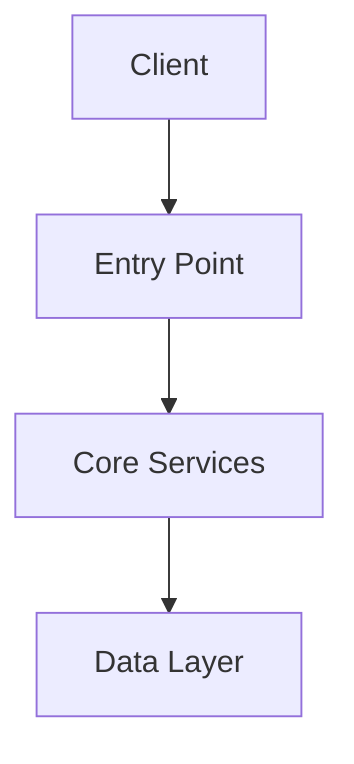

# Repository Architecture Overview

## Metadata
- **Repository**: [repository_name]
- **Last Updated**: [YYYY-MM-DD]
- **Version**: [version]
- **Maintainers**: [names]

## System Context
Brief description of where this repository fits in the overall system architecture.

### Primary Purpose
Core functionality and responsibilities of this repository.

### Key Stakeholders
| Role | Responsibility | Contact |
|------|---------------|---------|
| [role] | [responsibility] | [contact] |

## Architectural Overview

### High-Level Architecture

### Key Components
| Component | Purpose | Dependencies | Status |
|-----------|---------|--------------|--------|
| [name] | [purpose] | [dependencies] | [status] |

### Core Patterns
| Pattern | Usage | Implementation | Rationale |
|---------|--------|----------------|-----------|
| [pattern] | [usage] | [implementation] | [rationale] |

## Integration Points

### External Dependencies
| Dependency | Purpose | Version | Integration Type |
|------------|---------|---------|------------------|
| [name] | [purpose] | [version] | [type] |

### APIs
| Endpoint | Purpose | Consumers | SLA |
|----------|---------|-----------|-----|
| [endpoint] | [purpose] | [consumers] | [sla] |

### Event Flows
| Event | Producer | Consumers | Data Flow |
|-------|----------|-----------|-----------|
| [event] | [producer] | [consumers] | [flow] |

## Technical Stack

### Core Technologies
| Technology | Purpose | Version | Notes |
|------------|---------|---------|-------|
| [tech] | [purpose] | [version] | [notes] |

### Infrastructure
| Component | Technology | Scale | Notes |
|-----------|------------|-------|-------|
| [component] | [tech] | [scale] | [notes] |

## Data Architecture

### Data Models
| Model | Purpose | Storage | Access Pattern |
|-------|---------|---------|----------------|
| [model] | [purpose] | [storage] | [pattern] |

### Data Flows

## Security Architecture

### Authentication & Authorization
- Authentication method: [method]
- Authorization strategy: [strategy]
- Key security patterns: [patterns]

### Security Controls
| Control | Purpose | Implementation | Verification |
|---------|---------|----------------|--------------|
| [control] | [purpose] | [implementation] | [verification] |

## Operational Architecture

### Deployment
| Environment | Infrastructure | Deployment Method | Frequency |
|-------------|---------------|-------------------|-----------|
| [env] | [infra] | [method] | [frequency] |

### Monitoring
| Metric | Purpose | Alert Threshold | Response |
|--------|---------|----------------|----------|
| [metric] | [purpose] | [threshold] | [response] |

## Development Architecture

### Development Workflow
1. [Branch strategy]
2. [PR process]
3. [Review requirements]
4. [Deployment steps]

### Quality Gates
| Gate | Criteria | Tools | Enforcement |
|------|----------|-------|-------------|
| [gate] | [criteria] | [tools] | [enforcement] |

## Known Limitations

### Technical Debt
| Item | Impact | Priority | Plan |
|------|--------|----------|------|
| [item] | [impact] | [priority] | [plan] |

### Scale Limitations
| Aspect | Current Limit | Impact | Mitigation |
|--------|---------------|--------|------------|
| [aspect] | [limit] | [impact] | [mitigation] |

## Future Architecture

### Planned Changes
| Change | Motivation | Timeline | Dependencies |
|--------|------------|----------|--------------|
| [change] | [motivation] | [timeline] | [dependencies] |

### Migration Paths
| From | To | Strategy | Timeline |
|------|-----|----------|----------|
| [current] | [target] | [strategy] | [timeline] |

## Cross-Repository Dependencies
Reference to cross-repository analysis documents for:
- Integration points
- Shared patterns
- Data flows
- Security boundaries

## Version History
- [version] ([date]): [changes] 