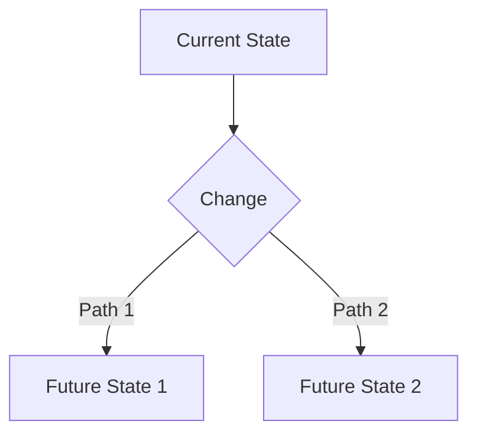

# Analysis Recommendations Template

## Metadata
- **Version**: 1.0
- **Analysis Date**: [date]
- **Repository**: [repository_name]
- **Scope**: [scope_description]
- **Analyst**: [analyst_name]

## Executive Summary
Brief overview of key findings and high-priority recommendations.

## Analysis Context

### Scope
- **Components Analyzed**: [list]
- **Time Period**: [period]
- **Analysis Methods**: [methods]

### Key Metrics
| Metric | Current Value | Target Value | Gap |
|--------|--------------|--------------|-----|
| [metric] | [current] | [target] | [gap] |

## Findings

### Strengths
| Area | Description | Impact |
|------|-------------|--------|
| [area] | [description] | [impact] |

### Areas for Improvement
| Area | Issue | Impact | Priority |
|------|-------|--------|----------|
| [area] | [issue] | [impact] | [priority] |

### Risks
| Risk | Likelihood | Impact | Mitigation |
|------|------------|--------|------------|
| [risk] | [likelihood] | [impact] | [mitigation] |

## Recommendations

### High Priority
| ID | Recommendation | Rationale | Impact | Effort |
|----|----------------|-----------|---------|---------|
| HP001 | [recommendation] | [rationale] | [impact] | [effort] |

### Medium Priority
| ID | Recommendation | Rationale | Impact | Effort |
|----|----------------|-----------|---------|---------|
| MP001 | [recommendation] | [rationale] | [impact] | [effort] |

### Low Priority
| ID | Recommendation | Rationale | Impact | Effort |
|----|----------------|-----------|---------|---------|
| LP001 | [recommendation] | [rationale] | [impact] | [effort] |

## Implementation Plan

### Quick Wins
| Task | Benefits | Timeline | Dependencies |
|------|----------|----------|--------------|
| [task] | [benefits] | [timeline] | [dependencies] |

### Strategic Initiatives
| Initiative | Objectives | Timeline | Resources |
|------------|------------|----------|-----------|
| [initiative] | [objectives] | [timeline] | [resources] |

## Technical Details

### Architecture Changes

### Code Changes
| File | Changes | Impact | Testing Requirements |
|------|---------|--------|---------------------|
| [file] | [changes] | [impact] | [requirements] |

### Performance Impact
| Area | Current | Expected | Improvement |
|------|---------|----------|-------------|
| [area] | [current] | [expected] | [improvement] |

## Resource Requirements

### Team Resources
| Role | Responsibility | Time Commitment |
|------|---------------|-----------------|
| [role] | [responsibility] | [time] |

### Tools & Infrastructure
| Resource | Purpose | Cost | Timeline |
|----------|---------|------|----------|
| [resource] | [purpose] | [cost] | [timeline] |

## Risk Assessment

### Implementation Risks
| Risk | Probability | Impact | Mitigation Strategy |
|------|------------|--------|-------------------|
| [risk] | [probability] | [impact] | [strategy] |

### Contingency Plans
| Scenario | Response | Owner | Timeline |
|----------|----------|-------|----------|
| [scenario] | [response] | [owner] | [timeline] |

## Success Metrics

### Key Performance Indicators
| KPI | Current | Target | Measurement Method |
|-----|---------|--------|-------------------|
| [kpi] | [current] | [target] | [method] |

### Validation Criteria
| Criterion | Description | Validation Method |
|-----------|-------------|------------------|
| [criterion] | [description] | [method] |

## Documentation Updates

### Required Updates
| Document | Changes | Owner | Timeline |
|----------|---------|-------|----------|
| [document] | [changes] | [owner] | [timeline] |

### New Documentation
| Document | Purpose | Audience | Timeline |
|----------|---------|----------|----------|
| [document] | [purpose] | [audience] | [timeline] |

## Follow-up Plan

### Review Schedule
| Review | Purpose | Participants | Frequency |
|--------|---------|--------------|-----------|
| [review] | [purpose] | [participants] | [frequency] |

### Success Criteria
| Criterion | Measurement | Target | Timeline |
|-----------|-------------|--------|----------|
| [criterion] | [measurement] | [target] | [timeline] |

## Version History
- 1.0 (2024-03-21): Initial template creation 