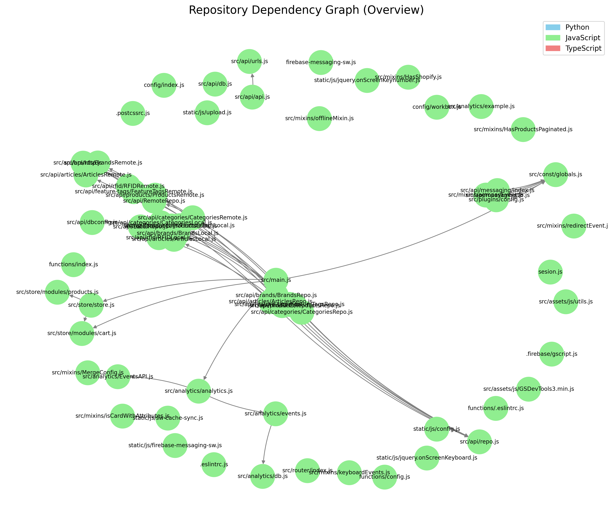

# Repository Analysis Report

## Local Repository: /Users/jeff/AI-agents/cross-repository-new-3-16-25/repositories/front-end

## Directory Structure

```
./
├── .
│   ├── .firebase
│   │   └── gscript.js
│   ├── config
│   │   ├── index.js
│   │   └── workbox.js
│   ├── functions
│   │   ├── .eslintrc.js
│   │   ├── config.js
│   │   └── index.js
│   ├── mdc_output
│   │   ├── dependency_graph_subgraphs
│   │   │   └── index.html
│   │   ├── dependency_graph.gexf
│   │   ├── directory_structure.txt
│   │   └── repo_analysis_report.md
│   ├── src
│   │   ├── analytics
│   │   │   ├── EventsAPI.js
│   │   │   ├── analytics.js
│   │   │   ├── db.js
│   │   │   ├── events.js
│   │   │   └── example.js
│   │   ├── api
│   │   │   ├── articles
│   │   │   │   ├── ArticlesLocal.js
│   │   │   │   ├── ArticlesRemote.js
│   │   │   │   └── ArticlesRepo.js
│   │   │   ├── brands
│   │   │   │   ├── BrandsLocal.js
│   │   │   │   ├── BrandsRemote.js
│   │   │   │   └── BrandsRepo.js
│   │   │   ├── categories
│   │   │   │   ├── CategoriesLocal.js
│   │   │   │   ├── CategoriesRemote.js
│   │   │   │   └── CategoriesRepo.js
│   │   │   ├── feature-tags
│   │   │   │   ├── FeatureTagsLocal.js
│   │   │   │   ├── FeatureTagsRemote.js
│   │   │   │   └── FeatureTagsRepo.js
│   │   │   ├── messaging
│   │   │   │   ├── fb.js
│   │   │   │   └── index.js
│   │   │   ├── products
│   │   │   │   ├── ProductsLocal.js
│   │   │   │   ├── ProductsRemote.js
│   │   │   │   └── ProductsRepo.js
│   │   │   ├── rfid
│   │   │   │   ├── RFIDLocal.js
│   │   │   │   ├── RFIDRemote.js
│   │   │   │   ├── RFIDRepo.js
│   │   │   │   └── test.conf
│   │   │   ├── LocalRepo.js
│   │   │   ├── RemoteRepo.js
│   │   │   ├── api.js
│   │   │   ├── db.js
│   │   │   ├── dbconfig.js
│   │   │   ├── http.js
│   │   │   ├── repo.js
│   │   │   └── urls.js
│   │   ├── assets
│   │   │   ├── css
│   │   │   │   ├── normalize.css
│   │   │   │   ├── onScreenKeyboard.css
│   │   │   │   └── onScreenKeyboardNumber.css
│   │   │   ├── fonts
│   │   │   │   ├── Muli-Bold.ttf
│   │   │   │   ├── Muli-ExtraBold.ttf
│   │   │   │   ├── Muli-ExtraLight.ttf
│   │   │   │   ├── Muli-Light.ttf
│   │   │   │   ├── Muli-Regular.ttf
│   │   │   │   ├── Muli-SemiBold.ttf
│   │   │   │   ├── muli-black-webfont.woff2
│   │   │   │   ├── muli-bold-webfont.woff2
│   │   │   │   ├── muli-extrabold-webfont.woff2
│   │   │   │   ├── muli-extralight-webfont.woff2
│   │   │   │   ├── muli-light-webfont.woff2
│   │   │   │   ├── muli-regular-webfont.woff2
│   │   │   │   └── muli-semibold-webfont.woff2
│   │   │   ├── img
│   │   │   ├── js
│   │   │   │   ├── GSDevTools3.min.js
│   │   │   │   └── utils.js
│   │   │   └── scss
│   │   │       ├── layout
│   │   │       │   └── _sidebar.scss
│   │   │       ├── _animations.scss
│   │   │       ├── _buttons.scss
│   │   │       ├── _colors.scss
│   │   │       ├── _fonts.scss
│   │   │       ├── global.css
│   │   │       ├── global.css.map
│   │   │       └── global.scss
│   │   ├── components
│   │   │   ├── ActiveCartButton.vue
│   │   │   ├── ActiveCartCheckoutCompleted.vue
│   │   │   ├── ActiveCartFinalizeOrderButton.vue
│   │   │   ├── ActiveCartKeepShopping.vue
│   │   │   ├── ActiveCartKeepShoppingButton.vue
│   │   │   ├── ActiveCartKeepShoppingFinalizeOrderFooter.vue
│   │   │   ├── ActiveCartNotFound.vue
│   │   │   ├── CloseActiveCart.vue
│   │   │   ├── LottieContainer.vue
│   │   │   ├── ModalTemplate.vue
│   │   │   ├── ProductCard.vue
│   │   │   ├── ProductCardBlank.vue
│   │   │   ├── ProductCardMenuBoard.vue
│   │   │   ├── ProductCardSale.vue
│   │   │   ├── ProductGraphs.vue
│   │   │   ├── ProductImage.vue
│   │   │   ├── ScreenBlank.vue
│   │   │   ├── ScreenBrands.vue
│   │   │   ├── ScreenCart.vue
│   │   │   ├── ScreenCheckout.vue
│   │   │   ├── ScreenCheckoutActiveCartCreator.vue
│   │   │   ├── ScreenCheckoutBlaze.vue
│   │   │   ├── ScreenCheckoutCovasoft.vue
│   │   │   ├── ScreenCheckoutEmail.vue
│   │   │   ├── ScreenCheckoutFlowhub.vue
│   │   │   ├── ScreenCheckoutLeaflogix.vue
│   │   │   ├── ScreenCheckoutShopify.vue
│   │   │   ├── ScreenCheckoutTreez.vue
│   │   │   ├── ScreenDebugCache.vue
│   │   │   ├── ScreenEffectsUses.vue
│   │   │   ├── ScreenFeaturedProducts.vue
│   │   │   ├── ScreenHome.vue
│   │   │   ├── ScreenHomeCCC.vue
│   │   │   ├── ScreenHomeCards.vue
│   │   │   ├── ScreenHomeDefault.vue
│   │   │   ├── ScreenHomeQuickCheckout.vue
│   │   │   ├── ScreenHomeRfidNav.vue
│   │   │   ├── ScreenHomeRfidSwipe.vue
│   │   │   ├── ScreenHomeSplitCards.vue
│   │   │   ├── ScreenHomeSpotlight.vue
│   │   │   ├── ScreenHomeSpotlightCards.vue
│   │   │   ├── ScreenHomeSwipe.vue
│   │   │   ├── ScreenHomeSwipeNav.vue
│   │   │   ├── ScreenHomeVideoImageBackground.vue
│   │   │   ├── ScreenIframeTest.vue
│   │   │   ├── ScreenMenuBoard.vue
│   │   │   ├── ScreenProduct.vue
│   │   │   ├── ScreenProductImage.vue
│   │   │   ├── ScreenProductVideo.vue
│   │   │   ├── ScreenProducts.vue
│   │   │   ├── ScreenProductsPromotions.vue
│   │   │   ├── ScreenUploadEvents.vue
│   │   │   ├── ShareButton.vue
│   │   │   ├── Slider.vue
│   │   │   ├── Spinner.vue
│   │   │   ├── ThankYouOrderCompleted.vue
│   │   │   ├── TheBrandSlideshow.vue
│   │   │   ├── TheNav.vue
│   │   │   └── TheSidebar.vue
│   │   ├── const
│   │   │   └── globals.js
│   │   ├── mixins
│   │   │   ├── HasProductsPaginated.js
│   │   │   ├── HasShopify.js
│   │   │   ├── MergeConfig.js
│   │   │   ├── aeropayEvent.js
│   │   │   ├── isCardWithAttributes.js
│   │   │   ├── keyboardEvents.js
│   │   │   ├── offlineMixin.js
│   │   │   └── redirectEvent.js
│   │   ├── plugins
│   │   │   └── config.js
│   │   ├── router
│   │   │   └── index.js
│   │   ├── store
│   │   │   ├── modules
│   │   │   │   ├── cart.js
│   │   │   │   └── products.js
│   │   │   └── store.js
│   │   ├── App.vue
│   │   └── main.js
│   ├── static
│   │   ├── anim
│   │   ├── css
│   │   │   └── custom.example.css
│   │   ├── img
│   │   ├── js
│   │   │   ├── config.js
│   │   │   ├── firebase-messaging-sw.js
│   │   │   ├── jquery.onScreenKeyboard.js
│   │   │   ├── jquery.onScreenKeynumber.js
│   │   │   ├── sw-cache-sync.js
│   │   │   └── upload.js
│   │   └── .gitkeep
│   ├── .babelrc
│   ├── .dockerignore
│   ├── .editorconfig
│   ├── .eslintignore
│   ├── .eslintrc.js
│   ├── .firebaserc
│   ├── .nvmrc
│   ├── .postcssrc.js
│   ├── .prettierrc
│   ├── .tsconfig
│   ├── CODE_QUALITY_ANALYSIS.md
│   ├── INTEGRATION_ANALYSIS.md
│   ├── MAINTAINABILITY_ANALYSIS.md
│   ├── PERFORMANCE_ANALYSIS.md
│   ├── README.md
│   ├── REPOSITORY_ANALYSIS.md
│   ├── RULES_ANALYSIS.md
│   ├── SECURITY_ANALYSIS.md
│   ├── TEST_COVERAGE_ANALYSIS.md
│   ├── comparison_analysis.md
│   ├── dockerfile
│   ├── favicon.ico
│   ├── firebase-messaging-sw.js
│   ├── firestore-debug.log
│   ├── how-to-make-a-deploy.md
│   ├── index.html
│   ├── progress.md
│   ├── pubsub-debug.log
│   ├── realese.md
│   ├── release.md
│   ├── sesion.js
│   ├── table.md
│   ├── ui-debug.log
│   └── versions.md
```

## Code Dependency Graph

- Total files analyzed: 188
- Total relationships: 50

### Dependency Graph Visualization

#### Force-Directed Layout


### Most Important Files

#### Most Imported Files

- **src/api/LocalRepo.js**: Imported by 6 files
- **src/api/http.js**: Imported by 6 files
- **src/api/repo.js**: Imported by 6 files
- **src/const/globals.js**: Imported by 5 files
- **src/store/modules/cart.js**: Imported by 2 files
- **src/App.vue**: Imported by 1 files
- **src/store/store.js**: Imported by 1 files
- **src/router**: Imported by 1 files
- **src/analytics/analytics.js**: Imported by 1 files
- **src/api/messaging/index.js**: Imported by 1 files

#### Files With Most Dependencies

- **src/main.js**: Imports 6 files
- **src/api/feature-tags/FeatureTagsRepo.js**: Imports 3 files
- **src/api/products/ProductsRepo.js**: Imports 3 files
- **src/api/brands/BrandsRepo.js**: Imports 3 files
- **src/api/articles/ArticlesRepo.js**: Imports 3 files
- **src/api/categories/CategoriesRepo.js**: Imports 3 files
- **src/api/rfid/RFIDRepo.js**: Imports 3 files
- **src/store/store.js**: Imports 2 files
- **src/analytics/analytics.js**: Imports 2 files
- **src/mixins/aeropayEvent.js**: Imports 2 files

#### Potential Core Modules

These files are imported by multiple other files and may represent core functionality:

- **src/api/LocalRepo.js**: Imported by 6 files
- **src/api/http.js**: Imported by 6 files
- **src/api/repo.js**: Imported by 6 files
- **src/const/globals.js**: Imported by 5 files

#### Potential Entry Points

These files import other modules but are not imported themselves, suggesting they may be entry points:

- **src/main.js**: Imports 6 files
- **src/mixins/aeropayEvent.js**: Imports 2 files
- **src/plugins/config.js**: Imports 1 files
- **src/api/api.js**: Imports 1 files
- **src/api/feature-tags/FeatureTagsRepo.js**: Imports 3 files
- **src/api/products/ProductsRepo.js**: Imports 3 files
- **src/api/brands/BrandsRepo.js**: Imports 3 files
- **src/api/articles/ArticlesRepo.js**: Imports 3 files
- **src/api/categories/CategoriesRepo.js**: Imports 3 files
- **src/api/rfid/RFIDRepo.js**: Imports 3 files

### Most Shared Functions, Classes, and Variables

This section shows individual components (functions, classes, variables) that are imported across multiple files.

#### Most Imported Functions

No functions are imported across files.

#### Most Imported Classes

No classes are imported across files.

#### Most Imported Variables and Constants

No variables or constants are imported across files.

#### Components Used Across Multiple Files

These components are imported by 3 or more different files and may represent core shared functionality:

- **default** (default): Used in 11 files - src/analytics/analytics.js, src/analytics/events.js, src/api/LocalRepo.js, src/api/RemoteRepo.js, src/api/articles/ArticlesRemote.js, src/api/brands/BrandsRemote.js, src/api/feature-tags/FeatureTagsRemote.js, src/api/products/ProductsRemote.js, src/api/rfid/RFIDRemote.js, src/main.js, src/store/store.js
- **fireb** (unknown): Used in 3 files - src/api/messaging/fb.js, src/api/messaging/index.js, src/mixins/aeropayEvent.js
- **Repo** (unknown): Used in 6 files - src/api/articles/ArticlesRepo.js, src/api/brands/BrandsRepo.js, src/api/categories/CategoriesRepo.js, src/api/feature-tags/FeatureTagsRepo.js, src/api/products/ProductsRepo.js, src/api/rfid/RFIDRepo.js
- **LocalRepo** (unknown): Used in 6 files - src/api/articles/ArticlesLocal.js, src/api/brands/BrandsLocal.js, src/api/categories/CategoriesLocal.js, src/api/feature-tags/FeatureTagsLocal.js, src/api/products/ProductsLocal.js, src/api/rfid/RFIDLocal.js

See repo_graph.graphml and repo_graph.json for detailed graph data.

## MDC Documentation Files

Cursor-compatible MDC documentation files have been generated in the `.cursor/rules` directory. These files provide context-aware documentation for:

- Individual files
- Directories
- The entire repository

These files include dependency information and are designed to provide contextual help within the Cursor IDE.

